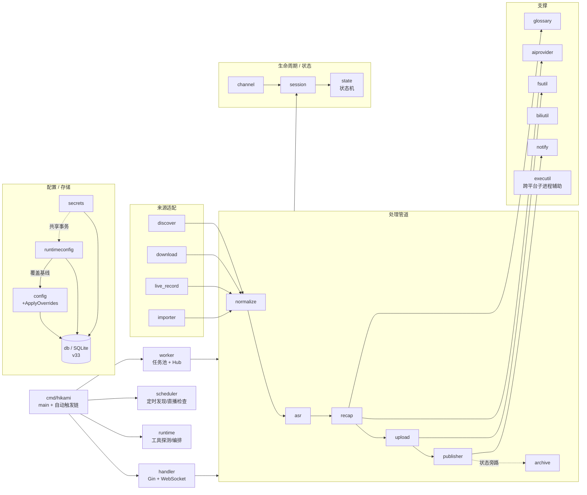

# Repository Guidelines

> **ZCode Agent 运行时上下文**。ZCode 在每个任务启动时读取**两处** `AGENTS.md`(据官方文档,仅两级、**不**逐级合并子目录):
> ① `~/.zcode/AGENTS.md`(用户全局,本机当前为空)、② `<repo>/AGENTS.md`(工作区,本文件)。两者存在时先追加全局、再追加工作区,工作区指令为当前任务的主源。
> 本文件聚焦"Agent 工作时最常需要的信息":命令、约定、结构与边界。
> 详细的架构图、模块逐一解析、数据流见根目录 [`CLAUDE.md`](./CLAUDE.md)(人类可读的完整参考;ZCode 仅在 onboarding 时把 CLAUDE.md 作为一次性迁移源,运行时不持续读取)。

## 项目一句话

Hikami-Go 是一个 Go 1.25 后端 + 内嵌 Vue 3 管理界面的 B 站直播回顾自动生成服务。入口 `cmd/hikami/`,后端包在 `internal/`,前端在 `web/`。

## 常用命令(Make 封装,优先使用)

| 命令 | 用途 |
|------|------|
| `make build` | 构建前端 → 嵌入 `web/dist` → 编译 `./hikami`(完整产物) |
| `make build-go` | 仅编译 Go 二进制(`./cmd/hikami`,含 `embedded_web` tag) |
| `make run` | `go run ./cmd/hikami -config config.yaml` |
| `make test` | `go test ./...`(全部后端单测) |
| `make fmt` | `gofmt -w cmd internal` |
| `make tidy` | 更新 go.mod |
| `make web-dev` | 启动 Vite 前端开发服务器(`web/`) |
| `make web-build` | 安装前端依赖并产出嵌入用 UI 包 |

## 直接命令(不依赖 Make 时)

```bash
# 编译(无需任何环境变量前缀,普通用户即可)
go build -tags embedded_web -o ./hikami ./cmd/hikami

# 全量测试
go test ./...

# 单模块测试(示例)
go test ./internal/recap/...

# 前端
cd web && npm install && npm run build      # 构建
cd web && npm run type-check                 # 类型检查
cd web && npx vitest run                     # 单测
```

> **关于 Go 环境**:本机 Go 1.25 已正确配置(`GOPATH=/home/<user>/go`,`GOCACHE` 默认)。
> **直接运行 `go build` / `go test` 即可,不需要 `HOME=` / `GOPATH=` / `GOMODCACHE=` 前缀。**
> (此前文档中 `HOME=/root ...` 的前缀仅适用于特定沙箱/CI 环境,在本工作区会导致命令失败。)

## 启动与运行

- **首次运行**:`cp config.example.yaml config.yaml`,按需编辑(最小配置仅需 `output_root`)。
- **启动(开发)**:`make run` 或 `./hikami -config config.yaml`(日志打到 stdout)。
- **启动(生产/systemd)**:`systemctl start hikami`(service 定义在 `/etc/systemd/system/hikami.service`,`Restart=on-failure` 崩溃自愈)。**改完代码必须 `make build-go` 重编 `./hikami` 后 `systemctl restart hikami` 才生效**;`systemctl restart` 不会重新编译。
- **默认监听**:`127.0.0.1:6334`(仅本机,定义在 `internal/config/config.go` 的 `web.listen` 默认值)。
- **访问管理界面**:浏览器打开 http://127.0.0.1:6334 。
- **二进制特点**:前端经 `embedded_web` build tag 内嵌进 `./hikami`(单文件部署,无需额外 web 资源)。

## 日志与状态存储

**事件日志和结构化状态分开存放,排查问题时两者都要看:**

| 位置 | 内容 | 查看方式 |
|------|------|---------|
| **journald**(systemd 收集) | 运行时事件日志(slog JSON 流:任务进度、自动触发链、WARN/ERROR) | `journalctl -u hikami -f`(实时)/ `-n 200`(最近)/ `--since "1 hour ago"` |
| **`hikami.db`**(SQLite) | 结构化状态:session/task/channel 表、时间戳、last_error | `sqlite3 hikami.db "..."` 查具体场次/任务状态 |
| **`logs/hikami-*.log`**(历史) | systemd 部署前的旧运行日志(手动启动时 stdout 重定向产生) | 已停止写入,仅供回溯;`.gitignore` 已忽略 |

> **日志位置说明**:
> - 程序代码里 slog 只输出到 **`os.Stdout`**(`cmd/hikami/main.go`),**自身不写文件**。
> - 生产环境(systemd)经 `StandardOutput=journal` 进 **journald**——这是唯一的实时日志源。
> - 开发环境(手动 `./hikami`/`make run`)日志直接到终端 stdout,需自行 `2>&1 | tee file` 才落盘。
> - `config.logs.{dir,level,format}` 配置项目前只控制日志**级别**和**格式**(`json`/`text`),`dir` 用于建目录但程序不主动写文件——文件落盘靠外层(systemd journal 或手动重定向)。

> **DB 时间字段时区**(2026-07-04 统一):`sessions`/`tasks` 表的用户可见时间字段(`started_at`/`ended_at`/`published_at`/`uploaded_at`/`archived_at`/`created_at`/`updated_at`)统一存本地时区 RFC3339(`2026-07-04T09:07:39+08:00`)。该日期之前的历史数据可能是 UTC 无时区格式,显示会偏移。前端 `formatDateTime` 用 `new Date()` 解析,带时区字符串能正确显示本地时间。

## 外部运行时依赖

| 工具 | 是否必需 | 说明 |
|------|----------|------|
| `ffmpeg` / `ffprobe` | **必需** | 启动时探测,缺失则启动失败 |
| `yt-dlp` | 可选 | 回放下载 / 多 P 降级 / 发现已知主播;缺失仅降级对应能力(见 `runtime.Probe`) |
| `rclone` | 可选 | 当 WebDAV/ASR 临时目录无原生后端时的回退;缺失仅降级 |

## 后端结构(internal/)

核心包(完整模块索引与 Mermaid 结构图见 `CLAUDE.md`):

- **入口/编排**:`cmd/hikami`(main)、`handler`(Gin 路由 + WebSocket)、`runtime`(启动编排 + 能力探测)、`config`、`db`(SQLite)。
- **生命周期**:`session`(场次状态机)、`state`、`scheduler`(调度)、`worker`(任务执行)、`channel`、`live_record`、`discover`。
- **业务流水线**:`download` → `asr`(语音转写)→ `recap`(AI 回顾生成)→ `glossary`(术语表)→ `normalize` → `upload` → `publisher`(发布)→ `archive` → `notify`(通知)。
- **支撑**:`aiprovider`(AI provider 抽象)、`secrets`、`runtimeconfig`(全局运行时配置覆盖持久化,与 secrets 共享事务)、`fsutil`、`importer`、`biliutil`、`executil`(跨平台子进程辅助,见下「平台兼容性」)。
- **平台兼容性 / `executil`**(2026-07-18 新增):桌面模式(`-H windowsgui`)派生 ffmpeg/yt-dlp/rclone/cmd 等控制台子进程时,Windows 会新建控制台窗口闪现。所有 `exec.Cmd` 在 `Start/Run/Output/CombinedOutput` **之前**必须调 `executil.HideWindow(cmd)`(Windows OR 进 `CREATE_NO_WINDOW=0x08000000`,非 Windows no-op)。位置选 `executil` 而非 `runtime`,规避 `runtime/probe.go→asr` 的 import cycle。新增调用点时照此办理。

### 模块依赖概览(Mermaid)

> 运行时快照。完整结构图(带 click 跳转)见 [`CLAUDE.md`](./CLAUDE.md);各模块深度说明见对应 `internal/<模块>/CLAUDE.md`。




## 前端结构(web/src/)

分层架构(详见 `docs/FRONTEND_ARCHITECTURE.md`):

- `api/` — 类型化 HTTP 客户端,**唯一**与后端通信处(新包装器不得含 UI 副作用)。
- `stores/` — Pinia 实体缓存,`loaded`/`byId`/`ensureLoaded()`(inflight 去重)+ `getByIdAfterLoad(id)`。当前 5 个:`channels`、`sessions`、`tasks`、`liveStatus`、`runtime`(运行时状态/能力)。
- `composables/` — 跨域复用 hooks(共 7 个):`useAdminToken`、`useExpertMode`、`usePolling`、`useWebSocket`、`useAppRefreshCoordinator`(WebSocket + 降级轮询 + 终态会话刷新的唯一拥有者)、`useRecapModels`(按厂商分组的推荐回顾模型下拉,全局/主播级复用)、`useDiscoverReplay`(发现回放抽屉可见性 + 执行后刷新,RecapsView/HomeView 共用)。
- `features/` — 按业务域组织(V10 重写核心):
  - `features/recaps/sessionActions.ts` — 两个回顾页入口(行 vs 抽屉)的显式动作矩阵(`UIActionName` 8 个动作,区别于生命周期的 `SessionActionName`);`isReplaySource` 对回放类(download/import)隐藏 publish/edit/remove(归档 upload 保留);覆盖测试 `sessionActions.test.ts`(48 用例)。
  - `features/recaps/components/`、`features/settings/components-v10/`、`features/channel/`、`features/onboarding/`、`features/streamers/`、`features/home/` — 拆分后的子组件与自管理 hooks。设置页由 `SettingsView.vue` 编排为 sidebar + content + 多卡(V10 重写,Phase 5)。
- `components/ui/` — **V10 自建组件库**(Phase 6):19 个 H* 组件(HInput/HSelect/**HCombobox**/HButton/HCheckbox/HSwitch/HDialog/HDrawer/HTable/HCard/HPill/HProgress/HEmpty/HDescriptions/HCollapse/HTextarea/HToast + ConfirmHost;2026-07-15 新增 HCombobox)+ HMessage/HConfirm/HToast 命令式基础设施,`design-tokens.css` 锁定 token。已移除 Element Plus。15 个组件有单测保护。
- `components/` — 其他共享/展示组件;`components/shared/` **不得**自取 store。
- `views/` — 薄路由壳:数据加载分发、store 编排、动作处理;业务 UI 委托给 `features/`。

## 编码规范

- **Go**:包名小写,文件可用 snake_case,导出标识符用 PascalCase,测试 `*_test.go`。提交前 `gofmt`。偏好聚焦的小包,仅在降低耦合处用接口。
- **前端**:Vue 组件 PascalCase,清晰 TS 模块名,沿用既有 Element Plus + Pinia 模式。
- **提交**:遵循 Conventional Commits,如 `feat(recap): ...`、`fix(runtime): ...`、`style: ...`,scope 对应包或区域(`ui`、`recap`、`scheduler`)。

## 测试约定

- 后端:Go 标准 `testing`,测试置于所测包旁,命名为 `TestXxx`,分支行为用表驱动。PR 前 `make test`。
- 前端:`cd web && npm run type-check`;单测 `cd web && npx vitest run`;改动路由/导入/Vite 配置后跑 `npm run build`。

## 安全与配置

**禁止提交**:`config.yaml`、cookies、API keys、生成的数据库(`*.db`)、本地输出目录(`data/`、`logs/`)。
使用 `config.example.yaml`(最小)或 `config.full.example.yaml`(完整)作为模板。

## ZCode Skills 与扩展能力

ZCode 运行时对**每个目录根**同时扫描两个 skill 源(逆向 `~/.zcode/server/agents/glm/zcode.cjs` 的 `WWt`/`GWt` 解析器确认):
- `<root>/.zcode/skills/`(`source="zcode"`)
- `<root>/.agents/skills/`(`source="agents"`)← **本项目约定的本地 vendored 路径**(见下,可能未安装)

二者均生效并合并。本项目**约定**在 `.agents/skills/`(本地 vendored,**已 `.gitignore` 第 68 行 `.agents/`**)放 43 个 Go Skill(`samber/cc-skills-golang`),全局 `~/.zcode/skills/` 另有 46 个(多 `codex-review`、`find-skills`、`pdf` 三个通用 skill)。**注意**:`.agents/skills/` 当前可能不在工作区(本地 vendored、按机器单独安装,不在 git 里);此时只有全局 `~/.zcode/skills/` 生效,本会话 `system-reminder` 的 skill 列表即实际可用集。两套同时存在时才会成对列出(正常的去重合并,不是重复)。

**调用方式**:**用户在 chat 里用 `$skill-name` 触发 skill**(`$` 是 Skill 触发符;`/` 留给 Command,二者在 `/` 命令面板里分两组显示)。Agent 内部则通过 Skill 工具调用。仅可调用列表中或用户显式 `$<name>` 提及的 skill,禁止凭训练记忆臆造。

> 例:用户输入 `$obscura 抓取 https://example.com` → ZCode 把该 skill 传给 agent,agent 遵循其指令工作。

**本项目常用的几个 Skill**:
- `golang-how-to` / `golang-code-style` / `golang-naming` — 写代码前查规范
- `golang-lint` / `golang-testing` / `golang-stretchr-testify` — 提交前 `gofmt` + 测试
- `golang-context` / `golang-concurrency` — 后端 `session`/`worker`/流水线大量依赖 context
- `codex-review` — 代码审查(全局 skill)
- `obscura` — Rust 无头浏览器(抓 JS 渲染页 / web 工具限流时的 fallback);已配置为全局 MCP server(`~/.zcode/v2/config.json` 的 `mcp.servers.obscura`),CLI 也能直接用 `obscura fetch <url>`

**尚未启用的 ZCode 扩展**(本仓库当前未配置,如需可后补):
- 自定义 slash 命令:`~/.zcode/commands/*.md`(用户级)或项目目录(工作区级),`/command-name` 调用
- Plugin:`.zcode-plugin/plugin.json`,可捆绑 skill + command + MCP + hook + LSP
- Output Styles 与 `hooks/hooks.json`

## 关键文件索引(遇到问题先看这些)

| 需求 | 入口文件 |
|------|----------|
| 启动流程 | `cmd/hikami/main.go` → `internal/runtime/` |
| 配置项定义与默认值 | `internal/config/config.go` |
| HTTP/WebSocket 路由 | `internal/handler/` |
| 场次状态机 | `internal/session/` |
| AI 回顾生成 | `internal/recap/` |
| 完整 API 路由表 | `CLAUDE-detail/api-routes.md` |
| 数据流详解 | `docs/data-flow.md` |
| 业务流程 | `docs/BUSINESS_FLOW.md` |
| 前端架构 | `docs/FRONTEND_ARCHITECTURE.md` |
| 各模块深度说明 | 根 `CLAUDE.md` + 各 `internal/<模块>/CLAUDE.md` |

## 变更记录

- 2026-07-23(三):**MCP 配置纳入配置备份导入导出**(bug fix,qoderclicn 计划审核 Ready with fixes + 执行后复审)。**触发**:用户实测「配置备份」(导出/导入)发现导出 JSON 不含 `mcp` 字段,换机器后 MCP 配置(servers/Brave/Tavily key/enabled/max_tool_rounds)需全部手动重建(详见 `docs/MCP配置导入导出缺失问题分析.md`、`docs/KNOWN_ISSUES.md` ISSUE-005)。**根因**:`ConfigExportBundle`(`internal/handler/config_export.go`)只有 6 个全局段,MCP 段是 2026-07-22 新增(6 phase 集成,commit `5b84b63`),引入时漏更新 `config_export.go`——典型「新功能上线、周边设施未同步」型遗漏。导入侧有保护性副作用(只处理 bundle 携带的段),所以 merge/overwrite 都不碰 MCP,现有配置不损坏但也恢复不了。**方案决策**:用户在 plan 阶段选定**投影 DTO + 密钥走 Secrets**(仿 WebDAV/ASRS3 范式 `config_export.go:50-91`),非直接嵌 `config.MCPConfig`——明文密钥(Servers 鉴权头、Brave/Tavily key)进 `bundle.Secrets`,配置段只投影非密钥字段。

  **改动**(`internal/handler/config_export.go` 单文件,前端/OpenAPI 无需动 —— config-export bundle 不在 OpenAPI spec 范围):
  ① **新增投影 DTO**:`MCPExportSection`(enabled/servers/builtin/max_tool_rounds)+ `mcpServerExport`(headers 不含 Authorization)+ `mcpBuiltinExport`(只留 env 名字段),剔明明文密钥。
  ② **3 helper**:`mcpToExport`(cfg→投影 DTO + 密钥写 secrets map;headers 仅按需分配保持 nil 语义;Authorization 大小写无关匹配)+ `mcpServerSecretKey(index, name)`(「下标+名」双键 `MCP_SERVER_{idx}_{NAME}_AUTHORIZATION` 防归一化碰撞)+ `mcpFromExport`(投影→cfg + 密钥回填到明文字段)。
  ③ **`ConfigExportBundle` 加 `MCP *MCPExportSection json:"mcp,omitempty"`**(指针+omitempty,旧备份缺段为 nil)。
  ④ **导出填充**:`handleExportConfig` RLock 内取 `s.cfg.MCP` 拷贝,RLock 后在 Secrets 收集段之前调 `mcpToExport`(因它写 `bundle.Secrets`)。
  ⑤ **导入恢复**:`handleImportConfig` 段收集加 mcp case(`mcpFromExport` → `MCPSectionDTO`,与 `updateMCPConfig` 同构,走同一 `ApplyOverrides` mcp case 落盘);内存提交 `s.cfg.MCP = nextMCP`(基线拷贝保证旧 bundle 零回归);锁外 `mcpManager.Reload`(bundle.MCP 非 nil 时,与 PUT handler 一致)。
  ⑥ **`validateImportedSections` 不扩展**:`Config.Validate()` 不校验 MCP,MCP 无格式约束(server name/url 自由文本、max_tool_rounds 由 `EffectiveMaxToolRounds` 兜底)。
  **密钥约定**:Brave/Tavily → `MCP_BRAVE_API_KEY`/`MCP_TAVILY_API_KEY`(固定键名,因 MCP key 既能存明文又能存 env 名);server 鉴权头 → `MCP_SERVER_{idx}_{NAME}_AUTHORIZATION`(双键防碰撞)。

  **qoderclicn 计划审核**(Qwen3.8-Max-Preview,Ready with fixes):**Critical 0**,3 Important + 3 Minor 全部采纳:
  - Important#1(server name 归一化碰撞范围比文档所述广):qoder 建议 `_2`/`_3` 后缀但不可逆,改用**更稳健的「下标+名」双键**(export/import 同序遍历可逆,即使 `my-server`/`my_server` 归一化后相同,index 区分各自 token)。
  - Important#2(缺 export→import round-trip 测试):新增 `TestMCPExportImportRoundTrip`(`reflect.DeepEqual` 完全可逆)+ `TestMCPExportImportRoundTrip_NameCollision`(碰撞场景)。
  - Important#3(Headers 序列化为 `{}` 而非 `null`):仅按需分配 headers map。
  - Minor#5(计划 §3.2 行引用 typo)+ Minor#4/6(文档说明)采纳。
  **测试**:`config_export_test.go` 11→**17**(+6:`TestExportBundleOmitsMCPPlaintextSecrets` 密钥不泄漏 / `TestExportBundleMCPIsOmittable` omitempty / `TestMCPExportImportRoundTrip` 完全可逆 / `TestMCPExportImportRoundTrip_NameCollision` 双键防碰撞 / `TestImportConfigPersistsMCPSection` merge 持久化+密钥回填 / `TestImportConfigOldBundleLeavesMCPUntouched` 旧 bundle 零回归)。handler 包函数口径 87→**94**。**零回归**:旧 bundle 无 mcp 段 → `nextMCP = s.cfg.MCP` 基线 + `bundle.MCP==nil` 跳过 section 收集,有测试钉死。**验证**:handler/config/mcp 包测试全过、`go vet`/`gofmt` 通过(worker/live_record 包的失败是 Windows 进程检测预存 flake,与本改动无关)。文档:`docs/MCP配置导入导出缺失问题分析.md`(状态→已修复 + 第六节修复实施)+ `docs/KNOWN_ISSUES.md`(ISSUE-005→已修复)+ 根 `CLAUDE.md`(模块索引 handler 87→94 + 数据流段 6→7 段 + changelog)+ `internal/handler/CLAUDE.md`(测试段 + 文件清单 + changelog)+ 本条 + `plans/plan-mcp-config-export-import-2026-07-23.md`。

- 2026-07-22(二):**MCP 搜索工具集成 — 增强 AI 回顾与术语校正**(feat,6 phase 完整实施,qoderclicn 计划审核 v1/v2 两轮收敛)。**触发**:用户反馈"AI 搜索和自动校正术语表功能比较鸡肋",要求接入 MCP(mark3labs/mcp-go)搜索工具,让 AI 主动联网查证增强术语校正。**调研结论**:现有 AI 层是纯文本单次调用(`Provider.Generate(system,prompt)`),**零 tool calling 基础设施**(6 个 provider 请求体无 tools 字段);"AI 搜索"不存在(knowledge_lookup 是硬编码正则抓 HTML,只认 4 个游戏);"自动校正术语表"是纯字符串替换,AI 只参与术语发现。**qoderclicn 审核**(Qwen3.8-Max v1 → 11 问题 → r2 → DeepSeek-V4-Pro v2 → **Critical 清零**,采纳全部反馈)。**6 层架构 + 6 phase 实施**:
  ① **Phase 1 aiprovider 类型扩展 + tool-calling 接口**:`aiprovider/result.go` 加 Role/Message/Tool/ToolCall/GenerateRequest + GenerateResult.ToolCalls;新文件 `aiprovider/provider.go` 定义 `ToolCapableProvider` 接口(**qoder v1 Critical#1 修订**:放 aiprovider 包而非 recap,消除 mcp→recap→glossary 循环依赖);OpenAI/Anthropic provider 实现 GenerateWithTools(请求体加 tools/tool_choice,parse 读 tool_calls)+ 4+4 测试(含**空 tools 等价于 Generate 零回归契约测试**)。
  ② **Phase 2 MCP 配置层**:`config.go` 加 MCPConfig/MCPServerConfig/MCPBuiltinConfig + MCPSectionDTO(presence-aware);DB **v36** 迁移(runtime_settings 白名单加 'mcp',表重建范式);handler GET/PUT /api/config/mcp(密钥只写 `*_set` bool,PUT 后 mcpManager.Reload 热重载);+5 测试。
  ③ **Phase 3 MCP Client 管理层**:新包 `internal/mcp/`(依赖 mcp-go v0.56.0);`manager.go` Manager 管理外部 server(stdio/http/sse transport)+ 内置工具注册表(**qoder v1 Important#5 修订**:in-process 不依赖 mcp-go transport,Manager 自维护 map,更稳);`builtin.go` 内置 web_search(Brave)/tavily_search(Tavily),key 空不注册降级,结果**硬上限 1500 字 + 紧凑格式**(qoder Minor#9);RWMutex 并发安全(CallTool RLock / Reload Lock);+8 测试(含并发 CallTool during Reload)。
  ④ **Phase 4 agent loop + 集成**:`mcp/loop.go` RunWithTools(检测 ToolCalls→执行→回传→再调,maxRounds 防死循环 + **token 预算 80% 阈值停止** qoder Important#2 + **ctx 取消检查** qoder Important#8 + 工具失败回传错误非中断);recap handler.go 走 generateRecap(有 MCP 工具 + provider 支持→RunWithTools,否则普通 Generate 零回归);glossary discovery.go 同理;main.go 装配注入(包级函数变量 RunToolsAwareGenerate 避免反向导入);+5 测试。
  ⑤ **Phase 5 术语批量复核**:`glossary/review.go` Review 分批(10条)AI+搜索核实 pending 候选,更新 ai_review+confidence+canonical(**status 保持 pending 保留人工把关**);candidate_store.go 加 AIReview 字段 + UpdateCandidateReview;DB **v37**(glossary_candidates ADD COLUMN ai_review,独立于 v36 qoder Important#7);handler POST /api/glossary/candidates/review 异步触发(后台 goroutine + 5min 超时);+7 测试。
  ⑥ **Phase 6 前端 + OpenAPI + 文档**:OpenAPI spec 补 /api/config/mcp + /api/glossary/candidates/review + MCPConfig/MCPServer/MCPBuiltin schema;make api-gen-types 重生成 generated.ts;前端 settings.ts 加 MCPConfig 类型 + getMCPConfig/updateMCPConfig/reviewGlossaryCandidates;新组件 MCPCardV10.vue(开关+max_rounds+Brave/Tavily key 只写+外部 server 增删改);SettingsView 加「AI 搜索(MCP)」折叠区 + sidebar 导航;config.full.example.yaml 补 mcp 段示例。
  **降级保证(零回归)**:未配置/CLI provider(claude_cli/codex_cli 不实现 ToolCapableProvider)/server 连不上 → 全部静默降级普通 Generate,行为与无 MCP 完全一致(有 empty-tools 等价测试保护)。**验证**:全量 go build + go test 通过(除 Windows 已知 0600 权限测试)、go vet 通过、前端 type-check/build 通过、**Windows 桌面版编译成功(23M,+1M mcp-go 依赖,纯 Go 不破坏交叉编译)**。新增依赖:github.com/mark3labs/mcp-go v0.56.0(go.mod go 版本 1.25.0→1.25.5,因 mcp-go 依赖要求,已验证 Windows 交叉编译兼容)。
  **执行后 qoderclicn 代码审核**(Kimi-K2.7-Code):**Critical 0**,裁决 Ready with fixes,3 Important + 4 Minor 全部采纳修复:
  - Important#1(Reload 未真正排空在途调用):connectedServer 加 `sync.WaitGroup inflight`,CallTool 用 Add/Done 跟踪,Reload 新增 `drainServers`(等待在途完成 + reloadDrainTimeout 上限,替代立即 closeServersGracefully)。
  - Important#2(TimeoutSec 配置未生效):connectedServer 加 timeout 字段,connectOne 按 `sc.TimeoutSec` 设置(<=0 兜底 30s),CallTool 用 `context.WithTimeout` 应用。
  - Important#3(glossary generateChunk 硬编码 maxRounds=5):Discoverer 加 maxToolRounds 字段 + SetMaxToolRounds setter,main.go 装配时从 `cfg.MCP.EffectiveMaxToolRounds()` 注入。
  - Minor#4(UpdateCandidateReview 未检查 RowsAffected):加 RowsAffected 判断,0 行返回 ErrCandidateNotFound。
  (Minor#5 续写不包 tool-call 是计划明确的设计决策,不改;Minor#7 成功响应体截断收益小不改。)

- 2026-07-21(二):**`/init-project` 增量同步 — bug 修复测试增量回填**(无代码改动,纯文档数字校正)。HEAD `2ad1f66`(07-21 docs sync for `b1ec623`)已是 AGENTS.md changelog 顶部条目,但机械统计发现:`2ad1f66` 只同步了 `b1ec623`(主播级发布字段)的文档,**未同步**同日稍早的三个 bug 修复 commit (`61f3989` v6 + `add3b51` v7 + `655edf4` gofmt)带来的测试增量——v6/v7 changelog 已在 AGENTS.md 详细写明,但**根 CLAUDE.md 精简模块索引与对应模块 CLAUDE.md 的「测试与质量」正文段没跟着更新**,典型「changelog 写了但索引忘了同步」型漂移(与 07-20 同款)。**全量逐包核对**(27 internal 包 `^func Test` 机械统计 vs 根 CLAUDE.md 索引声称值):**22/27 包零偏差**,5 处数字漂移。

  **根 `CLAUDE.md` 精简模块索引 6 处**:`config` 34→**35**(+1 `TestDashScopeEffectiveURLs`)、`session` 40→**49**(+9 `TestResetFailedSession_*`:8 个 v6 守卫 + 1 个 v7 原子守卫)、`worker` 42→**44**(+2 `TestSyncSessionState_Stale/FreshAttempt_*`)、`handler` 83→**87**(+4 `TestResetSession_*`)、`asr` 63→**67**(+4 `dashscope_test.go` EffectiveURLs + Submit/CheckTask 调用点 URL 捕获)、`web` 192→**200**(+8 `sessionActions` failed reset 入口 + isASRFailure)。

  **模块 CLAUDE.md 正文测试段 5 处**(文件清单段 + 正文段 + changelog):① `config/CLAUDE.md` `config_test.go` 34→**35** + Effective 段补 `TestDashScopeEffectiveURLs`;② `session/CLAUDE.md` `session_test.go` 40→**49** + 接口表补 `ResetFailedSession` 方法说明 + 文件清单补「4 个 reset 错误哨兵」;③ `worker/CLAUDE.md` `worker_test.go` 35→**37** + 正文段补 `syncSessionState attempt 校验` 子项;④ `handler/CLAUDE.md` `server_test.go` 67→**71** + 函数口径总数 83→**87** + 文件清单补「POST /api/sessions/:sid/reset 端点 + writeSessionDetail helper」;⑤ `asr/CLAUDE.md` 文件清单新增 `dashscope_test.go`(4 用例)+ dashscope.go 说明补「3 调用点改用 Effective」。

  **`web/CLAUDE.md` 3 处**:测试状态段 192→**200**(运行时)、`sessionActions.test.ts` 48→**56**(运行时,静态 52)+ 正文补「failed 行 retry/reset 并存 + isASRFailure + UIActionName 'reset'」、目录树行 `sessionActions.ts` 说明「6→7 个状态推进型动作含 'reset'」。

  **核实通过(无需改)**:根 CLAUDE.md 项目摘要/技术栈/数据流段、AGENTS.md 各模块说明(07-21 v6/v7 changelog 已完整记录)、各模块 changelog 自身、DB v35 migrations 数组确认(最后 4 条为 v35 runtime_settings +tools 表重建)、Go 1.25.0 / systray / build tags 声明仍成立。**验证**:全项目 `go test ./...` 27 包全绿、前端 `vitest run` 27 文件 **200 测试全过**。**回归**:零(纯文档数字校正,无代码改动)。文档:本条 + 根 CLAUDE.md changelog + config/session/worker/handler/asr/web CLAUDE.md。

- 2026-07-21(二):**两 BUG 修复:DashScope 配置丢失 + session failed 无恢复入口**(branch `fix/bug-fix-2026-07-20`,commit `61f3989` v6 + `add3b51` v7,**codex 计划审核 5 轮 r19→r19e 收敛 + 代码复审 r20/r20b**)。**触发**:2026-07-20 端到端实测(灰泽满 Hazel 一场完整流水线)发现两个互相关联的 BUG。

  **BUG #1(HIGH)**:DashScope `asr_url`/`tasks_url` 在 `runtime_settings` 表被持久化为空字符串,覆盖 viper SetDefault 默认值(`config.go:781-782`),导致 ASR POST 到空 URL 失败(`Post "": unsupported protocol scheme ""`)。**根因**:`dashscopeConfigToDTO` 用 `&c.ASRURL` 总是取地址,ApplyOverrides 的 nil 检查无法区分「空串指针」与「非空串指针」。**修复**(参照现有 `EffectiveBaseURL`/`EffectiveAPIKeyEnv` 模式):① `config.go` 加 `DefaultDashScopeASRURL`/`DefaultDashScopeTasksURL` 常量 + `EffectiveASRURL()`/`EffectiveTasksURL()` 方法(空串兜底),SetDefault 改引用常量;② `dashscope.go` 3 个调用点(227/311/356)改用 Effective,TasksURL 保留 `TrimRight`;③ `DashScopeCardV10.vue` placeholder 显示默认 URL 字面量;④ 新增 `TestDashScopeEffectiveURLs` + `TestSubmitUsesEffectiveASRURL`/`TestCheckTaskUsesEffectiveTasksURL`(用 `urlCapturingTransport` 捕获实际请求 URL,验证调用点真的用了 Effective)。

  **BUG #2(HIGH)**:ASR 任务失败后 session 进入 `failed` 状态,重提 ASR 返回 `409 status must be media_ready`,**无任何 UI/API 恢复入口**,只能直接改 DB + 重启服务。**修复(v6,核心是「仅 ASR 失败可 reset + active task 守卫 + CAS 双重防御」)**:
  ① **`state.go` applyInTx 的 EventTaskFailed 分支加 CAS**:`UPDATE ... WHERE id=? AND current_task_id=?`,空 taskID 走原逻辑(向后兼容 main.go:236/279/322 的「自动任务创建失败」场景)。reset 清空 current_task_id=NULL 后,旧 callback 的 taskID 不匹配 → CAS 失败 → 丢弃。
  ② **`worker.go` syncSessionState 加 attempt 校验**:retry 复用同一 task ID 只递增 attempt,旧 attempt 的延迟 callback 到达时重查 DB 当前 attempt,不匹配则丢弃。
  ③ **`session.go` 加 `ResetFailedSession` 方法 + 4 个错误哨兵**:5 个守卫(session 存在 / status=failed / local_available=1 / current_task 类型=asr / 无 pending/running task)+ UPDATE 的 WHERE status='failed' 二次校验 + RowsAffected 检查;**不删任何 task**(保留历史供审计);**保留 publish_target/published_at**。
  ④ **`handler/server.go` 加 `POST /api/sessions/:sid/reset` 端点** + 抽取 `writeSessionDetail` helper + writeError 4 个新 case(全部 409 Conflict)。
  ⑤ **前端 4 文件**:`api/sessions.ts` 加 `resetSession`;`sessionActions.ts` 加 `UIActionName 'reset'` + `isASRFailure` helper + `getRowActions` failed 分支(retry/reset 并存);`SessionTableV10.vue` 加 emit + 按钮;`RecapsView.vue` 加 `handleReset` + HConfirm。
  ⑥ **OpenAPI** 加 `/api/sessions/{sid}/reset` 路径 + 重新生成 `generated.ts`。
  ⑦ **新增测试 25 个**:state CAS 3 + session reset 8 + handler reset 4 + worker attempt 2 + 前端 sessionActions 8。**现有 `TestApplyTaskFailedSetsError` 同步修改**(预设 current_task_id=task_1 模拟真实流程)。

  **codex 计划审核 5 轮关键收敛**:r19 BLOCKING×4 → r19b HIGH×2 → r19c HIGH×2 → r19d HIGH×1 → r19e HIGH×2(空 taskID 静默丢失正常 callback + retry 复用 task ID)。每轮反馈都是真实问题。

  **v7 代码复审修订**(`add3b51`,codex `reviews/main--r20.md` BLOCKING+HIGH 收敛):codex r20 发现 v6 的 state.go CAS 设计有根本性缺陷 — 假设"失败 callback 的 taskID 总是匹配 session.current_task_id",但实际 normalize/recap/publish 等任务失败时 current_task_id 仍是上一阶段成功任务的 ID(失败不更新 current_task_id,只有成功转换才写新 task ID)。CAS 会误判这些正常失败 callback 为 stale 并丢弃,导致 session 状态不更新、失败信息和 retry 入口丢失。**v7 修订**:① **回退 state.go CAS**,恢复原无条件 UPDATE(EventTaskFailed 分支),移除 3 个 CAS 测试,恢复 TestApplyTaskFailedSetsError 原始版本;reset 后 callback 覆盖问题由 worker.go attempt 校验 + ResetFailedSession active task 守卫两层防御处理(容忍策略 + 文档说明);② **ResetFailedSession 原子化**(r20 HIGH):把 active task 检查从独立 SELECT 合并到 UPDATE 的 WHERE 子句(`NOT EXISTS pending/running task`),SQLite 单连接下原子执行,消除 check-then-act 竞态;RowsAffected=0 时二次查询区分 ErrNotFound/ErrSessionNotFailed/ErrActiveTaskExists;③ 新增 `TestResetFailedSession_ActiveTaskAtomicGuard` 验证原子守卫;④ 移除 dashscope_test.go 的 LOW 占位代码。**v7 验证**:后端 27 包全过、type-check 0 error、embedded_web build 成功。codex r20b 复审见 `reviews/main--r20b.md`。

  **验证**:后端 27 包全过(asr `TestCreateTaskActiveConflict` 偶发 SQLITE_BUSY flaky 重跑过,与本改动无关)、前端 27 文件 **200 测试全过**(192→200)、type-check 0 error、embedded_web build 成功(25.8 MB)。**回归**:零。**存量数据兼容**:本机 DB 已污染的 dashscope 空串无需手动修复,Effective 方法自动兜底。文档:本次 changelog + 根 CLAUDE.md changelog + config/asr/state/session/handler/web CLAUDE.md + `plans/plan-bug-fix-2026-07-20.md`(v6)+ `reviews/main--r19*.md`(5 轮计划审核)+ `reviews/main--r20.md`(代码复审)。

- 2026-07-20(一):**`/init-project` 增量同步 — 测试计数漂移修复**(无代码改动,纯文档数字口径校正)。HEAD `b1ec623` 已是 AGENTS.md changelog 最顶部条目,代码侧零新提交,但**机械统计 `^func Test` 逐包交叉核实**发现 4 处「changelog 写了但索引表/正文段忘了同步」型漂移(均在 07-20 主播级发布字段改动后)。**根 `CLAUDE.md` 精简模块索引 4 处**:`channel` 66→**69**、`handler` 80→**83**、`publisher` 67→**68**、`web` 180 例/26 文件→**192 例/27 文件**。**模块 CLAUDE.md 正文测试段 5 处**(文件清单段已对、正文段未同步的自相矛盾):`channel/CLAUDE.md`(`channel_test.go` 54→62 + 文件清单 55→62 + `identify_test.go` 5→7)、`handler/CLAUDE.md`(`server_test.go` 59→67 + 函数口径总数 75→83)、`publisher/CLAUDE.md`(`publisher_test.go` 29→34)。**`web/CLAUDE.md` 07-20 changelog 笔误**:「11 用例 / 180→191」→「**12 用例** / **180→192**」(实测 vitest 确认,与正文段「192 用例」自洽)。**核实通过(无需改)**:根 CLAUDE.md 项目摘要/技术栈/数据流、AGENTS.md 各模块说明(07-19/07-20 已完整记录)、各模块 changelog 自身、discover(32✓)/recap(105✓)等其余 23 包。**验证**:全项目 `go test ./...` 27 包全绿、前端 `vitest run` 27 文件 192 测试全过。文档:本次 changelog + 根 CLAUDE.md changelog + channel/handler/publisher/web CLAUDE.md。

- 2026-07-20(一):**主播级发布配置 UI 补齐 + publish_account_id 字段打通**(branch `fix/streamer-publish-fields-2026-07-19`,codex 计划审核 **r17→r17b→r17c→r17d 四轮收敛**,0 BLOCKING/HIGH 后实施)。**触发**:用户问「不同主播能不能上传到不同文集」。**核实结论**:后端 publish_list_id 等 6 字段早已就绪,但① 前端主播抽屉只有「自定义封面」,其余发布字段无 UI;② **更严重**:`publish_account_id` DB 列已存在(v25 迁移),但 `channel.Channel` struct 没读出来,`publisher.go:382` 调 `ResolveCookie` 永远传空 `sql.NullInt64{}`,导致 ResolveCookie 三级链 level 1(channel override)永远跳过,**主播级发布账号字段即使设了也无效果**;③ `listBiliSeries` 只用全局默认账号,无法支持不同主播不同发布账号拉不同文集。**用户决策**:选「完整方案」(补 publish_account_id 全链路 + 主播抽屉补全部发布字段 UI + 新建独立子组件)。**改动**:
  ① **后端 channel.go**:`PublishAccountID *int64` 全链路(参照 `download_account_id` 模板)—— Channel struct(`omitempty`)+ UpsertInput + EnsureUnassigned SQL(NULL 占位)+ Bootstrap/Create/Update 三处 ExecContext + `mergeIdentified`(识别保留 existing)+ `scanChannel`(sql.NullInt64)+ `selectColumns`/`createSQL`/`updateSQL` 三处 SQL 模板。DB 零迁移(v25 已有列,只是 Go struct 缺)。
  ② **后端 publisher.go**:`resolvePublishCookie` 改调 `ResolveCookie(ctx, sql.NullInt64{}, nullInt64FromPtr(ch.PublishAccountID), "publish", ch.CookieFile)`(本地 `nullInt64FromPtr` helper 参照 `live_record/manager.go:182`),让 level 1 真正生效。
  ③ **后端 handler/server.go**:`listBiliSeries` 加可选 `?channel_id=<id>` query,新增 helper `resolvePublishCookieForChannel` 统一走 ResolveCookie 三级链(与 publisher 完全一致),channel_id 空 = 等价现状(全局发布卡零回归)。
  ④ **后端 handler/config_export.go**:`channelToUpsertInput` 映射补 `PublishAccountID`(codex r17b HIGH 修正:不是 ChannelExport 结构,是 channelToUpsertInput 函数)。
  ⑤ **前端 OpenAPI**:`channel.yaml` Channel schema 补 `publish_account_id`(optional 非 nullable,与 Go omitempty 一致)+ UpsertChannelInput schema 补(`nullable: true`,**codex r17d 修订**:描述去掉「缺席=不修改」因 updateChannel 是全量 PUT 无法区分);`openapi.yaml` **新增** `/api/bili/series/list` path(codex r17c MEDIUM #3:此前 spec 未定义此 path)+ `channel_id` 可选 query;`make api-gen-types` 重新生成 `generated.ts`(codex r17c MEDIUM #1:`types-derived.ts` 不能手改,Channel 是 `Schema<'Channel'>` 直接派生)。
  ⑥ **前端 useStreamerDetail.ts**:新增 `PublishOverrideField` + `PublishOverrideValue` 类型,新增 `handlePublishOverrides(changes)` 单次 updateChannel 调用(**codex r17b BLOCKING**:必须 `{ ...toInput(c), ...changes }` 完整基底,因为全量 PUT);删除 `saveCover`(并入新方法,消除双路径);RecapOverrideField 去掉 publish_cover_url(归 PublishOverrideField)。
  ⑦ **前端新建 `ChannelPublishConfig.vue`**:7 字段表单(账号/文集/模式/可见范围/原创/AIGC/封面) + 「保存」按钮对比 draft vs channel 仅 emit 变化字段;**关键 codex r17b BLOCKING**:HSelect 仅 emit string,数字字段用 computed 代理 `Number(v)`,账号字段特殊(空串 → null,否则 `Number(v)`,因为「跟随全局」是 null 而非 0);各 HSelect 显式 `@update:model-value`(v-model 写法在 computed 代理上不自动触发 setter)。
  ⑧ **前端 StreamerDrawer.vue**:删旧 cover-only 发布表单,引入 ChannelPublishConfig,emit 改 `save-publish`。
  ⑨ **前端 ChannelAdvancedConfig.vue**:补 6 字段只读展示,**各字段「跟随全局」哨兵不同**(list_id 仅 -1,private_pub 仅 0,original/aigc 仅 -1)逐字段独立函数避免误导(codex r17b HIGH)。
  ⑩ **前端 StreamersView.vue 壳**:删 onSaveCover,加 onSavePublish。
  **测试**:channel 66→69(+3 RoundTrip/Clears/EnsureUnassigned_HasNull)、publisher +1(`TestHandleTask_PublishAccountIDWinsOverLegacy` end-to-end 用 `saveDraftFn` 闭包捕获 cookie 断言 SESSDATA/DedeUserID 同时区分 account vs legacy)、handler +3(`TestListBiliSeries_WithChannelID_*` 三个,用自定义 `cookieCapturingRT RoundTripper` 截获请求 Cookie + **覆盖 `server.biliCreativeClient`** 让硬编码 B 站 URL 走桩 codex r17d);前端新增 `ChannelPublishConfig.test.ts` 12 用例,前端 180→192 测试、26→27 文件。后端 27 包全过、前端 type-check/build/vitest 全过、go vet/gofmt 通过、redocly lint 7 warnings(基线)。**codex 关键贡献**:r17 BLOCKING(publish cookie 优先级方向反了)+ r17b 2 BLOCKING(handlePublishOverrides 完整基底/HSelect 账号代理特例) + 3 HIGH(config_export 函数名/types-derived 派生路径/ChannelAdvancedConfig 哨兵规则) + r17c 5 MEDIUM(types-derived 矛盾/schema nullable/path 未定义/ResolveCookie 复用/newTestServer cookieAccounts nil)+ r17d 2 文档措辞 + 1 测试 client 覆盖,**四轮才收敛**体现 codex 审核价值。**执行后 codex r18 复审**:1 HIGH(文集缓存只按 channel.id 失效,且 listBiliSeries 用后端持久化账号不是 draft)+ 1 MEDIUM(测试 cookie 没真正区分),修复:① `accountIdProxy` setter 检测变化时清空 series 缓存;② `loadSeriesList` 比较 draft vs 持久化账号,不一致时不调 API 提示「先保存」;③ 测试 helper 加 dedeUserID 参数区分。文档:channel/handler/publisher/web CLAUDE.md + 本文件 changelog + `plans/plan-streamer-publish-fields-2026-07-19.md`。

- 2026-07-19(五):**发现回放默认走登录账号 Cookie**(branch `fix/discover-default-cookie-2026-07-19`,codex 计划审核 r15→r15b→**r15c APPROVED** 三轮收敛 + 代码审核)。**触发**:用户反馈「发现回放」高级设置中的 cookie 是否默认是设置中登录的 B 站账号——核实后发现**不是**,发现预览阶段调 yt-dlp `--flat-playlist` 时只接用户手填的 cookie 路径,完全不接账号池,而下载阶段已经走 `ResolveCookie` 三级回退,体验割裂。**用户诉求**:不需要用户填 cookie,就默认走登录账号。**关键洞察**(codex r15 BLOCKING,经人工代码核实成立):账号池落盘的 cookie 文件可能是加密的(`HIKAMI_V1` AES-GCM,`cookie_writer.go:72` 的 `encryptCookieFile`),yt-dlp 读不了——不能直接传 `account.CookieFile`,必须走 `LoadCookie` 解密到内存 + 写明文临时文件(参照 `download.writeTempCookieFile:703-716`)。**v1→v2→v3 三轮收敛**(每轮 codex `gpt-5.5` read-only 模式):v1 BLOCKING(加密盲点)→ v2 拆双 helper 但合并 URL 显式与频道 legacy 到同字段(HIGH:优先级方向相反)→ **v3 APPROVED**(URL 和频道用两个完全独立入口 + helper)。**改动**:① 新文件 `internal/discover/cookie.go` 含 3 helper:`resolveURLCookie`(URL 模式:用户显式 → `GetDefaultDownload` 默认账号 → 空,显式调 `GetDefaultDownload` 不走 `ResolveCookie` 避免掩盖 DB 错误)+ `resolveChannelCookie`(频道模式直接调 `ResolveCookie` 三级链,与下载链路 `download.go:641-642` 完全对齐,helper 内不做任何"legacy 非空直返"判断)+ `writePreviewTempCookie`(`os.CreateTemp` 保证并发唯一,codex r15b MEDIUM #5);② `Manager` 加 `cookieAccounts`/`outputRoot` 字段 + 2 option;③ `previewCore`/`previewCoreForChannel` 拆分(`PreviewChannel` 不再转发到 `previewCore`,v3 关键修订),共享循环抽到 `previewFromEntries`;④ `DiscoverChannel` 第一行改用 `resolveChannelCookie`(零回归);⑤ `cmd/hikami/main.go` 注入 2 个 option;⑥ 前端 `DiscoverPreviewDrawer.vue` placeholder 改「可选,留空时使用默认登录账号」+ hint。**测试**:discover 20→32(+13:URL 模式 7 个含加密场景/空白分支/cleanup,频道模式 6 个含账号覆盖 vs legacy / 默认 vs legacy / 纯 legacy 退化;`recordingLister` 在 List 内读临时文件内容以验证 cleanup 后仍可断言,codex r15b MEDIUM #3);`TestPreviewChannelForwardsToPreview` 改名 `TestPreviewChannelUsesChannelCookieResolution`(v3 拆分后两者不再等价,codex r15c LOW #2)。**回归**:零(URL/频道显式路径原值返回);空 `channel.DownloadCookieFile` 的频道以前传空串给 yt-dlp,现在回退默认账号(改善私密收藏夹可见性)。后端 27 包全过、前端 type-check 通过。文档:`internal/discover/CLAUDE.md` + 本文件 changelog + `plans/plan-discover-default-cookie-2026-07-19.md`。

- 2026-07-19(五):**主播管理 ↔ 回顾管理·回放 完全解耦**(branch `fix/decouple-recap-replay-2026-07-18`,codex 计划审核 v1→v2 + 代码审核)。**触发**:用户测试「发现回放」按钮后大量下载任务未经确认就开始,根因是 scheduler 默认每 20 分钟自动调 `DiscoverAll` 遍历主播表自动下载,与回顾管理·回放页的手动两步式发现(PreviewAll→Execute)是两条交织链路。**用户诉求**:主播管理与回顾管理·回放功能完全分开。**三个决策**(用户确认):
  ① **scheduler 默认禁用**(`internal/config/config.go:757`):`v.SetDefault("cron.discovery", "@every 20m")` → `""`,`scheduler.go:85` 的 `if discoverySpec != ""` 自然跳过注册。向后兼容:viper 用户配置 > SetDefault,旧 config.yaml 显式配置不变。
  ② **发现回放改为 URL 驱动独立入口**:`internal/discover/discover.go` 新增 `PreviewInput{SourceURL,CookieFile,TitlePrefix,ChannelID}` + `Preview(ctx, in)` 方法(不绑定 channel 表,ChannelID 空时填 `channel.UnassignedID`,内部自动 `annotateExists`)+ `previewCore` 私有 helper(供 Preview/PreviewChannel 共享,避免 PreviewAll 双重标注 codex r13b MEDIUM #3);新端点 `POST /api/sessions/discover/preview-by-url`(body `{url, cookie_file?, title_prefix?}`);旧端点 `/api/sessions/discover/preview` 保留向后兼容。前端 `DiscoverPreviewDrawer.vue` 重写:顶部新增 URL 输入区(URL 必填 + 高级折叠含 cookie/title_prefix + 「发现」按钮),原「打开即自动遍历主播表」删除;原「全部下载」按钮删除(URL 模式用「全选新回放」+「执行勾选」替代)。`RecapsView.openDiscover()` 改为只打开抽屉,新增 `handleDiscoverSubmit(input)`。
  ③ **下载/导入主播字段可选**(占位 channel 方案,不动 schema):`internal/channel/channel.go` 新增 `const UnassignedID = "_unassigned"` + `EnsureUnassigned(ctx)` 启动幂等插入(裸 SQL + INSERT OR IGNORE,补全所有 NOT NULL 列,`uid=0`/`source_mode='live_only'`/`max_continuations=-1` 哨兵;不走 Create 因 validate 要求 UID>0)+ `ListVisible(ctx)` 方法(handler/scheduler/onboarding/cookie-status/export 等用户可见场景用,过滤占位;List 保留给 identify/runtime.CheckCookieExpiry)。**三重保险**让占位 channel 对主播管理页/scheduler 完全不可见:`enabled=false` + `source_mode=live_only` + ListVisible 过滤。`main.go` 启动调 `EnsureUnassigned`。`downloadSessionByURL`/`importSession` 空 channel_id 时回退 `channel.UnassignedID`(title 仍必填)。前端 `DownloadByURLDrawer`/`ImportSessionDrawer` 主播下拉第一项加 `{label:'(不选) 归入未分类', value:''}`,校验改为可选,label 加 `(可选)` 灰字。`SessionFiltersV10` replay tab 隐藏主播下拉。`SessionTableV10.channelName()` 把 `_unassigned` 显示为「未分类」。
  **文件系统路径**:`data/_unassigned/<slug>/` 沿用全链路统一模板(codex HIGH 反馈接受折中,不改为独立存储根 `data/replays/`,降低 downstream 路径分支复杂度)。
  **测试**:+4 channel(EnsureUnassigned 字段齐全/幂等 + ListVisibleExcludesUnassigned/Empty)+4 discover(PreviewUnassigned/WithExplicitChannelID/AnnotatesExists/PreviewChannelForwards)+5 handler(Download/Import 空兜底 + Import 仍拒空 title + DiscoverPreviewByURL + ListChannelsExcludesUnassigned)。后端 27 包全过、前端 vitest 26 文件 180 测试全过、type-check + build 通过、gofmt + vet 通过。测试计数:channel 62→66、discover 16→20、handler 75→80。
  **codex 审核**:计划 v1(`reviews/main--r13.md`,gpt-5.5)NEEDS_CHANGES 1 BLOCKING(SQL 缺 uid 等列) + 1 HIGH(_unassigned 路径债) + 1 MEDIUM(List 硬编码) + 1 SUGGESTION(AnnotateExists 封装);计划 v2 全部采纳修订(`reviews/main--r13b.md`)NEEDS_CHANGES 但无 BLOCKING/HIGH,仅 3 MEDIUM(`max_continuations=-1` 哨兵 + ListVisible 调用方迁移完整 + previewCore 抽 helper)全部在实施时落实。**待补**:代码审核 r14 + 浏览器实机验证。
  文档:channel/discover/handler/config/scheduler/web CLAUDE.md + 根 CLAUDE.md(模块索引 4 行更新)+ 本文件 changelog。OpenAPI 待补。

- 2026-07-18(四):**`/init-project` 增量核对 — 测试计数口径统一**(无代码改动,纯文档漂移修复)。上次文档同步 = HEAD `b21ab4e`(零新代码提交),本轮核心任务为核对现有文档与代码一致性。**全量逐包核对测试计数**(27 internal 包 `^func Test` 机械统计 vs 根 CLAUDE.md 模块索引表声称值):**26/27 包零偏差**,仅 `handler` 一处口径漂移。**根因**:根索引 `handler` 行用**运行时用例口径**(98,含表驱动子测试展开),全表其余 26 行用**函数口径**(`grep -c "^func Test"`),口径混用——项目早在 2026-06-21 normalize 校正时确立"统一函数口径"惯例(`internal/normalize/CLAUDE.md:127`),handler 是漏网的旧运行时口径。**修复 3 处**:① 根 `CLAUDE.md` 模块索引 `handler` 行 98→**75**(函数口径,对齐全表);② `internal/handler/CLAUDE.md` 测试段 `server_test.go` 条目运行时用例数 92→**98**(实测 `go test -v | rg "=== RUN"`,旧值 92 过时)+ 补注函数口径总数 75(server 59 + config_export 11 + auth 5);③ handler CLAUDE.md 补 07-18 changelog 说明本次口径统一,07-15 历史 changelog 的"运行时口径 75→98"保留为事实记录(不改写历史)。**核实通过(无需改)**:`web.listen` 默认 `127.0.0.1:6334`(`config.go:751`)、vite 代理 `/api`+`/ws` → `127.0.0.1:6334`、executil 模块索引行已存在(132 行)、28 个模块 CLAUDE.md 面包屑齐全、前端 vitest 26 文件/180 测试与索引一致、全量 `go test ./...` 27 包全绿(handler 包 `ok 3.074s`)。**前置**:上次 `/init`(紧接本次之前)已给 AGENTS.md 后端结构段 + Mermaid 图补登 `executil`(静态结构漂移)。**验证**:git diff 3 文件 +6/-3,handler 包测试通过。文档:根 CLAUDE.md + handler CLAUDE.md + 本文件 changelog。

- 2026-07-18(四):**Windows 子进程闪窗 + B 站扫码二维码 修复**(branch `fix/investigations-2026-07-18`,codex 计划审核 APPROVED + 执行审核待补;2 份调查文档 + 合并计划 `plans/plan-investigations-2026-07-18.md`)。**两份调查文档均误标"✅ 已修复",实际仓库未落地**(与 07-15 同款情况:代码停在别处/分支不存在)。**① Issue A 子进程闪窗**(后端):桌面模式(`-H windowsgui`)下派生 ffmpeg/yt-dlp/rclone/cmd 等控制台子进程时黑色窗口闪现——Win32 机制:GUI 子系统父进程无控制台,子进程为控制台程序时 Windows 新建控制台窗口。新增零依赖小包 `internal/executil/`(`exec_windows.go` + `exec_other.go`,build constraint 互斥),helper `HideWindow(cmd)` 仅 OR 进 `CREATE_NO_WINDOW (0x08000000)`,非 Windows no-op;**11 个生产文件 / 18 处调用点**(`cmd/hikami/main.go` openBrowser 三分支共享一处 + normalize/importer/download×5/live_record×3/upload×2/asr×2/discover/recap claude+codex CLI)在 `Start/Run/Output/CombinedOutput` 前加一行。位置选 `executil` 而非 `runtime`:规避 `runtime/probe.go→asr` 的 import cycle 风险(`asr/dashscope.go` 是调用点之一)。与 `cmd.Cancel`(ffmpeg 录制 SIGTERM)正交、与 stdin/stdout pipe 兼容。**② Issue B 扫码二维码**(前端):设置页首次点击必现空白(根因:`AccountsCardV10.vue` 的 `watch(qrSession.url)` 在 `<div v-if="qrSession">` 内 canvas 挂载前同步触发,`!canvasRef.value` 直接 return → 永不画)+ 主播页偶发空白/全黑(根因:canvas HTML width/height 属性未设,默认 300×150,QRCode 库时序敏感,codex Medium 提示此因果链未从库实现完全证明,定位为防御性加固)+ 设置页「刷新状态」按钮被拉成 1505px 长条(flex 容器缺 `align-items: flex-start`)。修复:`BiliQRCodeLoginDialog.vue` canvas 加 `:width="220" :height="220"` + renderQRCode 显式设位图尺寸 + 失败 console.warn;`AccountsCardV10.vue` watch 抽 `renderQRCode`(nextTick + requestAnimationFrame 双等 + 一帧重试)、canvas 加 `:width="200" :height="200"` + CSS 尺寸、flex 容器加 `align-items: flex-start`。**保留 07-15 的 `{ immediate: true }` 不改回 onMounted**(调查文档建议但本计划不采纳,避免无收益回归面)。**测试**:后端 27 包全过、4 种编译目标(windows-desktop/-lite/windows-amd64/linux)全过、go vet/gofmt 通过;前端 vitest 26 文件 180 测试全过、type-check 0 error、build 通过。**codex 计划审核**(路由 pppzzz,`reviews/main--r12.md`):VERDICT APPROVED,0 Critical/0 High/2 Medium(canvas 根因措辞过强 + 静态验收 grep 易误报)/2 Low(文件计数 + ffmpeg 顺序措辞)/1 Suggestion(设置页加一帧重试),全部纳入计划。文档:2 份调查文档订正(状态 + 7 处 API 标注错误:`importer/download×3/dashscope/claude_cli/codex_cli` 的 `Run()` 与 `CombinedOutput()` 混淆)+ 新建 `internal/executil/CLAUDE.md` + 本文件 changelog + 根 CLAUDE.md + web/CLAUDE.md。**待回归**:Windows 实机走一场完整回顾流水线确认零闪窗 + chrome-devtools-mcp 像素级确认二维码黑白像素各半。

- 2026-07-17(四):**子文件夹文档漂移全面修复 + 计划归档 + vite 端口 bug**(3 commits:`8630b95` fix(web)+ `881f093` docs + `78d703d` chore;codex-review **5 轮**审核 r1→r5 收敛,pppzzz 路由)。用户要求"扫描子文件夹文档有无需要更新",2 个 Explore agent 盘点 + 交叉核实发现大量事实性漂移,经 codex 计划审核 3 轮(r1 NEEDS_FIX 3H+3M+2L → r2 NEEDS_FIX 1H+1L → r3 APPROVED)+ 执行后终审 2 轮(r4 NEEDS_FIX 2 Low → r5 APPROVED)。**① vite 代码 bug**(`8630b95`):`web/vite.config.ts` dev 代理 `localhost:8080` → `127.0.0.1:6334`(/api + /ws 两处),与后端 `web.listen` 默认值对齐,修复 `npm run dev` 连不上默认后端。**② 文档漂移修复**(`881f093`,36 文件 +375/−118):`docs/DESIGN.md` 22 处(Element Plus×3→自建 H* 组件库、8080×3→6334、迁移表 v18→v35 补 v19-v35、SQLite Schema 补 4 表、路由表 8 假视图→4 真视图+redirect、`useChannelHealth`×3→7 真实 composables、组件族重写、删"未配置 Vitest"补 180 用例、API 列表补 14 文件、构建命令补 test/test:watch 等);`data-flow.md`(v27→v35、audio.wav→audio.asr.mp3);`BUSINESS_FLOW.md`(ASR 默认 qwen3→fun-asr);`README.md`/`FRONTEND_ARCHITECTURE.md`(Element Plus→自建 H*、组件 16→18+ConfirmHost 19、composables 6→7);`DOCUMENTATION_INDEX.md`/`KNOWN_ISSUES.md`(日期+活跃计划段重写);`CLAUDE-detail/` 4 文件(testing 计数全刷新 61/880/4/90→67/1033/26/180、development 补 4 Windows target+systray、frontend-types 补 HCombobox、pipelines 补 replaceTermBoundaryAware);各模块 CLAUDE.md 测试计数与 changelog 同步。**③ 计划归档 + 清理**(`881f093`+`78d703d`):12 个 `docs/plan-*.md` → `plans/archive/`(git mv 保留历史);同步 5 处引用(AGENTS×2、reviews/main--r7×4 锚点、录播总结×2、plan-recap-default 内部×1);清理 3 处失效 `plans/archive/*.md` 链接(根 CLAUDE:168 + `internal/archive/archive.go:12-13` 代码注释 + archive CLAUDE:11,改概括描述);`.gitignore` 放行 `plans/archive/`(`plans/*` + `!plans/archive/`,解决 git mv 目标被忽略陷阱);移除误入库的 `.zcode/plans/` 会话缓存 + 补 `.zcode/` 忽略规则。**codex 关键贡献**:r1 High#1(plan 间内部引用)、r2 High(失效链接在 Go 源码 archive.go)、r4 Low(构建命令漏 test),均为人工盘点易漏项。**验证**:vite type-check 0、archive.go gofmt+编译 OK、`rg` 断链全清、useChannelHealth/Element Plus/8080 残留 0。文档:本次 changelog + 根 CLAUDE.md + 全部受影响模块文档。

- 2026-07-15(二):**回顾模型支持手动输入 + HCombobox 组件**(`e17fa9c` + merge `797a8e4`,codex 审核 2 轮 APPROVED)。回顾模型选择原先用 `HSelect`(原生 `<select>`),只能从预设选、无法手动输入;后端预设却堆 8 个覆盖面仍不足。**改动**:① 新增 `web/src/components/ui/HCombobox.vue`(input + 原生 datalist 组合框,可输入任意模型名 + 下拉快捷选项,`clearable` 清空回路用于主播级"留空跟随全局",渐进增强旧浏览器降级为普通 input),H* 组件库 16→19(含 ConfirmHost/HToast 统计口径);② `RecapCardV10.vue`(设置页)与 `StreamerDrawer.vue`(主播抽屉)两处回顾模型字段改用 HCombobox;③ 后端 `internal/handler/server.go` 的 `recommendedRecapModels` 常量精简到 DeepSeek 2 个(flash + pro),`TestGetRecapModels` 改精确集合+顺序断言。**测试**:新增 `HCombobox.test.ts`(11 用例:v-model/旧值回显/datalist 绑定/同页双实例 id 唯一性/disabled/clearable/slot/size),前端 161→180 测试、24→26 文件。后端 27 包全过、type-check/build/gofmt 通过。文档:handler/web CLAUDE.md + 本文件 changelog。

- 2026-07-15(二):**4 个调查问题修复**(`a1a595d`,codex CLI 计划+执行审核 APPROVED)。基于 4 个调查文档(ffmpeg-location/弹幕/z-index/二维码竞态),经代码核实统一实施。① **download: yt-dlp `--ffmpeg-location` 注入**(`download.go`):`ytDlpArgs()` 原只处理 `--cookies`,未把 `YTDLPDownloader.FFmpeg` 字段转为 `--ffmpeg-location`,致 yt-dlp 后处理(`-x` 提取音频为 m4a)找不到 hikami 解析的 ffmpeg;重写注入 `--ffmpeg-location <dir>` + 新增 `ffmpegLocationDir()` helper(裸命令名/空值返回空保持 PATH 回退)。② **download: 单 P 弹幕抓取缺失**:`downloadSingleP` 原无弹幕抓取,normalize 阶段弹幕为空、回顾显示 0 条;新增 `singlePCid()` helper(bvid→view API→Pages[0].CID),成功后调 `fetchDanmakuShared` 写 `raw/danmaku.xml`(与 native 单 P / yt-dlp 多 P 对齐),失败不阻断。③ **ui: RecapDrawerV10 面板 z-index 缺失**:面板用 `recap-drawer-panel` class 但该 class 全前端无 CSS 定义 → `position:static` 被遮罩盖住;class 改为 `drawer rtl open recap-drawer-panel` 复用 ui.css 的 fixed+z-index:101。④ **channel: B站扫码二维码首次不显示**:真实根因(修正调查文档竞态归因)是 `watch(visible)` 缺 `immediate:true`(组件 v-if 挂载、visible 初值即 true,watch 默认只在变化时触发 → startLogin 永不调用);主修复加 `{ immediate: true }`,补充防御 `renderQRCode` 加 `await nextTick()`。**测试**:download +7(ffmpegLocationDir 跨平台 + TestSinglePCidNoBvid 降级),download 49→56(运行时 60)。**验证**:后端 27 包全过、前端 vitest 172 全过、gofmt/vet/build 通过。文档:download/web CLAUDE.md + 本文件 changelog。

- 2026-07-14(一):**Windows 系统托盘 + 隐藏控制台 + 文件日志**(`ad34a15`)。为 Windows 桌面用户优化:双击 exe 后无控制台黑窗、托盘图标可打开管理界面/退出、日志自动落盘。**改动**:① `cmd/hikami/` 新增 `tray_windows.go`(`//go:build windows && systray`,基于 `fyne.io/systray` 实现托盘图标+菜单「打开管理界面/退出」)、`tray_other.go`(`//go:build !windows || !systray` 等价占位,两文件 build tag 互斥保证 `runTray`/`shutdownCoordinator`/`initLogFile` 在所有平台可编译)、`trayicon.go`+`trayicon.ico`(`//go:embed` 托盘图标字节);② **关闭流程重构为 `shutdownCoordinator`**(sync.Once 幂等):原 main.go 内联的 SIGINT/SIGTERM 监听 + HTTP Shutdown 抽到协调器,托盘「退出」/信号都走 `requestShutdown`,关 HTTP 后调 `systray.Quit()` 让 `systray.Run()` 返回、main 继续 defer 链(LIFO:sched.Stop→workerPool.Stop→database.Close→logCleanup),**不调 os.Exit** 保证 defer 执行;③ **桌面模式文件日志**:`initLogFile` 在 Windows+systray 下优先写 `%LOCALAPPDATA%/Hikami-Go/hikami.log`(用户可写目录),失败回退 exe 同目录便携模式,其他平台返回 stdout(main 启动时调 `initLogFile()` 拿 logWriter+logCleanup);④ Makefile 新增 `build-windows-desktop`/`-lite` target(`-tags 'embed_ffmpeg,embedded_web,systray'` + `-ldflags='-H windowsgui -s -w'`,`CGO_ENABLED=0`);⑤ CI `.github/workflows/release.yml` windows 矩阵新增 `desktop: true` 变体(产物名带 `-desktop` 后缀)。依赖:`go.mod` 新增 `fyne.io/systray v1.12.2`(transitive godbus/dbus/v5 等)。**验证**:27 包全过、go vet 通过。文档:cmd/hikami CLAUDE.md + 本文件 changelog。

- 2026-07-16(三):**3 个调查文档问题修复**(用户提供的 `/home/lioi/文档/investigations/` 下 3 个调查,codex CLI + code-reviewer 子代理多轮审核)。**核实阶段发现**:问题 2(术语校正)的调查文档误标"已修复",实际本仓库代码未修复(改动停在另一台 Windows 机器 `C:\Users\Administrator\Desktop\ccc\hzm`),3 个问题全部待修复。**修复**:
  ① **术语校正词边界缺失**(后端,严重度中):`glossary_correction.go`/`transcript_correction.go` 两处 `strings.ReplaceAll` 纯子串匹配,含 ASCII 字母数字的 term 嵌在更长单词里时被误替换(AI 嵌 MAIL/277 嵌 123277456),静默损坏转写文本+回顾正文。新增 `replaceTermBoundaryAware`/`hasAlphanumeric`/`isASCIIAlphanumeric`(对含 `[A-Za-z0-9]` 的 term 强制词边界,纯 CJK 回落 ReplaceAll 零回归;`term==""` 提前返回防文本损坏),位置B 顺带修正 applied 记录准确性。+4 测试(recap_test.go 72→76)。
  ② **ResolvedTemplate 缺 json tag**(后端,严重度中):`template.go:57-63` 4 字段无 tag → Go 用 PascalCase 序列化 → 前端按 snake_case 访问得 undefined,主播级模板「跟随全局」预览全空。补 `json:"snake_case"` tag,同步 OpenAPI spec 4 文件(从 PascalCase 改回 snake_case)、重新生成 `generated.ts`、清理误导注释。+1 测试(template_test.go 26→27)。
  ③ **TemplateCardV10「添加变量」无效**(前端,严重度中):`kvRows` writable computed 读写环 + setter 过早丢弃空 key,点「+ 添加变量」后新行立即被销毁。改为独立 ref + 保存时 flush;`:key` 从数组索引改稳定 id。codex 3 轮审核收敛出额外 BLOCKING:成功/失败协议(composable 的 loadData/save/importTemplateFile 返回 `Promise<boolean>`,组件仅在成功时 sync/关对话框/emit;写入成功但重拉失败也视为失败)、导入同步(import handler 后 sync 避免覆盖)、预设不 sync(applyPreset 不动 extraVars)。+8 测试(web 161→180、24→26 文件)。
  **审核**:codex CLI 对修复 2/3 APPROVED、修复 1 经 3 轮 NEEDS_CHANGES 收敛后 code-reviewer 子代理 APPROVED;codex 渠道前期持续 503(模型 gpt-5.6-sol 无可用 distributor),后期恢复完成修复1的3轮交互审核。**验证**:后端 27 包全过、前端 type-check/vitest/build 全过、gofmt/vet 通过、redocly 7 warnings 同基线。文档:recap/web CLAUDE.md + 本文件 changelog + 调查文档状态更正。

- 2026-07-14(一):**`/init-project` 增量文档同步**(无代码改动,纯文档漂移修复)。核对 `4a79b44`(HEAD,上次文档终点)→ 当前,无新 commit,但三路并行审计发现文档与代码的多处漂移(根 `CLAUDE.md` 模块索引停在 2026-07-06、多个模块 CLAUDE.md 测试计数过时、config CLAUDE.md 的 `EnsureDirs` 描述与代码矛盾)。**修复 10 个文档文件**:① **根 `CLAUDE.md`** 模块索引 13 行测试计数全量刷新(config 31→34、discover 10→16、download 48→49、glossary 63→68、handler 66→75、live_record 72→89、recap 94→100、runtimeconfig 8→9、secrets 8→9、session 39→40、worker 41→42、archive 14→13、web 97→161)+ 描述更新(handler 补 tools/glossary 双格式/GET channels、discover 补 title_prefix raw-title、live_record 补 #10/#11/P2 哨兵、db v33→v35)+ 补 4 个 changelog 段(07-07/07-08/07-13);② **config CLAUDE.md**:`EnsureDirs()` 描述从"创建 output_root、logs.dir、数据库目录"改为"创建 output_root、数据库目录(不再创建 logs/)"(事实修正)+ 补 07-08 tools 段 + 07-13 logs/ 移除两行 changelog + 测试 31→34;③ **discover CLAUDE.md**:补 title_prefix 匹配在原始标题(CleanReplayTitle 之前)的说明 + 07-13/07-11 两行 changelog + 测试 10→16;④ **runtime CLAUDE.md**:平台表 windows 源从"BtbN"改为"裁剪版嵌入"+ manifest 路径修复细节补入 changelog;⑤ **db CLAUDE.md**:补 v33(runtime_settings)/v34(bypass_fail_state)/v35(tools CHECK 扩展)三行 changelog(正文已有但 changelog 停在 v32);⑥ **handler CLAUDE.md**:server_test 50→59 + 补 07-08 tools+bug-report changelog + 测试 66→75;⑦ **live_record CLAUDE.md**:bilibili 11→13、manager 38→51、anomaly9 8→10 + changelog 72→87 修正为 72→89(执行复审 +2);⑧ **archive CLAUDE.md**:14→13;⑨ **web/CLAUDE.md**:149→161、23→24 文件;⑩ **recap/glossary/download/runtimeconfig/session/worker CLAUDE.md**:各 per-file 测试计数刷新。**覆盖率**:28 个模块 CLAUDE.md + 根 CLAUDE.md + AGENTS.md 全部审计,0 缺失文档。**验证**:全项目 `go test ./...` 27 包全过(0 fail)、`cd web && npx vitest run` 24 文件 161 测试全过。

- 2026-07-13(日):**嵌入裁剪版 ffmpeg,减小 Windows 单文件体积**。用户反馈"软件依赖 ffmpeg,包体积大,可不可以打小一点的包"。**先核实代码再动手**(关键,避免误解):① 默认 `make build`/`build-go`(Linux/macOS)**不含 ffmpeg**,二进制只嵌前端,ffmpeg 走运行时 `exec` 调系统命令,Linux 服务器本就不会体积暴涨(`apt install ffmpeg` 即可);② 体积暴涨只发生在 `build-windows-amd64`(`-tags embed_ffmpeg,embedded_web`,嵌完整 BtbN gpl 版 ffmpeg ~80MB);③ 项目**已有完整的 ffmpeg 解析链路**(`ResolveFFmpeg` 三级:系统查找→嵌入→下载兜底)+ `embed_ffmpeg` build tag,改动面很小。**ffmpeg 实际用量调查**(决定裁剪清单):录制(`live_record`)+ 分段合并(`manager.go`)+ download 多P 合并**全走 `-c:a copy` 流复制,零编码器**;仅 normalize 需 mp3 encoder、importer 需 aac encoder;demuxer 需 flv(直播)/concat(合并)/mov/mp3 等、muxer 需 mov(m4a)/mp3。完整 gpl 版 80MB 里绝大部分是 h264/h265/vp9/av1 视频编解码(用不到),裁剪后预计 8-12MB(≈1/8)。**改动**:① 新增 `scripts/build-ffmpeg-minimal.sh`(Docker `gcc:13-bookworm`+MinGW-w64 交叉编译 Windows x64 静态,`--disable-everything` 后白名单启用本项目所需模块,`--disable-asm` 规避 MinGW 汇编坑,产物 `internal/runtime/assets/ffmpeg.zip`);② 新增 `scripts/verify-ffmpeg-minimal.sh`(6 用例逐条复刻代码真实参数:ffprobe 时长/normalize 转码/importer 转码/concat 合并/pipe 录制/FLV 录制,全绿才算产物合格);③ 新增 `scripts/README-ffmpeg-build.md`(用法/许可证/裁剪清单与代码出处对应表/不支持什么);④ `ffmpeg_manifest.go` Version `master-latest`→`embedded-minimal-7.x`(新缓存目录隔离旧完整版,升级用户重新解包裁剪版),补裁剪版注释;⑤ `.gitignore` 第 22 行 `internal/runtime/assets/` 整目录忽略 → 改为白名单放行 `ffmpeg.zip`/`LICENSE.txt`(入库让 Windows 构建开箱即用),加 `.tmp/ffmpeg-build/` 忽略;⑥ Makefile 新增 `build-ffmpeg-minimal`/`verify-ffmpeg-minimal` target,`build-windows-amd64` 注释更新为裁剪版 + 体积提示,lite 版(不嵌)保留兜底。**未改任何解析逻辑**(`ResolveFFmpeg`/`installEmbeddedFFmpeg`/`probe.go` 原样复用,裁剪版只是替换嵌入的 zip 内容)。**验证**:全项目编译通过、27 包 `go test` 全过、`go vet` 通过、`.gitignore` 白名单用 `git check-ignore` 逐条验证、脚本 `bash -n` 语法检查通过。**用户需自行运行一次 `make build-ffmpeg-minimal`**(Docker 环境)产出 `ffmpeg.zip` 放进 assets,否则 `make build-windows-amd64` 因 embed 失败报错(与现状一致,非回归)。文档:`internal/runtime/CLAUDE.md` + 本文件 changelog。

- 2026-07-13(日):**修复 Windows exe 双击闪退(manifest 路径与裁剪版 zip 结构不匹配)**。用户反馈双击 `hikami-windows-amd64.exe` 一闪而过。**核实(命令行实跑 + 源码追溯双确认,详见 `docs/exe闪退问题与修复.md`)**:裁剪版 ffmpeg 本身经 3 轮验证全绿(`docs/验证报告.md` PASS=7 FAIL=0),问题不在 ffmpeg。根因是上次裁剪版提交时**只换了 `assets/ffmpeg.zip` 内容、没同步改 `ffmpeg_manifest.go` 的路径**——manifest 的 `windows-amd64.FFmpegPath` 写死的是 BtbN 完整版目录结构 `ffmpeg-master-latest-win64-gpl-shared/bin/ffmpeg.exe`,而裁剪版 zip 顶层直接是 `bin/ffmpeg.exe` → embedded 解包成功但 `finalizeInstall` 按 manifest 找不到 ffmpeg → 兜底 `downloadAndInstallFFmpeg` 又指向 BtbN 完整版(联网失败/路径仍不符)→ 启动 health check fatal → `exit(1)`(console 程序窗口关太快看起来像"闪退")。**改动**:`ffmpeg_manifest.go` 的 `windows-amd64` 段三处——`FFmpegPath`→`bin/ffmpeg.exe`、`FFprobePath`→`bin/ffprobe.exe`、`ArchiveURL` 删除(留空防误下 80MB 完整版,`downloadAndInstallFFmpeg:135` 对空 URL 有显式保护兜底报错而非 panic);`linux-*` 不动(走系统 ffmpeg)。`Version` 保持 `embedded-minimal-7.x`(上次已改)。**验证**:`runtime`/`config` 包 `go test` 通过、`go vet` 通过、`-tags 'embed_ffmpeg,embedded_web'` 交叉编译 Windows exe(21M,符合嵌裁剪版预期)、用户 Windows 实机验证 exe 正常启动并监听端口。**教训**:换 zip 内容时必须同步 manifest 的 `FFmpegPath`/`FFprobePath`(解包后按此路径找二进制),只改 Version 不够。

- 2026-07-13(日):**不再创建空的 logs/ 目录**。用户反馈 Windows 运行后同目录冒出空 `logs/` 文件夹、里面没文件。**核实(全项目 grep 互证)**:程序只把 slog 日志写到 `os.Stdout`(`main.go:65/67` 的 TextHandler/JSONHandler 绑 stdout),全项目无任何 `OpenFile/os.Create` 写日志文件;`logs/` 空目录是 `config.go:EnsureDirs()` 启动时 `MkdirAll(c.Logs.Dir)` 建的——`logs.dir` 配置项是历史遗留(早期版本可能写过文件),当前只 `level`/`format` 起作用。**改动**:`EnsureDirs()` 删掉建 `logs/` 那段(保留 `LogsConfig.Dir` 字段和 `logs.dir` 默认值,纯向后兼容老 config.yaml,避免反序列化报错),加注释说明程序不落盘、日志靠 stdout(Linux systemd→journald、Windows 手动运行需 `> run.log 2>&1` 重定向)。**验证**:`config` 包 `go test` 通过(无断言 `Logs.Dir`)、Windows exe 重编。

- 2026-07-08(三):**配置默认值 + 设置页 UI 三处修复**(branch `fix/config-and-ui-2026-07-08`,Claude CLI 计划审核 v1 NEEDS_CHANGES → v2 APPROVED + 执行后复审)。用户反馈 4 问题,逐一核实成立。① **output_root 默认值 huizeman→hikami-go**:`config.go` SetDefault + `config.full.example.yaml`(output_root + webdav.base_path)+ `docs/DESIGN.md`。已配 config.yaml 的用户不受影响(SetDefault 仅在未设 key 时生效);recap 测试 fixture 里的 `"huizeman"` ChannelID/路径与默认值无关不改。② **设置页 sidebar 不随滚动**:`settings-v10.css` 的 `.sidebar` 加 `position:sticky;top:0;align-self:flex-start;max-height:calc(100vh - var(--topbar-h))`,配合已有 `overflow-y:auto` 实现钉顶 + 自身超长独立滚动。滚动容器是 `AppLayout.vue` 的 `.main-content`(`overflow-y:auto`),sticky 相对它吸附。③ **yt-dlp/rclone 路径 web 可编辑(新增 tools 配置段)**:新增第 7 个 runtimeconfig 段——`ToolsSectionDTO`(YTDLP/Rclone 指针,presence-aware)+ `ApplyOverrides` tools case + `GET/PUT /api/config/tools` handler(参照 archive 模式,保存后 `refreshRuntimeStatus` 重新 Probe,前端 `onSaved` 重拉 runtime)。**DB v35 迁移**:runtime_settings 表 CHECK 约束白名单 `+tools`(SQLite 不支持改 CHECK,走标准表重建:建 v35 临时表→INSERT 复制→DROP 旧表→RENAME,6 段旧数据无损回灌)。**设计决策(只暴露 yt-dlp/rclone 不含 ffmpeg/ffprobe)**:后者 required=true,改错路径下次启动 fatal、web 不可达无法纠正,运维代价高;前者改错仅降级不崩,web 仍可修正。前端:`settings.ts` 加 getToolsConfig/updateToolsConfig + ToolsConfig 内联类型(generated.ts 尚未含此端点,过渡期手写),`ToolsCardV10.vue` 由纯展示重写为可编辑表单(上半 yt_dlp/rclone 输入框 + 保存,下半保留只读探测结果表),`SettingsView.vue` 加 `@saved` + `:key` reload。④ **确认框出现在左下角**:**根因是 DOM 结构与 CSS 不匹配**——HDialog.vue 里 `.dialog-overlay` 与 `.dialog` 是**兄弟节点**,overlay 的 `display:flex;align-items:center;justify-content:center` 只作用于子元素,dialog 作为兄弟不受影响,其 `position:relative` 无偏移 → 跟随文档流跑到左下。修复:模板改为**嵌套**(`.dialog` 作为 `.dialog-overlay` 子元素)+ overlay 改用 `@click.self="close"`(codex v1 必改:`@click.self` 比 `@click.stop` 更健壮——`.self` 修饰符精确匹配 `event.target===currentTarget`,杜绝 dialog 内 body/footer 空白区点击冒泡误关)。**测试**:config +3(ToolsOverrides/PresenceAware/EmptyStringClears)、handler +1(ToolsConfigRoundTrip 含 presence-aware + runtime_settings 持久化断言)、HDialog +2(点内容不关 / 嵌套结构断言)。前端 149→151、config 31→45、handler 95、db 9。27 包全过、type-check/build/vitest 通过、redocly lint 通过(7 warnings 同基线)。文档:openapi(+tools path+schema)、handler/config/db CLAUDE.md、本文件 changelog。

- 2026-07-08(三):**Bug 报告核实修复**(branch `fix/bug-report-2026-07-08`,复审人 Claw 的 5 条报告逐条核实 + 可复现测试验证 + Claude CLI codex-review 两轮)。**核实结论(不照单全收)**:报告 5 条中真实 3 条、不成立 1 条、夸大定性 1 条。① **Bug #1(glossary JSON 导入,修)**:报告声称"服务崩溃/HTTP 000"**不成立**(实测返回 500,Gin 有 `Recovery()` 不崩),但真实 Bug 存在——前端 `importGlobalJSON` 发裸数组 `[{...}]`、后端 `ImportJSON` 只收 `GlossaryExport` 对象 → 导入永久失败。修复:`ImportJSON` 双格式 fallback(对象→裸数组,范式对齐 `recap/template.go`),新增 `ErrInvalidJSON` 哨兵经 `writeError` 映射为 **400**(原 500)。② **Bug #2(publish round-trip,修 + codex 复审收敛)**:报告归因"topic_name 非法 UTF-8"**不成立**(默认空串,脏数据在该用户 DB),真实根因是全局 `private_pub` 校验拒绝 `0`,而 GET 默认/未配置状态返回 0 → round-trip 失败。**初版放宽接受 0/1/2,codex 审核标 BLOCKING**(指出 publisher.go:62 把频道级 0 回落全局值,若全局也是 0 会原样发给 B 站 API),**改为规范化**:全局段 PUT 把 `0` 规范化为 viper 默认 `2`(公开),既保证 round-trip 幂等又堵住 publisher 收到 0 的路径。③ **Bug #3(channels PUT 非部分更新)**:属实但**设计如此**(仅 auto_recap 三态,全字段替换),改 PATCH 语义风险大,**文档说明不改代码**。④ **Bug #4(缺 GET /api/channels/:id,修)**:`Store.Get` 已存在仅未注册路由,补 `getChannel` handler + 路由。⑤ **Bug #5(cover_url 默认 /home/cc)**:**不成立**,仓库无此默认值(仅无关测试路径),用户 DB 脏数据。**改动**:glossary + handler 2 包、OpenAPI(`channels/{id}` 补 get operation、publish private_pub 描述补规范化语义、glossary import 描述补双格式)、文档 4 文件。**测试**:新增 7 测试(glossary 3 + handler 4),其中 publish 测试 v2 覆盖 0→2 规范化 + 1/2 直收 + 非法拒绝 + GET 回读 round-trip 幂等。27 包全过、build 通过、redocly lint 通过(7 warnings 同基线)。**codex 审核**:v1 NEEDS_CHANGES(Bug #2 publisher fallback BLOCKING + Bug #1/#4 APPROVED)→ v2(规范化修复)。

- 2026-07-08(三):**Vue 3 前端 V10 全页面重写完成(Phase 0-6)**(branch `feat/remove-element-plus`)。基于 OpenAPI 契约(openapi-typescript 生成 `generated.ts`)重写全部 4 个视图(HomeView/RecapsView/StreamersView/SettingsView)+ 设计系统。**设计系统**:自建 V10 组件库 `web/src/components/ui/`(16 个 H* 组件 + HMessage/HConfirm/HToast 命令式基础设施)+ `design-tokens.css` 锁定 token,完全移除 Element Plus。**Phase 6(本轮,4 commits)**:① 迁移剩余 8 个 EP 业务组件(GlossaryEditor/RecapTemplateEditor/ImportSessionDrawer/DownloadByURLDrawer/DiscoverResultDrawer/OnboardingWizard/ChannelIdentifyDialog/BiliQRCodeLoginDialog)到 H* 原语(el-*→H*,@element-plus/icons-vue→inline SVG,el-upload→native file input),删除死代码 TaskProgressBar.vue;② main.ts 删除 ElementPlus 注册 + 删除 ep-theme-bridge.css + `npm uninstall element-plus`;③ 删除手写 `api/types.ts`(549 行),39 个 import 全部迁移到 `api/types-derived.ts`(从 generated.ts 派生;补齐 Capabilities.reason 必填、ConfigStatus.glossary_* 字段、配置类型 Response+Request 写字段合并、ResolvedRecapTemplate snake_case 等兼容性);④ 文档同步(FRONTEND_ARCHITECTURE 技术栈/红线、api-gap-analysis P0/P1 标 ✅、web/CLAUDE.md、本文件)。**验证**:149 测试通过(含 sessionActions 48 + 14 个 UI 组件单测)、type-check 通过、build 通过、bundle 体积大幅下降(EP ~600KB gz 移除)。**关键约束**:业务逻辑(API 调用/表单校验/emit 契约/composable)全部不变,纯 UI 原语替换;types-derived 保留与运行时数据形态一致的兼容定义(Capabilities/ConfigStatus/ResolvedRecapTemplate 等)。

- 2026-07-07(一):**后端接口 OpenAPI 文档落地**(`docs/api/`,branch `feat/api-openapi-doc`)。手写 OpenAPI 3.0.3 YAML 规范,**121 个端点 + WebSocket 事件契约**,作为 Vue 3 前端全页面重写(V10 模板)的契约源。**对 spec §2.1 的执行期修正**:原计划 paths/ 按域拆分需 JSON Pointer 转义(`/`→`~1`),改为 **openapi.yaml 单文件 paths 内联 + 仅 schema 跨文件**(14 个 `components/schemas/*.yaml`)。产物:`openapi.yaml`(主文件,paths 内联)+ 14 个 schema + `index.html`(Swagger UI 5 CDN)+ `api-gap-analysis.md`(V10 模板 vs 后端 4 页逐元素对照)+ `README.md` + Makefile 3 target(`api-docs`/`api-lint`/`api-gen-types`)。11 个 task 分 3 批次(T0-T3 骨架+系统+频道+场次 / T4-T6 任务+运行时+配置 / T7-T11 术语+模板+B站+密钥+gap),打 tag `api-batch-1`/`api-batch-2`。**关键陷阱如实记录**:① `/ws` 路径无 `/api` 前缀;② `ResolvedTemplate` 字段名 **PascalCase**(SystemPrompt 等,源码无 json tag 历史遗留);③ `POST /api/sessions/import` 是 multipart/form-data;④ **`PUT /api/secrets/{key}` 传空串删除,无 DELETE 端点**;⑤ `auto_recap` 三态(`*bool`);⑥ 6 组 config 全 patch 语义(全字段指针,无 required);⑦ QR session 过期→**410**(非 404);⑧ 兼容端点 `/api/bili/accounts/*` 标 `deprecated: true`;⑨ 配置密钥只写(GET 永不返回明文,只有 `*_set` boolean);⑩ `TaskDetailResponse` 条件字段(friendly_error/auto_retry 仅 failed 出现)。redocly lint 全程通过(7 warnings,均 info-license 或未来用的未引用 component)。gap 分析核心结论:模板与 API 整体契合度高,P0 阻塞点是 **Session/Task 缺 channel_name 字段** + **listSessions 不支持 channel_id/source/search 过滤** + **模板无 WebSocket 连接代码**(进度列静态),前端重写需先补这三项。

- 2026-07-07(二):**录播稳定性 异常 #10/#11 + P2 落地**(合并 `plans/archive/plan-录播稳定性-异常10-11.md`,codex 审核计划 **v1→v4 四轮收敛 APPROVED** + 执行后复审 **v1→v3 三轮 APPROVED**)。三项修复,6 个 commit on branch `fix/live-record-anomaly-10-11-p2`(`7c9ae23`/`a35cbbb`/`ce4b0ba`/`6801b26`/`603ae90`/`fcbdbaa`),共 17 个新测试,全 `internal/live_record/...` 通过。① **异常 #10(重连死循环,P0)**:`decideAfterRecord` default 分支(探测出错 + wantErr!=nil)不再"attempt anyway",改返回新决策 `afterRecordProbeFailReconnect`,由重连循环用独立预算 `probeErrorBudget=1` 控制;耗尽时**校验有效音频**(`hasRecordedAudio`):有 → 成功收尾保留,无 → 失败路径(避免空音频送 normalize 污染回顾,codex v1 Critical #1)。配套 4 测试(无音频失败/有音频成功/瞬时抖动恢复/AutoReconnect=false)。② **异常 #11(0 字节僵尸 + NotGrowing,P1)**:`fileSizes`/`failCount`/`zeroSizeStreak`/`abortReason` 四字段聚合到 `map[string]*healthStats`,`checkRecordingHealth` 拆 `checkOneChannelHealth` 分发 + `applyHealthStat` 锁内闭包(**消除循环内 `defer m.mu.Unlock()` 自锁**,codex v1 Critical #2);0 字节文件连续 2 次检测 → `ErrZeroByteStalled` + 取消;`failCount>=3`(文件曾增长后停滞)→ `ErrRecordingNotGrowing` + 取消。**HandleTask peekAbortReason 收尾逻辑(codex impl 复审 Important 修正)**:任一 abort + `hasRecordedAudio`(前序有有效分段)→ 覆盖 err=nil 走**成功**收尾保留(0 字节重连分段不应丢前序有效音频);无有效分段 → 走**失败**路径(0 字节→ErrZeroByteStalled、不增长→NotGrowing,不送 normalize 污染回顾)。`markAbort` 只 Cancel,`peekAbortReason` 只读不 `clearActive`(codex v1 Important #1)。配套 4+2 测试(含 impl 复审新增的"前序有效音频保留"确定性测试,用 `secondFileReady` channel 同步)。③ **P2(HTTP 412/403/429 风控冷却)**:新哨兵 `ErrHTTPRiskControl`,`getJSON` 经 `httpStatusError` 识别风控码(5xx 不冷却);`CheckLive` 对 HTTP 风控单次重试(同 -352 范式);`isRiskControlError` helper 统一识别;**全部 6 个 CheckLive 调用点 + GetStream 经 selectStream 入口**(首次 + 重连 3 处,抽 `handleSelectStreamRiskControl`)覆盖冷却或快速失败:checkOne/Check/Start/preflight(不乐观放行)/decideAfterRecord(独立副作用,不改 #10 决策,codex v3 P1)/首次 selectStream(codex v2 P1);preflight 风控移出乐观放行(网络抖动仍乐观)。**决策 F 改名**:`applyCooldown352`→`applyCooldownRiskControl` 等(语义泛化覆盖所有风控)。配套 7 测试 + 新 `newStatusSequenceServer` helper(支持 status code,替 `newSequenceServer`)。**codex 计划审核**:v1 NEEDS_CHANGES → v2 → v3 → **v4 APPROVED**。**codex 执行后复审**:v1 NEEDS_CHANGES(0字节 abort 丢前序音频 Important + 2 Minor)→ v2 NEEDS_CHANGES(测试时序不确定)→ **v3 APPROVED**(无新 blocking)。文档同步:本文件 changelog + `internal/live_record/CLAUDE.md` + 调查总结标注三项已修 + 计划状态 APPROVED。测试计数 live_record 72→89(+17)。

- 2026-07-06(日):**auto_recap 默认值反转 + -352 剩余端点加固**(合并 `plans/archive/plan-recap-default-and-risk-hardening.md`,codex 审核计划 v3 APPROVED + 执行后复审 2 轮)。① **auto_recap 默认 true→false**:`channel.go` Create/Bootstrap 两处 `resolveAutoRecap(input.AutoRecap, true)` → `false`;`channel_test.go` `TestAutoRecapRoundTrip`/`TestBootstrapAutoRecapDefault` 两处断言反转;`resolveAutoRecap` 注释同步。**迁移 v32 `DEFAULT 1` 保留不改**(codex 执行审核 P1 发现:原计划改 DEFAULT 0 会因 SQLite ADD COLUMN 用 DEFAULT 回填已有行,静默关闭旧库升级用户的已有主播,违背"已有主播不受影响";正确做法是只改应用层 fallback,迁移 DEFAULT 保持 1 保护升级路径)。**消费方 `main.go:250` `if !ch.AutoRecap` 不变**,新建主播默认不自动回顾,需手动打开开关;已有主播不受影响(Update 走 existing)。② **-352 P1 `biliutil/video.go`**:`VideoClient` 改**指针接收者** + 加 `buvids`/`signers`/`newSigner`/`signersMu` 字段(懒初始化在锁保护下),`Fetch` 注入 buvid(`InjectBuvids`)+ WBI 签名(`signerForCookie` 按原始 cookie 缓存,对齐 `live_record/bilibili.go:103-115` v3 修正)+ `setBiliHeaders` 补 `Origin`;`SetBuvidStore`/`SetSignerFactory` 测试注入桩;新增 `NewWBISignerWithHTTPClient`(codex 执行审核 P2 发现:默认 signer 用独立 client 绕过配置的 transport,nav 请求在测试/代理环境失效——让 signer 沿用 VideoClient.HTTPClient)。4 处生产调用点(`download.go:404/504`、`native.go:83/108/159`)配套——变量构造可寻址无需改调用点,`FetchVideoInfo` 包级函数 + 8 处测试复合字面量改 `(&VideoClient{...}).Fetch`。`NativeDownloader` 加 `ViewBuvids`/`ViewSignerFactory` 可选注入字段。③ **-352 P2 `handler/server.go`**:抽 `biliCreativeGet` 共享 client helper(替代 `searchBiliTopics`/`listBiliSeries` 各自内联 `&http.Client{}` 裸调),补 Referer/Origin(本地常量 `biliCreativeReferer`,因 `biliutil.biliReferer` 包私有不可见);`defaultPublishCookieHeader` helper 共用账号解析;业务码判断(-101/非 0)留在端点。本次 P2 不加 buvid/WBI(创作类端点带 cookie+头通常足够,P2 非核心路径,观察)。**测试配套**:`video_test.go` 加 `stubSigner`/`handleAntiRisk`(spi 空响应降级);`native_test.go` 加 `nativeHandleAntiRisk`(3 个 view 测试 mock 放行 spi/nav)。**验证**:`go test ./...` 全过(asr 偶发 SQLITE_BUSY flaky 与本改动无关,重跑过)。文档同步:channel/db/config/biliutil/handler/download 的 CLAUDE.md + 本文件 changelog。

- 2026-07-06(日):**录播稳定性 9 个异常修复**(录播稳定性专项,`3ae2435` + `f13c854`)。**异常 #1~#8**:① `worker.recoverRunning` 恢复重启后孤儿 pending 任务(只入队不递增 attempt,超限 MarkFailed + syncSessionState 同步 session 状态,解除 `discovered→ActiveLiveForChannel 误判 active→scheduler 死锁跳过`的死锁);② `CheckAndStartAll` 的 checkOne 对 CheckLive/Start 失败打 WARN 不再静默吞;③ `BilibiliClient` 注入共享 `BuvidStore` + WBI 签名 + Referer/Origin 加固 CheckLive/GetStream 的 -352(降级容错);④ **删除 `worker.live_record_num` 死配置项**(调度器从不读它,`worker.num` 为唯一并发旋钮,旧配置含此字段被 viper 静默忽略);⑤ 重连循环重构:按 err 类型分支(selectStream 失败走 maxReconnect / CDN 瞬时错误走独立 `cdnRetryBudget=5` + 指数退避),两类重试均不调 CheckLive 避免 `live:false` 抖动误判;⑥ 健康检测 activeRecord 加 `CurrentOutputPath`,切换分段时重置 fileSizes/failCount 基线;⑦ `globLatestAudio` 兜底 Adopt 重启接管时恢复 CurrentOutputPath;⑧ `updateCurrentOutputPath` 切分分段同步更新。**异常 #9**:**scheduler 批量 CheckLive 触发 -352 频率风控**——CheckLive 检测 -352 后 `RefreshKeys`(按 baseCookie 选 signer)+ `buvids.Invalidate(baseCookie)` 失效指纹缓存重试一次,仍 -352 返回新哨兵 `ErrRiskControl352`(`live_record/types.go`);checkOne/Check 用 `errors.Is` 识别哨兵触发频道级阶梯冷却(5/10/20m,`cooldown352Until`/`cooldownStep`),冷却期跳过该频道 CheckLive,成功后重置;CheckLive 前 0~800ms jitter 摊开并发突发;抽 `ensureStartAllowed`+`startWithInfo`,checkOne 透传已得 info 省掉二次 `getInfoByRoom`。新增 `biliutil.BuvidStore.Invalidate`(配套 4 测试)。**部署验证**(61min 实战,3 路录制):CheckLive 成功率 95%(3470/3645),B站 -352 实为周期性脉冲(8~9min/波),修复前雪崩式硬打致 100% 持续失败,修复后脉冲期冷却兜住、脉冲间即恢复,0 ERROR。文档同步:live_record/biliutil/worker/config 的 CLAUDE.md + 根 CLAUDE.md/AGENTS.md changelog。测试计数:live_record 36→72、biliutil 80→84、worker 38→41、config 19→31。
- 2026-07-05(六):**修复识别主播 -352 风控 + buvid 风控对抗下沉共享**。① **根因**:用户反馈"添加主播识别不了,显示网络错误"。systematic-debugging 定位为 `internal/channel/identify.go` 的 `getJSON` 发 `getInfoByRoom` 时 UA 用 `"Mozilla/5.0 Hikami-Go"`、无 Referer/Origin、无 buvid/WBI → B 站 -352 风控(前端"网络错误"是误导,实为后端 500)。② **关键洞察(探针实测)**:buvid 注入是 -352 对抗的**必要但不充分**条件——`getInfoByRoom` 还需 WBI 签名(buvid only 仍 -352,buvid + WBI → 200 code=0,这正是 `live_record/danmaku` 的 `getDanmuInfo` 用 `WBISigner` 的原因)。③ **修复**:新增 `internal/biliutil/buvid.go`(`BuvidStore` 按 cookie 24h 缓存 buvid3/buvid4,nil-safe + `InjectBuvids` **replace 语义**剔除旧同名 cookie);identify 注入 buvid + 用按 cookie 缓存的 `WBISigner` 做 WBI 签名 + 改浏览器 UA/Referer/Origin。④ **下沉重构(行为等价)**:`publisher` 和 `live_record/danmaku` 的本地 buvid 实现删除改用共享 `BuvidStore`,消除两份重复。⑤ **验证**:后端 27 包全过(biliutil 69→80、channel 59→61、publisher 66→67);strace 确认测试无对外网络;手动 `curl identify 924973` → 200 返回 UID 1401928(火西肆)。⑥ **codex 审核**:计划 v1 NEEDS_CHANGES 4 条 → v2 全落实 APPROVED;执行后再次 codex 审核实际代码。文档同步:biliutil/channel/publisher/live_record CLAUDE.md + 根 CLAUDE.md/AGENTS.md changelog。
- 2026-07-05(六):**配置备份导入持久化 + B站账号卡片区分登录态**(`6a2bb18` + `a449d7e`)。① **配置备份导入持久化到 `runtime_settings`**:此前导入只改内存 cfg + 进程 env、重启即丢;现改两阶段事务化。**导出**:bundle 的 6 个全局段(recap_ai/publish/webdav/asr_s3/dashscope/archive)全指针化 + `omitempty` 统一 presence 判断;WebDAV/ASR S3 用专用导出 DTO(`WebDAVExportSection`/`ASRS3ExportSection`)剔除明文密钥(Password/AccessKeySecret),密钥统一走 Secrets 段。**导入**:阶段一把 6 段 + secrets 绑进同一 `runtimeconfig.WithTx` 事务(overwrite 用新增 `secrets.ClearTx`),commit 成功后才提交内存 cfg + 进程 env;阶段二(仅 overwrite)清 glossary/templates/cookies。**持久化前校验** `validateImportedSections` 复用各 update handler 的段内约束,非法值 400 不落盘。修正 webdav/asr_s3 的 managed tombstone(先回填 env 再用 effective env 判定,覆盖 overwrite 下 env 改名场景)。新增 `config_export_test.go`(11 用例),handler 测试总数 55→66。② **B站账号卡片区分登录态**:`BiliAccountsCard.vue` 对 `cookie_file` 为空的账号(备份导入的元数据)显示灰色「未登录」标签 + 卡片 `opacity: 0.6` 置灰,避免误读为已登录。③ 文档同步:handler/secrets 的 CLAUDE.md、api-routes、根 CLAUDE.md(模块索引 handler 55→66 + 设计说明 + changelog)、web/CLAUDE.md、本文件 changelog。
- 2026-07-04(六):**运维 + 代码三处修复**。① **回归 systemd 部署**:停掉 7/3 起手动 `./hikami`(stdout 重定向 `logs/*.log`)的进程,`systemctl start hikami` 走 journald;service 配 `Restart=on-failure` 崩溃自愈。**重要:`systemctl restart` 不会重新编译,改代码后必须先 `make build-go` 再 restart**。日志查看从 `tail -f logs/*.log` 改为 `journalctl -u hikami -f`;`logs/` 目录停止写入(历史文件保留,`.gitignore` 已忽略)。② **DB 时间统一本地时区**:`sessions` 表用 `time.Now().Format(RFC3339)` 存本地时区,但 `tasks` 表 + `state.go` 的 `published_at`/`uploaded_at` 用 SQLite `datetime('now')` 存 **UTC**(无视系统时区),前端 `new Date()` 把无时区字符串当本地时间,显示早 8h。修复:`worker/task.go`+`state/state.go`+`session/session.go` 共 16 处 `datetime('now')` 改 `nowRFC3339()`(本地时区),`SetArchivedAt` 去掉 `.UTC()`;新数据生效,历史 UTC 数据不迁移。③ **自动发布跳过补日志**:`main.go` recap→publish 回调原 `if err != nil || !ch.AutoPublish { return }` 静默,拆为 get channel 失败打 WARN、`auto_publish` 关闭打 INFO,便于排查"自动发布为何没触发"(诊断 7/3 漏自动发布用此)。codex-review(pppzzz)APPROVED,报告 `reviews/main--r34.md`。
- 2026-07-03(四):**移除专栏删除/编辑 + 新增重新生成回顾**。① 砍掉 `removeOpus`/`editOpus`(删B站专栏)——B站内容只能手动去 B站管理。连带清理 4 处死代码:`state.ApplyRevertPublish`、`EventPublishReverted`、`transitions[StatusPublished]` 出口(published 改为终态)、`session.SetPublishTarget`。② 新增「重新生成回顾」:`POST /api/sessions/:sid/recap/regenerate` → `recap.CreateRegenTask`(覆盖本地 md 不碰 B站)。**任务实例级 bypass**:`worker.Task`/`CreateInput` 加 `BypassFailState bool`(DB v34 加列 `bypass_fail_state`),`syncSessionState` 改 OR 逻辑(实例级 || 类型级),失败仅写 `last_error` 不降级 published/recap_done。`main.go` onSuccess 回调对 published 早退。前端 `UIActionName` 8→6、`RecapDrawer` 加硬编码「重新生成」按钮。后端 26 包全过、前端 vitest 97。文档:api-routes(-2+1)、state/session/handler/publisher/archive/worker/db/recap 的 CLAUDE.md、web/CLAUDE.md、根 CLAUDE.md 同步。
- 2026-07-03(四):`/init-project` 增量更新。核对 `d45695f`(上次文档)→ `be509b6`(HEAD)区间,代码改动仅前端 3 文件(后端零改动),集中于一处未同步的 UI 重构:**设置页折叠分组**(`af9df47` + `be509b6`)。① `web/CLAUDE.md` 目录树补登遗漏的 `DashScopeSettingsCard.vue`/`ASRS3SettingsCard.vue`(实为 9 `.vue`,此前文档仅列 7);`views/SettingsView.vue` 章节由"5 分区平铺"重写为"4 折叠分组"(`el-collapse`:总览/流水线配置/账号与备份/高级),详述三处状态卡合并为单个总览卡、API 密钥空壳卡删除(密钥改由各子卡内联管理)、`scrollToSection` 跨分组先展开再滚动的 ~320ms 过渡等待、ASR 能力项 `CapActionType` section/hint 分流。② 根 `AGENTS.md` 前端结构小节 `features/settings/components/` 行补一句 9 卡 + 4 折叠分组要点。③ **修正测试计数口径**:`vitest run` 运行时实为 100(此前文档写 96),`sessionActions.test.ts` 运行时 51(静态 47,因 `describe.each(['download','import'])` 将 6 个回放类用例 ×2 展开);本轮在 `web/CLAUDE.md` 测试状态小节同时标注运行时/静态两数,消除歧义。26 个 internal 模块 + cmd + web 的 28 份 CLAUDE.md 面包屑齐全,本轮无新增模块、无后端改动。
- 2026-07-02(四):`/init-project` 增量更新(跟随 `83ef024` 发现回放两步式 + `e9cb624` 回放类不自动发布)。① `composables/` 计数 6→7(新增 `useDiscoverReplay`,发现回放抽屉可见性 + 执行后刷新);`features/recaps/sessionActions.ts` 补 `isReplaySource` 说明(回放类隐藏 publish/edit/remove)。② 同步更新 5 处模块文档:`internal/discover/CLAUDE.md`(新增 `PreviewAll`/`Execute`/`ExecuteItem`/`Result.Exists`/`annotateExists` + 2 端点,测试 5→10)、`internal/handler/CLAUDE.md`(+2 路由)、`cmd/hikami/CLAUDE.md`(recap→publish 回调按 source_type 拦截回放类)、`web/CLAUDE.md`(录播/回放子 tab + 两步式抽屉,Vitest 90→96,静态口径;`describe.each` 运行时展开实为 94→100,见 2026-07-03 条)、`CLAUDE-detail/api-routes.md`(+2 路由)。③ 根 `CLAUDE.md` 精简模块索引同步 discover(测试 5→10)/web(测试 90→96,静态口径)两行 + 新增本轮 changelog。28 个模块级 CLAUDE.md 面包屑齐全,本轮无新增模块。
- 2026-07-01(二):`/init-project` 增量更新。**新增 Mermaid 模块依赖概览图**(本节"模块依赖概览",运行时自包含、无需跳转 CLAUDE.md);后端"支撑"组补 `runtimeconfig`(全局运行时配置覆盖持久化,与 secrets 共享 `*sql.Tx`)。配合新增的 `internal/runtimeconfig/CLAUDE.md`(26 个 internal 模块 + `cmd/hikami` + `web` 文档齐),并修正 `internal/db/CLAUDE.md` 漂移(schema v32→v33、补 v31/v32/v33 迁移、业务表数 9→10,另含 `schema_migrations` 账本)。注:DB schema 现为 v33(`runtime_settings` 表),`TestMigrateCreatesAllTables` 的 `expected` 清单**已**纳入该表(见 `internal/db/migrate_test.go:69`)。
- 2026-07-01(二):`/init-project` 复核修正。核对代码树与文档漂移:① 前端 `composables/` 实为 6 个(补 `useRecapModels`),`stores/` 实为 5 个(补 `runtime`);② 修正 `docs/DOCUMENTATION_INDEX.md` —— 删除指向**已不存在**的 `OPUS_DRAFT_EMPTY_CONTENT_INVESTIGATION.md` / `WEB_OPTIMIZATION_SUGGESTIONS.md` 两行,补登 `docs/archive/investigations/前端兜底页-embedded_web构建标签缺失.md`,更新索引日期;③ 清理本文件结构性重复(全文正文被意外粘贴两遍,合并去重)。模块级 27 份 `CLAUDE.md`(26 包 + cmd + web)均含导航面包屑,本轮无新增,验证一致。
- 2026-06-29(二):用 Obscura 抓取 ZCode 官方文档(`/en/docs/skill`、`mcp-services`、`agents`、`commands`、`plugin`)核对,据官方表述修正两处:**① Skill 触发符为 `$`(用户 chat 输入 `$skill-name`),不是 `/`(`/` 是 Command 的触发符);② AGENTS.md 只读全局 + 工作区两级,不逐级合并子目录**。补充 Obscura(全局 MCP server + Skill)的集成说明。
- 2026-06-29(二):ZCode 运行时适配修正。逆向 `zcode.cjs` 确认 ZCode 对每个目录根**同时**扫描 `.zcode/skills` 与 `.agents/skills` 两个源并合并,因此本仓库 `.agents/skills/`(43 个 Go Skill,本地 vendored 且 `.gitignore`)与全局 `~/.zcode/skills/`(46 个)均生效;新增"ZCode Skills 与扩展能力"小节说明调用方式与未启用的扩展;修正上次把 `.agents/skills` 当"死引用删除"的错误结论。联动修正 `.gitignore`(移除误入的 `引用格式`、移除与"已提交 AGENTS.md"矛盾的 `AGENTS.md` 忽略规则)。
- 2026-06-28(一):依据 ZCode 文档规范重写。修正错误的 Go 环境指令(移除 `/root` 前缀要求);补充启动/端口/调试命令与运行时依赖表;明确 AGENTS.md(ZCode 运行时)与 CLAUDE.md(详尽人类参考)的分工。
