# Hikami-Go

> **📄 文档分工说明**
> - [`AGENTS.md`](./AGENTS.md) — **ZCode Agent 运行时上下文**(每个任务启动时自动读取)。聚焦"Agent 工作时最常用"的命令、约定、结构与边界,内容自包含、轻量。
> - `CLAUDE.md`(本文件)— **详尽的人类可读参考**:项目愿景、完整架构图(Mermaid)、28 模块逐一解析、数据流、编码规范。Claude Code 等工具读取;ZCode 仅在 onboarding 时作为一次性迁移源。
> - 修改工程约定时,**优先更新 `AGENTS.md`**(ZCode 实际依赖它);架构性大改动再同步本文件。两者共享同一份"真实信息",只是详略与受众不同。
>
> **🗂 `.claude/` 目录说明**:本仓库根的 `.claude/index.json`(及历史上的 `.claude/`)是 **Claude Code 时代的遗留物**,本项目已全面切换到 ZCode。ZCode 运行时不读取 `.claude/`(ZCode 只认 `.claude-plugin/plugin.json`,与本目录无关)。该目录按用户决定**保留但标注**,不再维护;`AGENTS.md` 才是 ZCode 的真实入口。

## 项目愿景

Hikami-Go 是面向 B 站主播的单机自动化直播音频处理服务。它用 Go 完成 B 站直播音频流录制、回放发现与下载、手动导入、ASR 转写、AI 直播回顾生成、WebDAV 归档上传和 B 站专栏发布，统一抽象为"来源适配 + 标准化 + 后处理"管道。发布成功后可选自动归档到 WebDAV（状态旁路任务，不推进会话主状态）。系统不保存视频画面，最终交付为单个服务二进制 + 外部工具运行时依赖。

## 架构总览

单机 Go 服务，SQLite 单文件数据库，Gin HTTP + WebSocket，自研 goroutine 任务池。所有来源统一进入标准化模块后，走相同的 ASR / 回顾 / 上传 / 发布管道。技术栈见下方，模块结构图见本文末。

**核心数据流：**

```text
来源适配器          标准化           后处理
  live_record  --> normalize --> asr --> recap --> upload --> publish
  replay_download                 |                              |
  manual_import                   |                              v
                          场次状态机 (state)            archive (状态旁路: published → 不改主状态, 仅写 archived_at)
```

**场次生命周期：**

```text
discovered --> downloading/recording/importing --> media_ready
  --> asr_submitted --> asr_done --> recap_done --> uploaded --> published
  (任何状态可 --> failed，失败状态可恢复到后续管道节点)

注：archive 从 published 出发，是「状态旁路任务」——不调用 states.Apply、不发 Event，
    成功后仅写 archived_at 时间戳；失败时由 cmd/hikami 特判只写 last_error，不降级 published。
```

**技术栈：**

| 组件 | 选型 |
|------|------|
| 语言 | Go 1.25.0 |
| HTTP 框架 | Gin |
| WebSocket | gorilla/websocket |
| 数据库 | SQLite (modernc.org/sqlite, 纯 Go 无 CGO) |
| 配置 | Viper (YAML) |
| 日志 | slog (结构化 JSON,输出 stdout；生产经 systemd 进 journald) |
| 定时任务 | robfig/cron/v3 |
| 外部工具 | ffmpeg, ffprobe, yt-dlp, rclone |
| AI | DashScope ASR + OpenAI-compatible/Anthropic 回顾生成 |
| 前端 | Vue 3 + Vite (内嵌 SPA)；V10 自建 H* 组件库（19 个），已移除 Element Plus |

## 模块结构图

```mermaid
graph TD
    ROOT["hikami-go (根)"] --> CMD["cmd/hikami"]
    ROOT --> INTERNAL["internal"]
    ROOT --> WEB["web"]

    INTERNAL --> CONFIG["config"]
    INTERNAL --> DB["db"]
    INTERNAL --> FSUTIL["fsutil"]
    INTERNAL --> AIPROV["aiprovider"]
    INTERNAL --> RUNTIME["runtime"]
    INTERNAL --> BILIUTIL["biliutil"]
    INTERNAL --> CHANNEL["channel"]
    INTERNAL --> SESSION["session"]
    INTERNAL --> STATE["state"]
    INTERNAL --> WORKER["worker"]
    INTERNAL --> HANDLER["handler"]
    INTERNAL --> SOURCE["来源适配"]
    INTERNAL --> PIPELINE["处理管道"]
    INTERNAL --> SCHEDULER["scheduler"]
    INTERNAL --> SECRETS["secrets"]
    INTERNAL --> RUNTIMECFG["runtimeconfig"]
    INTERNAL --> GLOSSARY["glossary"]
    INTERNAL --> NOTIFY["notify"]
    INTERNAL --> ARCHIVE["archive"]

    SOURCE --> DISCOVER["discover"]
    SOURCE --> DOWNLOAD["download"]
    SOURCE --> LIVE_REC["live_record"]
    SOURCE --> IMPORTER["importer"]

    PIPELINE --> NORMALIZE["normalize"]
    PIPELINE --> ASR["asr"]
    PIPELINE --> RECAP["recap"]
    PIPELINE --> UPLOAD["upload"]
    PIPELINE --> PUBLISHER["publisher"]
    PIPELINE --> ARCHIVE2["archive(状态旁路)"]

    click CMD "./cmd/hikami/CLAUDE.md" "查看 CLI 入口文档"
    click CONFIG "./internal/config/CLAUDE.md" "查看配置模块文档"
    click DB "./internal/db/CLAUDE.md" "查看数据库模块文档"
    click FSUTIL "./internal/fsutil/CLAUDE.md" "查看原子文件写入模块文档"
    click AIPROV "./internal/aiprovider/CLAUDE.md" "查看 AI Provider 类型文档"
    click RUNTIME "./internal/runtime/CLAUDE.md" "查看运行时探测文档"
    click BILIUTIL "./internal/biliutil/CLAUDE.md" "查看 B 站工具文档"
    click CHANNEL "./internal/channel/CLAUDE.md" "查看主播管理文档"
    click SESSION "./internal/session/CLAUDE.md" "查看场次管理文档"
    click STATE "./internal/state/CLAUDE.md" "查看状态机文档"
    click WORKER "./internal/worker/CLAUDE.md" "查看任务池文档"
    click HANDLER "./internal/handler/CLAUDE.md" "查看 API 文档"
    click DISCOVER "./internal/discover/CLAUDE.md" "查看回放发现文档"
    click DOWNLOAD "./internal/download/CLAUDE.md" "查看下载模块文档"
    click LIVE_REC "./internal/live_record/CLAUDE.md" "查看直播录制文档"
    click IMPORTER "./internal/importer/CLAUDE.md" "查看导入模块文档"
    click NORMALIZE "./internal/normalize/CLAUDE.md" "查看标准化模块文档"
    click ASR "./internal/asr/CLAUDE.md" "查看 ASR 模块文档"
    click RECAP "./internal/recap/CLAUDE.md" "查看回顾生成文档"
    click UPLOAD "./internal/upload/CLAUDE.md" "查看上传模块文档"
    click PUBLISHER "./internal/publisher/CLAUDE.md" "查看发布模块文档"
    click SCHEDULER "./internal/scheduler/CLAUDE.md" "查看调度器文档"
    click SECRETS "./internal/secrets/CLAUDE.md" "查看密钥管理文档"
    click RUNTIMECFG "./internal/runtimeconfig/CLAUDE.md" "查看运行时配置覆盖文档"
    click GLOSSARY "./internal/glossary/CLAUDE.md" "查看术语表文档"
    click NOTIFY "./internal/notify/CLAUDE.md" "查看通知模块文档"
    click ARCHIVE "./internal/archive/CLAUDE.md" "查看归档模块文档"
    click WEB "./web/CLAUDE.md" "查看前端文档"
```



## 精简模块索引

| 路径 | 职责 | 测试用例 | 文档 |
|------|------|----------|------|
| `cmd/hikami` | CLI 入口、服务启动、自动触发链（normalize→asr→recap→publish→archive 的 SetOnSuccess 回调）、归档注入与旁路注册、初始化、Windows 系统托盘（systray tag，shutdownCoordinator sync.Once 幂等关闭 + 桌面模式文件日志 %LOCALAPPDATA%，2026-07-14） | 0 | [CLAUDE.md](./cmd/hikami/CLAUDE.md) |
| `internal/config` | YAML 配置加载、校验、默认值、DownloaderConfig、ASRS3Config、ArchiveConfig、ToolsConfig（yt-dlp/rclone 路径 web 可编辑）、Effective\* 默认方法、AdminToken/loopback 校验、ApplyOverrides（runtimeconfig 持久化覆盖，含 tools 段）。2026-07-19:`cron.discovery` 默认值 `@every 20m`→`""`(禁用,回放页发现回放改为独立 URL 入口,scheduler 不再自动遍历主播表下载;旧 config.yaml 显式配置维持不变) | 34 | [CLAUDE.md](./internal/config/CLAUDE.md) |
| `internal/db` | SQLite 打开与 schema 迁移 (v35，含 runtime_settings 7 段 CHECK/archived_at/auto_recap/bypass_fail_state)、DB 文件权限 0600 | 9 | [CLAUDE.md](./internal/db/CLAUDE.md) |
| `internal/fsutil` | 原子文件写入辅助（WriteFileAtomic/WriteJSONAtomic） | 4 | [CLAUDE.md](./internal/fsutil/CLAUDE.md) |
| `internal/executil` | 子进程窗口隐藏辅助（HideWindow，Windows 桌面模式 `-H windowsgui` 下抑制子进程黑色控制台闪现；非 Windows no-op） | 0 | [CLAUDE.md](./internal/executil/CLAUDE.md) |
| `internal/aiprovider` | AI Provider 共享返回类型 | 5 | [CLAUDE.md](./internal/aiprovider/CLAUDE.md) |
| `internal/runtime` | 外部工具探测、FFmpeg 自动解析/下载/嵌入、健康检查、磁盘/Cookie 检查 | 26 | [CLAUDE.md](./internal/runtime/CLAUDE.md) |
| `internal/biliutil` | B 站 Cookie、登录、WBI、UA、加密工具、视频链接解析、view/playurl/弹幕 XML/seg.so API 客户端、buvid 设备指纹（-352 风控对抗共享层：GetBuvids 24h 缓存 + Invalidate 失效重试 + InjectBuvids replace 注入）、封面下载/回放标题清洗 | 84 | [CLAUDE.md](./internal/biliutil/CLAUDE.md) |
| `internal/channel` | 主播 CRUD、识别（-352 风控对抗：buvid 注入 + WBI 签名）、自动化配置（auto_record/auto_asr/auto_publish/auto_recap 三态）、per-channel 发布配置（2026-07-20 补 `publish_account_id` 全链路,打通 ResolveCookie level 1 channel override）。2026-07-19:`UnassignedID` 占位 channel + `EnsureUnassigned` 启动幂等 + `ListVisible` 过滤占位(回放页下载/导入不选主播时的兜底) | 69 | [CLAUDE.md](./internal/channel/CLAUDE.md) |
| `internal/session` | 场次 CRUD、去重、统计（GetStats/GetDashboardStats）、失败重试、local_available/archived_at 标记；CreateLive 同槽冲突返回 ErrAlreadyLive（不再复用/重置） | 40 | [CLAUDE.md](./internal/session/CLAUDE.md) |
| `internal/state` | 场次聚合状态机与失败恢复、ApplyWithPublishTarget（published 为终态，无 publish_reverted 出口） | 11 | [CLAUDE.md](./internal/state/CLAUDE.md) |
| `internal/worker` | 任务池、任务存储、Hub 广播、重试取消、Register+WithBypassFailState（状态旁路任务元数据）、任务实例级 BypassFailState（重新生成等非推进型任务失败不降级主状态）、live_record 进程接管回调、recoverRunning 两阶段（running 类型分发 + pending 孤儿重入队解除 scheduler 死锁） | 42 | [CLAUDE.md](./internal/worker/CLAUDE.md) |
| `internal/handler` | Gin REST API、WebSocket、引导、诊断、配置导出/导入（6 段配置+secrets 事务化持久化到 runtime_settings）、回顾模型列表（2026-07-15 精简到 DeepSeek 2 个，前端 HCombobox 支持手动输入）、DashScope/ASR S3/archive/tools 配置端点、stats/dashboard（单连接查询，已修复自死锁）、recap/regenerate 重新生成端点、glossary JSON 双格式导入、GET /channels/:id、运行时状态代际校验、admin token 认证中间件。2026-07-19:下载/导入空 channel_id 兜底 _unassigned + 新端点 POST /api/sessions/discover/preview-by-url(回放页 URL 驱动发现,解耦主播管理)。2026-07-20:`listBiliSeries` 加 `?channel_id=` query,走 ResolveCookie 三级链支持主播级发布账号拉文集 | 83 | [CLAUDE.md](./internal/handler/CLAUDE.md) |
| `internal/discover` | B 站回放发现（两步式预览勾选下载：PreviewAll 预览→Execute 执行；保留一步式 DiscoverAll 作回退；title_prefix 匹配原始标题在 CleanReplayTitle 之前）。2026-07-19:新增 `Preview(ctx, PreviewInput)` 不绑定 channel 表的预览(回放页 URL 驱动入口);**发现阶段默认走登录账号 cookie**(v3 拆双 helper:`resolveURLCookie`/`resolveChannelCookie`,账号池 cookie 加密场景走 LoadCookie 解密 + 临时明文文件给 yt-dlp,与下载链路对齐) | 32 | [CLAUDE.md](./internal/discover/CLAUDE.md) |
| `internal/download` | 回放音频下载（native 单 P/多 P + yt-dlp 双后端，concat list 路径转义；2026-07-15 yt-dlp 注入 --ffmpeg-location + 单 P 补弹幕抓取）、单链接触发、CookieAccountStore cookie 解析 | 56 | [CLAUDE.md](./internal/download/CLAUDE.md) |
| `internal/live_record` | 直播音频与弹幕录制、ffmpeg 进程接管（Adopt）、-352 频道级阶梯冷却（5/10/20m，CheckLive RefreshKeys+Invalidate 重试 + ErrRiskControl352 哨兵 + jitter）、重连按错误类型分支（selectStream→maxReconnect / CDN 瞬时→cdnRetryBudget）、HTTP 412/403/429 风控冷却（ErrHTTPRiskControl）、0 字节僵尸文件检测（ErrZeroByteStalled）+ 不增长检测（ErrRecordingNotGrowing）、probe 失败独立预算重连 | 89 | [CLAUDE.md](./internal/live_record/CLAUDE.md) |
| `internal/importer` | 手动 multipart 导入 | 15 | [CLAUDE.md](./internal/importer/CLAUDE.md) |
| `internal/normalize` | 媒体标准化、弹幕解析（JSONL/XML/多 P 合并）、元数据生成 | 68 | [CLAUDE.md](./internal/normalize/CLAUDE.md) |
| `internal/asr` | DashScope ASR、S3 存储后端、本地临时音频、公网 IP 检测、弹幕校正 | 63 | [CLAUDE.md](./internal/asr/CLAUDE.md) |
| `internal/recap` | AI 回顾、模板、分段、续写、术语发现、符号化纯文本文章输出（emoji 前缀分行）、署名识别（hasGeneratedNotice 兼容改名过渡期变体）、术语校正词边界感知替换（replaceTermBoundaryAware，2026-07-16）、ResolvedTemplate snake_case json tag、local_available 守卫、CapabilityChecker 能力 gate、disabledProvider 禁用即禁用、CreateRegenTask（重新生成，覆盖本地 md 不碰 B站，带 BypassFailState） | 105 | [CLAUDE.md](./internal/recap/CLAUDE.md) |
| `internal/upload` | WebDAV 归档上传（rclone + 原生 WebDAV）、前置产物校验、清理策略+local_available 闭环 | 38 | [CLAUDE.md](./internal/upload/CLAUDE.md) |
| `internal/publisher` | B 站专栏草稿/发布与 Markdown 转 Opus，含 -352 风控自动处理（buvid 注入 via 共享 BuvidStore + gaia 验证 + WBI 刷新重试）、封面来源解析（recap cover > 配置 cover_url 本地路径自动上传/网络 URL 原样）、local_available 守卫（专栏只能手动去 B站管理，本系统不删不改）。2026-07-20:`resolvePublishCookie` 改调 `ResolveCookie(ctx, null, channel.PublishAccountID, ...)` 让 level 1 channel override 真正生效(配合 channel.PublishAccountID 全链路打通) | 68 | [CLAUDE.md](./internal/publisher/CLAUDE.md) |
| `internal/archive` | 发布后 WebDAV 归档（状态旁路任务：从 published 出发，不推进主状态仅写 archived_at），复用 upload.Copier/Deleter，与 upload 互斥 | 13 | [CLAUDE.md](./internal/archive/CLAUDE.md) |
| `internal/scheduler` | 定时发现、直播检查、告警任务。2026-07-19:`cron.discovery` 默认禁用(config.go SetDefault 改空串),scheduler 不再自动遍历主播表下载;CheckAll/CheckAndStartAll 用 ListVisible 过滤占位 | 13 | [CLAUDE.md](./internal/scheduler/CLAUDE.md) |
| `internal/secrets` | API Key 管理 | 9 | [CLAUDE.md](./internal/secrets/CLAUDE.md) |
| `internal/runtimeconfig` | 全局运行时配置覆盖持久化（runtime_settings 表 per-section JSON 7 段含 tools，SaveTx/WithTx 与 secrets 原子写入；启动由 ApplyOverrides 覆盖 config.yaml 基线） | 9 | [CLAUDE.md](./internal/runtimeconfig/CLAUDE.md) |
| `internal/glossary` | 术语表与 AI 术语发现候选（ImportJSON 双格式：对象/裸数组 fallback，ErrInvalidJSON→400） | 68 | [CLAUDE.md](./internal/glossary/CLAUDE.md) |
| `internal/notify` | 通知事件与发送器 | 12 | [CLAUDE.md](./internal/notify/CLAUDE.md) |
| `web` | Vue 3 前端管理界面（V10 自建 H* 组件库 19 个含 HCombobox，移除 Element Plus；features 分域 + composables 收敛 + Vitest 测试 192 例/27 文件；设置页 4 折叠分组 V10 重写 + 录播/回放子 tab + 两步式发现回放抽屉 + 抽屉内重新生成回顾 + 回顾模型 HCombobox 手动输入；2026-07-20 新增 `ChannelPublishConfig.vue` 主播级发布字段表单 + StreamerDrawer/ChannelAdvancedConfig 联动） | 192 | [CLAUDE.md](./web/CLAUDE.md) |

完整路径、入口文件、测试数量见下方「精简模块索引」表。

## 详细文档索引

| 文档 | 内容 |
|------|------|
| [api-routes.md](./CLAUDE-detail/api-routes.md) | 所有 API 端点（~105 条）与通知事件完整清单 |
| [pipelines.md](./CLAUDE-detail/pipelines.md) | 回顾管道、术语发现、模板、续写、来源模式、健康检查、引导 |
| [frontend-types.md](./CLAUDE-detail/frontend-types.md) | TypeScript 类型定义与前端 API 模块说明 |
| [development.md](./CLAUDE-detail/development.md) | 构建、运行、配置（20 项）、完整编码规范、完整 AI 使用指引（逐模块深度） |
| [testing.md](./CLAUDE-detail/testing.md) | 测试策略和现有测试覆盖 |
| [plans/](./plans/) | 活跃设计文档（当前无活跃计划）。已落地的历史计划归档于 [plans/archive/](./plans/archive/)（12 份，2026-07-17 自 `docs/plan-*` 迁入）：录播稳定性异常 #10/#11/P2 修复、auto_recap 默认值反转 + -352 风控加固、config + UI 修复、ASR 成本/失败清理/title_prefix 三项 issue、recap 模型手动输入、调查问题修复 2026-07-15、调查问题修复 2026-07-16（TemplateCardV10/术语词边界/ResolvedTemplate json tag） |

> 架构、技术栈、模块结构图、场次状态机、变更记录已并入本文（根 CLAUDE.md），不再单独拆分为 CLAUDE-detail 子文件，以消除拆分维护导致的漂移。

## 核心编码规范

- 单一 Go module：`hikami-go`；业务代码放在 `internal/` 下，前端放在 `web/`。
- 配置以 SQLite 为主来源，YAML 只负责全局配置和首次引导。
- 主播隔离：路径、任务、状态、锁必须携带 `channel_id`。
- 原始层不可覆盖：`raw/` 保存原始输入，后续产物写入 `asr/`、`package/`、`recap/`。
- 标准产物采用临时文件 + 校验 + rename 的原子写入方式。
- 外部工具交互必须通过接口抽象，便于单元测试和集成测试替身实现。
- 状态转换只由 `internal/state` 执行，业务模块不得直接散写 session 状态。
- 错误定义在各模块中，handler 层通过 `errors.Is` 映射 HTTP 状态码。
- Cookie、WBI、UA、Cookie 加密和路径校验统一走 `internal/biliutil`。
- 新增数据库结构只追加 `internal/db/migrate.go` 的 `migrations`，保持迁移幂等。
- WebSocket 必须执行 Origin 校验；敏感文件权限默认 `0600`，目录默认 `0700`。
- 前端按功能域组织组件，复用 `utils/lifecycle.ts`、`utils/friendlyStatus.ts` 和现有 composables。

完整规范见 [development.md](./CLAUDE-detail/development.md)。

## AI 使用指引

- 先读模块级 `CLAUDE.md` 和邻近代码，再修改；不要越过模块职责边界。
- 路由注册在 `internal/handler/server.go` 的 `routes()`；配置结构在 `internal/config/config.go`。
- 状态机转换表在 `internal/state/state.go` 的 `transitions`。
- 任务类型常量在各模块内定义，例如 `download.TaskType`、`normalize.TaskType`。
- 回顾生成主流程在 `internal/recap/handler.go`Provider 返回 `aiprovider.GenerateResult`；模板预设与符号化（emoji 前缀分行）纯文本格式在 `internal/recap/presets.go`。
- Cookie 查找优先使用 `CookieAccountStore.ResolveCookie`，不得各模块自行维护优先级。
- FFmpeg 路径解析由 `runtime.ResolveFFmpeg` 完成，支持系统 PATH / 嵌入资源 / 在线下载三级回退。
- 上传模块支持 rclone 和原生 WebDAV（gowebdav）两种后端，由 `WebDAVConfig.NativeConfigured()` 自动选择。
- 发布成功后归档到 WebDAV（`internal/archive`）是「状态旁路任务」：从 `published` 出发，**不**调用 `states.Apply`、不发任何 Event，仅写 `archived_at`；失败时由 `cmd/hikami` 的 `SetFailSessionStateFn`（签名含 `bypassState bool`，由 `worker.bypassFailState(taskType)` 判定，upload/archive 经 `worker.WithBypassFailState()` 注册声明）对旁路任务仅写 `last_error`（否则 `EventTaskFailed` 全局特判会把 `published` 降级为 `failed`）。归档复用 `upload.CleanupSession`/`Copier`/`Deleter` 后端（`guardStatus=published` 区分守卫态），`CreateTask` 与活跃 upload 互斥；`archive` 经 `worker.Register(..., WithBypassFailState())` 声明旁路（与 publish 同策略，失败后用户手动重试）。详见 [archive](./internal/archive/CLAUDE.md)。
- **自动触发链**（设计 4.1/4.3/4.5）：`cmd/hikami` 通过各模块 `SetOnSuccess(func(ctx, task))` 串联 `normalize→(auto_asr)→asr→recap→(auto_publish)→publish→(auto_after_publish)→archive` 全链。每段回调检查主播开关与对应能力后调下一阶段 `CreateTask`，失败仅 warn 不阻断。关键设计：① 回顾能力 gate **下沉到 `recap.CreateTask`**（注入 `CapabilityChecker`，复用 server 代际刷新快照，自动链与手动 API 走同一套校验，消除 main.go 启动快照陈旧导致的不一致）；② `recap_ai.enabled=false` 时 `NewConfiguredProvider` 返回 `disabledProvider`，`Generate` 抛 `ErrRecapDisabled`——禁用即禁用，不退回 LocalProvider 占位；③ 各业务 handler 内冗余的 `Apply(EventTaskFailed)` 已移除，失败降级统一由 worker 处理；④ per-channel `auto_recap` 为 `*bool` 三态（nil→`resolveAutoRecap(nil,true)` 默认开）。
- 回放下载支持 `downloader.backend: auto/native/ytdlp`：`auto` 默认先走 native BV 下载（单 P/多 P），遇非 BV、番剧等 `ErrNativeUnsupported` 时自动回退 yt-dlp；显式 `native`/`ytdlp` 为单后端。
- **前端嵌入由 `//go:build embedded_web` 控制**：`make build-go`/`make build` 自动加该 tag 且 `strings` 自检前端是否嵌入，`make build-go-api` 不带 tag（纯 API，启动打 WARN 降级到 fallback 页）；**CI release 的 TAGS 必须始终含 `embedded_web`**（embed_ffmpeg 仅 Windows 叠加），漏 tag 会让 `embed.go` 被排除导致前端静默丢失（`1781937` 曾踩坑）。
- ASR 临时音频发布支持三级后端：本地 HTTP 服务（优先）> S3 兼容对象存储 > rclone（回退），由 `ASRTempConfig.NativeConfigured()` 和 `ASRS3Config.Configured()` 自动选择。
- B 站专栏发布 API 的 -352 风控由 `BiliOpusClient` 内置处理（`doRequestWithGaia`）：buvid 指纹注入 + gaia 两步验证 + WBI 密钥刷新重试，业务层无需感知；`DeleteDraft` 走 `doRequest` 仅 WBI 刷新。
- 配置导出（`GET /api/config/export`）聚合 6 个全局配置段（recap_ai/publish/webdav/asr_s3/dashscope/archive）+ Secrets/Channels/Glossary/Templates/BiliAccounts 为 JSON；WebDAV/ASR S3 用专用导出 DTO 剔除明文密钥字段。配置导入（`POST /api/config/import?strategy=merge/overwrite`）两阶段事务化：阶段一把 6 段配置 + secrets 绑进同一 `runtimeconfig.WithTx` 事务（overwrite 用 `secrets.ClearTx`），commit 成功后才提交内存 cfg 与进程 env；持久化前 `validateImportedSections` 复用各 update handler 的段内校验，非法值 400 不落盘。阶段二（仅 overwrite，核心事务成功后）清 glossary/templates/cookies。
- 运行时状态的并发读写由 `internal/handler` 的代际校验机制保护：`configGen atomic.Uint64` 单调递增，所有配置更新点（导入/密钥/发布/回顾/WebDAV）在 `publishMu` 写锁内 `bumpConfigGen()` 后调用 `refreshRuntimeStatus(cfgSnapshot, gen)`；过期快照（`configGen.Load() > gen`）在 Probe 完成后被丢弃。各 capability handler（submitASR/generateRecap/uploadSession/fetchSession/publishSession）必须通过 `currentRuntimeStatus()` 读取，不得直接访问 `s.runtimeStatus` 字段。新增配置更新点时务必复用同一套 helpers。
- 术语表、回顾模板、续写、per-channel 回顾配置的完整上下文见 [pipelines.md](./CLAUDE-detail/pipelines.md)。
- API 路由和前端类型修改需同步检查 [api-routes.md](./CLAUDE-detail/api-routes.md) 与 [frontend-types.md](./CLAUDE-detail/frontend-types.md)。
- 用户未主动要求时，不要计划或执行 git commit、push、reset、分支切换等操作。

## 常用验证命令

```bash
make test
make build-go
make web-build
make build
make fmt
make tidy
```

## 部署与日志

**生产部署用 systemd**(service 定义在 `/etc/systemd/system/hikami.service`,`Restart=on-failure` 崩溃自愈):

```bash
systemctl start hikami       # 启动(跑磁盘上的 ./hikami 二进制)
systemctl restart hikami     # 重启
systemctl status hikami      # 状态
```

> ⚠️ **`systemctl restart` 不会重新编译。** 改完 Go 代码后必须先 `make build-go` 重编 `./hikami`,再 `systemctl restart hikami`——否则 service 跑的还是旧二进制。

**日志与状态存储分开,排查问题两者都要看:**

| 位置 | 内容 | 查看 |
|------|------|------|
| **journald** | 运行时事件日志(slog JSON 流) | `journalctl -u hikami -f`(实时)/ `-n 200` / `--since "1 hour ago"` / `-p err` |
| **`hikami.db`** | 结构化状态(session/task/channel 表、时间戳、last_error) | `sqlite3 hikami.db "..."` |
| **`logs/*.log`** | 历史(2026-07-04 前,手动启动 stdout 重定向产生) | 已停写,仅供回溯 |

**日志落盘机制**:程序代码里 slog 只输出到 `os.Stdout`(`cmd/hikami/main.go`),**自身不写文件**。生产环境经 systemd `StandardOutput=journal` 进 journald(唯一实时日志源);开发环境(`make run`/手动 `./hikami`)日志到终端 stdout,需自行 `2>&1 | tee file` 落盘。`config.logs.{level,format}` 控制级别与格式;`config.logs.dir` 建目录但程序不主动写文件。

**DB 时间字段时区**(2026-07-04 统一):`sessions`/`tasks` 表用户可见时间字段(`started_at`/`ended_at`/`published_at`/`uploaded_at`/`archived_at`/`created_at`/`updated_at`)统一存本地时区 RFC3339(`2026-07-04T09:07:39+08:00`)。此前历史数据可能是 UTC 无时区格式,显示会偏移。前端 `formatDateTime` 用 `new Date()` 解析,带时区字符串能正确显示本地时间。

优先运行与改动相关的最小测试；跨模块、迁移、API 或前端类型变更后运行 `make test`，前端变更运行 `cd web && npm run type-check` 或 `make web-build`。

## 变更记录 (Changelog)

### 2026-07-20 · `/init-project` 增量同步 — 测试计数漂移修复

- **背景**：HEAD `b1ec623`(2026-07-20 主播级发布字段)已是 AGENTS.md changelog 最顶部条目,代码侧零新提交。本轮核心任务为**核实文档与代码是否真的对齐**——不凭 changelog 已写就假设无漂移,机械统计 `^func Test` 逐包交叉核实。
- **全量逐包核对**(27 internal 包机械统计 vs 根 CLAUDE.md 精简模块索引声称值):**23/27 包零偏差**,4 处数字漂移,均为「changelog 写了但索引表/正文段忘了同步」型。
- **根 `CLAUDE.md` 精简模块索引 4 处**:`channel` 66→**69**、`handler` 80→**83**、`publisher` 67→**68**、`web` 180 例/26 文件→**192 例/27 文件**。channel/handler/publisher 三处对应 07-20 主播级发布字段改动(AGENTS.md changelog 已写 `channel 66→69`、`publisher +1`、`handler +3`,但根索引这三行没同步);web 对应 07-20 新增 `ChannelPublishConfig.test.ts` 12 用例。
- **模块 CLAUDE.md 正文测试段 5 处**(文件清单段已对、正文段未同步的自相矛盾):① `channel/CLAUDE.md` `channel_test.go` 54→**62** + 文件清单段 55→**62** + `identify_test.go` 5→**7**;② `handler/CLAUDE.md` `server_test.go` 59→**67** + 函数口径总数 75→**83**;③ `publisher/CLAUDE.md` `publisher_test.go` 29→**34**。
- **`web/CLAUDE.md` changelog 笔误**:07-20 条「`ChannelPublishConfig.test.ts` 11 用例 / 180→191」→「**12 用例** / **180→192**」(实测 vitest run 确认 12 用例,与正文段 line 392「192 用例」自洽)。
- **核实通过(无需改)**:根 CLAUDE.md 项目摘要/技术栈/数据流段、AGENTS.md 各模块说明(07-19/07-20 改动已完整记录在 changelog 顶部两条)、各模块 CLAUDE.md 的 changelog 自身(07-20 条目均已正确记录改动 + 测试增量)、discover(32✓)、recap(105✓)等其余 23 包。
- **验证**:全项目 `go test ./...` 27 包全绿、前端 `vitest run` 27 文件 192 测试全过。文档:本次 changelog + AGENTS.md changelog + channel/handler/publisher/web CLAUDE.md。

### 2026-07-18 · Windows 子进程闪窗 + B 站扫码二维码 修复

- **背景**：2 份调查文档（`docs/子进程闪窗问题分析.md`、`docs/扫码二维码问题分析.md`）均误标"✅ 已修复"，实际仓库未落地（与 07-15 同款情况）。合并计划 `plans/plan-investigations-2026-07-18.md`，codex 计划审核 APPROVED（`reviews/main--r12.md`，路由 pppzzz，0 Critical/0 High）。
- **Issue A 子进程闪窗（后端）**：桌面模式（`-H windowsgui`）下派生控制台子进程（ffmpeg/yt-dlp/rclone/cmd）时黑色窗口闪现（Win32：GUI 子系统父进程无控制台 → 子进程新建控制台）。新增零依赖小包 `internal/executil/`（`HideWindow(cmd)`：Windows OR 进 `CREATE_NO_WINDOW 0x08000000`，非 Windows no-op；build constraint 互斥）。改造 **11 个生产文件 / 18 处调用点**（main.go openBrowser 三分支共享一处 + normalize/importer/download×5/live_record×3/upload×2/asr×2/discover/recap claude+codex CLI）。位置选 `executil` 而非 `runtime`：规避 `runtime/probe.go→asr` 的 import cycle 风险。与 `cmd.Cancel`（ffmpeg SIGTERM）正交、与 pipe 兼容。
- **Issue B 扫码二维码（前端）**：设置页首次点击必现空白（`AccountsCardV10.vue` 的 `watch(qrSession.url)` 在 `<div v-if="qrSession">` 内 canvas 挂载前同步触发，`!canvasRef.value` → return → 永不画）+ 主播页偶发空白（canvas 默认 300×150 隐患，防御性加固）+ 设置页「刷新状态」按钮被拉成 1505px 长条（flex 缺 `align-items: flex-start`）。修复：两处 canvas 加 `:width/:height` + renderQRCode 显式设位图尺寸；设置页 watch 抽 renderQRCode（nextTick + rAF + 一帧重试）；flex 容器加 `align-items: flex-start`。**保留 07-15 `{ immediate: true }` 不改回 onMounted**（避免无收益回归面）。
- **测试**：后端 27 包全过、4 种编译目标（windows-desktop/-lite/windows-amd64/linux）全过、go vet/gofmt 通过；前端 vitest 26 文件 180 测试全过、type-check 0 error、build 通过。
- **codex 计划审核**：路由 pppzzz，VERDICT APPROVED，2 Medium（canvas 根因措辞 + 静态验收 grep）/2 Low（文件计数 + ffmpeg 顺序措辞）/1 Suggestion（一帧重试），全部纳入计划。
- **文档订正**：2 份调查文档（状态 + 7 处 API 标注错误）+ 新建 `internal/executil/CLAUDE.md` + AGENTS.md changelog + web/CLAUDE.md + 本段。
- **待回归**：Windows 实机走一场完整回顾流水线确认零闪窗 + chrome-devtools-mcp 像素级确认二维码。

### 2026-07-17 · 子文件夹文档漂移全面修复 + 计划归档 + vite 端口 bug

- **vite dev 代理端口 bug 修复**(`8630b95`):`web/vite.config.ts` 的 `/api`、`/ws` 代理目标从 `localhost:8080` 改为 `127.0.0.1:6334`,与 `config.go` 的 `web.listen` 默认值对齐,修复 `npm run dev` 连不上默认后端。全仓 8080 仅此一处 + 文档残留,无其他依赖。
- **文档漂移全面修复**(`881f093`,codex-review 5 轮 r1→r5 APPROVED):2 个 Explore agent 盘点 + 交叉核实,修复 22 个文档文件。`docs/DESIGN.md` 22 处(Element Plus×3、8080×3、迁移表 v18→v35 补 v19-v35、Schema 补 4 表、路由表 8 假视图→4 真视图+redirect、`useChannelHealth`×3→7 真实 composables、组件族重写、删"未配置 Vitest"补 180 用例等);`data-flow.md`(v27→v35、audio.wav→audio.asr.mp3);`BUSINESS_FLOW.md`(ASR 默认 qwen3→fun-asr);`README.md`/`FRONTEND_ARCHITECTURE.md`(Element Plus→自建 H*、组件/composables 计数);`DOCUMENTATION_INDEX.md`/`KNOWN_ISSUES.md`;`CLAUDE-detail/` 4 文件;各模块 CLAUDE.md。
- **计划归档 + 仓库清理**(`881f093`+`78d703d`):12 个 `docs/plan-*.md` → `plans/archive/`(git mv);同步 5 处引用;清理 3 处失效 `plans/archive/*.md` 链接(根 CLAUDE:168 + `internal/archive/archive.go` 代码注释 + archive CLAUDE);`.gitignore` 放行 `plans/archive/`(`plans/*` + `!plans/archive/`);移除误入库的 `.zcode/plans/` + 补 `.zcode/` 忽略。

### 2026-07-16 · 术语校正词边界 + ResolvedTemplate json tag + TemplateCardV10 添加变量修复

- **术语校正词边界感知替换**（`0ec038f`）：`glossary_correction.go`/`transcript_correction.go` 两处 `strings.ReplaceAll` 纯子串匹配，含 ASCII 字母数字的 term 嵌在更长单词里时被误替换（AI 嵌 MAIL、277 嵌 123277456）。新增 `replaceTermBoundaryAware`/`hasAlphanumeric`/`isASCIIAlphanumeric`，对含 `[A-Za-z0-9]` 的 term 强制词边界、纯 CJK 回落 ReplaceAll 零回归。位置B 顺带修正 applied 记录准确性。
- **ResolvedTemplate 补 json tag**（`0ec038f`）：`template.go:57-63` 4 字段无 tag → Go 用 PascalCase 序列化 → 前端按 snake_case 访问得 undefined，主播级模板「跟随全局」预览全空。补 `json:"snake_case"` tag，同步 OpenAPI spec 4 文件 + 重新生成 `generated.ts`。
- **TemplateCardV10「添加变量」无效**（`09548ab`）：`kvRows` writable computed 读写环 + setter 过早丢弃空 key，点「+ 添加变量」后新行立即被销毁。改为独立 ref + 保存时 flush；`:key` 从数组索引改稳定 id；composable 的 loadData/save/importTemplateFile 返回 `Promise<boolean>`（成功/失败协议，codex BLOCKING）。

### 2026-07-15 · 回顾模型手动输入 + HCombobox + 4 个调查问题修复

- **回顾模型支持手动输入 + HCombobox**（`e17fa9c` + merge `797a8e4`）：回顾模型选择原先用 `HSelect` 只能从预设选。新增 `HCombobox.vue`（input + datalist 组合框，可输入任意模型名 + 下拉快捷选项，clearable 清空回路，渐进增强），H* 组件库 16→19。`RecapCardV10`/`StreamerDrawer` 两处改用 HCombobox。后端 `recommendedRecapModels` 精简到 DeepSeek 2 个（flash + pro），`TestGetRecapModels` 改精确集合+顺序断言。
- **4 个调查问题修复**（`a1a595d`，codex 计划+执行审核 APPROVED）：① **download yt-dlp `--ffmpeg-location` 注入**：`ytDlpArgs()` 原只处理 `--cookies`，致 yt-dlp 后处理（`-x` 音频提取）找不到 ffmpeg；重写注入 `--ffmpeg-location <dir>` + `ffmpegLocationDir()` helper（裸命令名/空值返回空保持 PATH 回退）。② **download 单 P 弹幕抓取缺失**：`downloadSingleP` 原无弹幕抓取；新增 `singlePCid()`（bvid→view API→Pages[0].CID），成功后调 `fetchDanmakuShared` 写 `raw/danmaku.xml`，失败不阻断。③ **ui RecapDrawerV10 面板 z-index 缺失**：面板 `recap-drawer-panel` class 全前端无 CSS 定义 → 被 z-index:100 遮罩盖住；class 改为 `drawer rtl open recap-drawer-panel` 复用 ui.css fixed+z-index:101。④ **channel B站扫码二维码首次不显示**：真实根因是 `watch(visible)` 缺 `immediate:true`（v-if 挂载、visible 初值即 true，watch 默认只在变化时触发 → startLogin 永不调用）；主修复加 `{ immediate: true }`，补充 `renderQRCode` 加 `await nextTick()`。

### 2026-07-14 · Windows 系统托盘 + 隐藏控制台 + 文件日志

- **Windows 系统托盘**（`ad34a15`）：为 Windows 桌面用户优化，双击 exe 无控制台黑窗、托盘图标可打开管理界面/退出、日志自动落盘。① 新增 `cmd/hikami/tray_windows.go`（`//go:build windows && systray`，基于 `fyne.io/systray`）+ `tray_other.go`（等价占位，build tag 互斥保证全平台可编译）+ `trayicon.go`/`trayicon.ico`（`//go:embed` 图标字节）；② **关闭流程重构为 `shutdownCoordinator`**（sync.Once 幂等）：托盘「退出」/信号都走 `requestShutdown`，关 HTTP 后调 `systray.Quit()` 让 `systray.Run()` 返回、main 继续 defer 链（LIFO），**不调 os.Exit** 保证 defer 执行；③ **桌面模式文件日志**：`initLogFile` 在 Windows+systray 下优先写 `%LOCALAPPDATA%/Hikami-Go/hikami.log`（失败回退 exe 同目录便携模式），其他平台返回 stdout；④ Makefile 新增 `build-windows-desktop`/`-lite` target（`-tags 'embed_ffmpeg,embedded_web,systray'` + `-ldflags='-H windowsgui -s -w'`）；⑤ CI release.yml windows 矩阵新增 `desktop: true` 变体。依赖：`go.mod` 新增 `fyne.io/systray v1.12.2`。

### 2026-07-13 · 嵌入裁剪版 ffmpeg + Windows exe 闪退修复 + 不再创建空 logs/

- **嵌入裁剪版 ffmpeg**（`7eb7203`）：`build-windows-amd64` 嵌入的 ffmpeg 从 BtbN 完整 gpl 版（~80MB）改为裁剪版（~8-12MB）。新增 `scripts/build-ffmpeg-minimal.sh`（Docker+MinGW-w64 交叉编译，`--disable-everything` 后白名单启用 flv/concat/mov/mp3 demuxer/muxer + mp3/aac encoder；依据：录制全 `-c:a copy` 零编码器）+ `scripts/verify-ffmpeg-minimal.sh`（逐条复刻真实参数验证）+ `scripts/README-ffmpeg-build.md`。`ffmpeg_manifest.go` Version 改 `embedded-minimal-7.x`。`.gitignore` 白名单放行 `assets/ffmpeg.zip`。未改任何解析逻辑。
- **Windows exe 闪退修复**（`4a79b44`）：裁剪版 zip 顶层是 `bin/ffmpeg.exe`，但 manifest 仍写死 BtbN 完整版目录结构 `ffmpeg-master-latest-win64-gpl-shared/bin/ffmpeg.exe` → 解包后按 manifest 找不到二进制 → 启动 fatal。修复：`ffmpeg_manifest.go` 的 `windows-amd64` 段 `FFmpegPath`→`bin/ffmpeg.exe`、`FFprobePath`→`bin/ffprobe.exe`、`ArchiveURL` 删除（留空防误下 80MB 完整版）。
- **不再创建空 logs/ 目录**（`f39c44d`）：`config.EnsureDirs()` 删掉建 `logs/` 那段——程序只把 slog 日志写到 stdout（`main.go`），从不落盘，`logs.dir` 配置项是历史遗留，保留字段仅为向后兼容老 config.yaml 不报错。
- **discover title_prefix 匹配修复**（`96b5115`）：`DiscoverChannel`/`PreviewChannel` 的 title_prefix 匹配改在 `resolveTitle`（内部调 `CleanReplayTitle` 去掉 `【直播回放】` 前缀）**之前**的原始标题上做，否则清洗后的标题不再匹配前缀。

### 2026-07-08 · 配置默认值 + 设置页 UI + Bug 报告核实修复 + V10 前端全页面重写

- **配置默认值 + 设置页 UI 三处修复**（branch `fix/config-and-ui-2026-07-08`）：① `output_root` 默认值 `huizeman`→`hikami-go`；② 设置页 sidebar `position:sticky` 钉顶；③ 新增 `tools` 配置段（yt-dlp/rclone 路径 web 可编辑，第 7 个 runtimeconfig 段，DB v35 迁移表重建扩展 CHECK 白名单 +tools）+ `ToolsCardV10.vue` 可编辑表单；④ HDialog 确认框 DOM 结构从兄弟改嵌套 + `@click.self` 修冒泡误关。前端 149→151 测试、config 31→45、handler 95、db 9。
- **Bug 报告核实修复**（branch `fix/bug-report-2026-07-08`）：5 条报告核实 3 真 1 不成立 1 夸大。① glossary JSON 导入双格式 fallback（裸数组）+ ErrInvalidJSON→400；② publish `private_pub` 全局段 `0` 规范化为默认 `2`（堵 publisher 收到 0 路径）；③ 补 `GET /api/channels/:id` 路由（Store.Get 已存在）；④ channels PUT 全字段替换是设计如此（文档说明不改代码）；⑤ cover_url 默认 `/home/cc` 不成立（仓库无此默认值）。新增 7 测试。
- **Vue 3 V10 全页面重写 Phase 6 完成**（branch `feat/remove-element-plus`）：基于 OpenAPI 契约重写 4 视图 + 自建 V10 组件库（16 个 H* 组件 + HMessage/HConfirm/HToast）+ `design-tokens.css`，完全移除 Element Plus。删除手写 `api/types.ts`（549 行），39 个 import 迁移到 `api/types-derived.ts`。149 测试通过、type-check/build 通过、bundle 体积大幅下降。

### 2026-07-07 · 后端接口 OpenAPI 文档落地 + 录播稳定性异常 #10/#11 + P2

- **OpenAPI 文档落地**（`docs/api/`，branch `feat/api-openapi-doc`）：手写 OpenAPI 3.0.3 YAML，121 端点 + WebSocket 事件契约，作为 V10 前端重写契约源。`openapi.yaml`（paths 内联）+ 14 个 schema + Swagger UI + `api-gap-analysis.md` + Makefile 3 target。10 个关键陷阱如实记录（`/ws` 无 `/api` 前缀、ResolvedTemplate PascalCase、multipart import、PUT secrets 空串删除、auto_recap 三态、6 组 config patch 语义、QR 410、配置密钥只写等）。
- **录播稳定性异常 #10/#11 + P2**（branch `fix/live-record-anomaly-10-11-p2`，codex 计划 v1→v4 APPROVED + 执行复审 v1→v3 APPROVED）：① **异常 #10（重连死循环 P0）**：probe 失败用独立 `probeErrorBudget=1` 控制 + 耗尽时校验有效音频（有→成功收尾，无→失败避免空音频污染回顾）；② **异常 #11（0 字节僵尸 + NotGrowing P1）**：`healthStats` 四字段聚合 + 0 字节连续 2 次→`ErrZeroByteStalled`、`failCount>=3`→`ErrRecordingNotGrowing` + 取消；HandleTask `peekAbortReason` 收尾：前序有有效音频→覆盖走成功保留，无→失败路径；③ **P2（HTTP 412/403/429 风控冷却）**：`ErrHTTPRiskControl` 哨兵 + `getJSON` 识别风控码 + 全部 6 个 CheckLive 调用点 + GetStream 覆盖冷却。live_record 72→89（+17 测试）。
- **auto_recap 默认值反转 + -352 剩余端点加固**（branch `fix/recap-default-and-risk-hardening`）：① `auto_recap` 默认 true→false（新建主播默认不自动回顾，已有主播不受影响，迁移 DEFAULT 保持 1）；② `biliutil/video.go` VideoClient 改指针接收者 + buvid/WBI 签名注入；③ `handler/server.go` 抽 `biliCreativeGet` 共享 client helper 补 Referer/Origin。

### 2026-07-06 · 录播稳定性 9 个异常修复

- **异常 #1~#8**（`3ae2435`）：录播稳定性专项 8 个异常。① **重启后孤儿 pending 任务死锁**：`worker.recoverRunning` 阶段二恢复 pending 任务（只入队不递增 attempt，超限 MarkFailed + syncSessionState 同步 session 状态），解除 `discovered → ActiveLiveForChannel 误判 active → scheduler 死锁跳过该主播`的死锁——根因是重启后内存队列清空但 DB pending 任务不会被 `loop()` 消费。② `CheckAndStartAll.checkOne` 对 CheckLive/Start 失败打 WARN 不再静默吞。③ `BilibiliClient` 注入共享 `BuvidStore` + WBI 签名 + Referer/Origin，加固 CheckLive/GetStream 的 -352（降级容错）。④ **删除 `worker.live_record_num` 死配置项**：调度器从不读它，录制走共享 `worker.num` 池，`worker.num` 为唯一并发旋钮；viper 默认忽略未知字段，旧配置含此字段被静默忽略（新增 `TestLoadConfigBackcompatLiveRecordNumRemoved` 验证）。⑤ **重连循环重构**：按 err 类型分支——selectStream 失败（含 CheckLive 判定下播）走 `maxReconnect`，CDN 瞬时错误（404/connection reset）走独立 `cdnRetryBudget=5` + 指数退避绕过 maxReconnect；两类重试均不调 CheckLive 避免 `live:false` 抖动误判为下播而放弃整段录制。⑥ 健康检测 `activeRecord` 加 `CurrentOutputPath`，切换分段时 `updateCurrentOutputPath` 重置 `fileSizes`/`failCount` 基线。⑦ `globLatestAudio` 兜底 Adopt 重启接管时恢复丢失的 CurrentOutputPath。⑧ checkOne 经 `ensureStartAllowed`+`startWithInfo` 透传已得 info，省掉 Start 路径的二次 `getInfoByRoom`。
- **异常 #9**（`f13c854`）：**scheduler 批量 CheckLive 触发 -352 频率风控**。B 站 -352 实为周期性脉冲（实测 8~9min/波），修复前调度器雪崩式硬打致 100% 持续失败。① **CheckLive 单次重试**：把 buvid 注入+WBI 签名+请求封进 `query()` 闭包，首请求 -352 时按 **baseCookie**（BuvidStore 缓存 key + signer 选择 key，注入前的原始 cookie）`RefreshKeys` 刷 WBI 密钥 + `buvids.Invalidate(baseCookie)` 失效指纹缓存后重试一次，仍 -352 返回新哨兵 `ErrRiskControl352`（`live_record/types.go`）。WBI 密钥源自账号身份（nav API）不随 buvid 变，故 signer 按 baseCookie 选（codex 审核要点）。② **频道级阶梯冷却**：`cooldown352Until`/`cooldownStep`（5/10/20m），`checkOne`/`Check` 用 `errors.Is(err, ErrRiskControl352)` 识别哨兵触发冷却，冷却期跳过该频道的 CheckLive，CheckLive 成功后重置 step。③ **jitter**：CheckLive 前 0~800ms 随机抖动（放在 activeFor/冷却早退之后、CheckLive 之前），摊开并发突发。④ 新增配套 `biliutil.BuvidStore.Invalidate`（+4 测试）。
- **部署验证**（61min 实战，3 路录制）：CheckLive 成功率 95%（3470/3645），脉冲期冷却兜住、脉冲间即恢复，0 ERROR；3 路录制健康。调研文档：`docs/archive/录播稳定性/`（测试计划/结果/修复计划/异常9修复方案/测试结果）。
- **文档**：同步 live_record/biliutil/worker/config 的 CLAUDE.md + 根 CLAUDE.md/AGENTS.md changelog。**测试计数**：live_record 36→72、biliutil 80→84（+Invalidate 4、+cover 2/replay_title 2 此前漏登）、worker 38→41、config 19→31。

### 2026-07-05 · 修复识别主播 -352 风控 + buvid 风控对抗下沉共享

- **背景**：用户反馈"添加主播识别不了，显示网络错误"。systematic-debugging 定位根因：`internal/channel/identify.go` 的 `getJSON` 发往 `getInfoByRoom` 端点时 UA 用 `"Mozilla/5.0 Hikami-Go"`、无 Referer/Origin、无 buvid、无 WBI → 触发 B 站 -352 风控。日志铁证 `error="bilibili room info error: code=-352"`，curl 复现确认。前端"网络错误"是误导（后端把 -352 包成 500，axios 把所有非 2xx 都提示"网络错误"）。
- **关键发现**：仓库内已有两份成熟的 buvid 拉取实现（`publisher/bilibili_opus.go` 的 `getBuvids` + `live_record/danmaku.go` 的 `getBuvidConf`），逻辑重复。且**探针实测**：buvid 注入是 -352 对抗的**必要但不充分**条件——`getInfoByRoom` 端点还需 WBI 签名才能完全通过（buvid only 仍 -352，buvid + WBI → 200 code=0，这正是 danmaku 的 `getDanmuInfo` 用 `WBISigner` 的原因）。
- **修复（3 处）**：① 新增 `internal/biliutil/buvid.go`：`BuvidStore`（按 cookie 24h 缓存 buvid3/buvid4，nil-safe）+ `InjectBuvids`（**replace 语义**——剔除旧同名 cookie 段再追加新值，避免 B 站按首个同名 cookie 解析导致新指纹失效）+ 6 个测试。② **identify 修复**：`Identify` 注入 buvid；`identifyByRoom`/`liveRoomIDByUID` 用按 cookie 缓存的 `WBISigner` 做 WBI 签名；`getJSON` 改用 `BiliUserAgent` + `Referer`/`Origin: https://live.bilibili.com`。③ **下沉重构（行为等价）**：`publisher` 和 `live_record/danmaku` 的本地 buvid 实现删除，改用共享 `BuvidStore`，消除两份重复。
- **验证**：后端 27 包全过（biliutil 69→80、channel 59→61、publisher 66→67、live_record 不变）；strace 确认测试无对外网络连接（passthroughSigner + buvid 桩隔离）；**手动验证** `curl -X POST localhost:16334/api/channels/identify -d '{"live_room_id":924973}'` → 200 返回 UID 1401928（火西肆）。
- **codex 审核**：计划 v1 NEEDS_CHANGES（4 条：InjectBuvids 重复 buvid3、spiURL 私有致测试打真实网、publisher helper 捕获旧 client、danmaku nil panic）→ v2 全部落实后 APPROVED。执行后再次 codex 审核实际代码。
- **文档**：同步 biliutil/channel/publisher/live_record 的 CLAUDE.md + 根 CLAUDE.md/AGENTS.md changelog。

### 2026-07-05 · 配置备份导入持久化 + B站账号卡片区分登录态

- **配置备份导入持久化到 runtime_settings**（`6a2bb18`）：此前导入的配置只改内存 cfg + 进程 env，重启即丢；现改为两阶段事务化持久化。① **导出 bundle 6 段指针化**：recap_ai/publish/webdav/asr_s3/dashscope/archive 全部 `*T` + `omitempty`，缺失段反序列化为 nil，导入侧用「段是否存在」统一 presence 判断（兼容旧备份）。② **导出 DTO 剔除明文密钥**：WebDAV/ASR S3 改用 `WebDAVExportSection`/`ASRS3ExportSection`（不嵌含密钥的 `config.WebDAVConfig`/`ASRS3Config`），Password/AccessKeySecret 不进导出文件，密钥统一走 Secrets 段。③ **导入两阶段**：阶段一把 6 段 + secrets 绑进同一 `runtimeconfig.WithTx`（overwrite 用新增 `secrets.ClearTx` 清旧密钥），commit 成功后才提交内存 cfg + 进程 env；阶段二（仅 overwrite，核心事务成功后）清 glossary/templates/cookies。④ **持久化前校验**：`validateImportedSections` 复用各 update handler 的段内约束（provider 白名单/URL/枚举/负数/env 名/timer 范围），非法值返回 400 不落盘，避免污染 `runtime_settings` 导致启动 `ApplyOverrides`→`Validate` 失败。⑤ **修正 managed tombstone**：WebDAV/ASR S3 先回填 env 字段再用 effective env 判 managed，覆盖 overwrite 下 env 改名且 bundle 缺新 secret 的场景。新增 `config_export_test.go`（11 个回归用例），handler 测试总数 55→66。
- **B站账号卡片区分登录态**（`a449d7e`）：`BiliAccountsCard.vue` 对 `cookie_file` 为空的账号（如从备份导入的元数据）显示灰色「未登录」标签、卡片整体 `opacity: 0.6` 置灰，避免把导入的裸元数据误读为已扫码登录的账号。
- **文档**：同步更新 handler/secrets 的 CLAUDE.md、api-routes、根 CLAUDE.md 模块索引 + 设计说明 + changelog、根 AGENTS.md changelog、web/CLAUDE.md。

### 2026-07-04 · 回归 systemd 部署 + DB 时间统一本地时区 + 自动发布跳过补日志

- **回归 systemd 部署**：此前服务实际由手动 `./hikami`(stdout 重定向到 `logs/hikami-*.log`)运行,而 `/etc/systemd/system/hikami.service`(配 `Restart=on-failure`、`StandardOutput=journal`)自 6/29 起一直 `inactive`。切换:停手动进程 → 重编 `./hikami`(含本次改动)→ `systemctl start hikami`。日志实时源从 `logs/*.log` 改为 **journald**(`journalctl -u hikami -f`);`logs/` 目录停写(历史文件保留,`.gitignore` 已忽略)。**关键:`systemctl restart` 不重新编译,改代码后必须先 `make build-go` 再 restart。** 新增"部署与日志"小节、技术栈表日志行补充 journald。
- **DB 时间统一本地时区**：根因——`sessions` 表用 `time.Now().Format(RFC3339)` 存本地时区,但 `tasks` 表 + `state.go` 的 `published_at`/`uploaded_at` 用 SQLite `datetime('now')` 存 **UTC**(SQLite 的 `datetime('now')` 无视系统时区恒返回 UTC);前端 `formatDateTime` 用 `new Date()` 解析,无时区字符串被当本地时间,任务时间显示早 8h。修复:`worker/task.go`(新增 `nowRFC3339()`,Create 显式传 created/updated_at,8 处 UPDATE)+ `state/state.go`(Apply 事务内统一 nowStr,5 处)+ `session/session.go`(3 处,`SetArchivedAt` 去掉 `.UTC()`)共 16 处 `datetime('now')` 改 `nowRFC3339()`。新数据生效,历史 UTC 数据不迁移。codex-review(pppzzz)APPROVED,报告 `reviews/main--r34.md`。
- **自动发布跳过补日志**：`cmd/hikami/main.go` recap→publish 回调原 `if err != nil || !ch.AutoPublish { return }` 静默返回(诊断 7/3 漏自动发布时无任何日志可查),拆分为:get channel 失败打 WARN(带 error)、`auto_publish` 关闭打 INFO(带 channel_id/session_id)。下次"自动发布为何没触发"可一眼定位。

### 2026-07-03 · 移除专栏删除/编辑 + 新增重新生成回顾

- **背景**：回顾页「删除」「编辑」按钮会调 B站 API 删除/替换已发布专栏（`removeOpus`/`editOpus`），但用户期望 B站内容只能手动去 B站管理。
- **砍掉专栏删除/编辑**：移除 `publisher.RemoveOpus`/`EditOpus`、`biliOpusClient.RemoveOpus`、`OpusClient.RemoveOpus` 接口签名、handler `editOpus`/`removeOpus` + 路由（`POST /opus/edit`、`DELETE /opus`）。连带清理 4 处死代码：`state.ApplyRevertPublish`、`EventPublishReverted`、`transitions[StatusPublished]` 出口表（published 改为终态）、`session.SetPublishTarget`。前端 `UIActionName` 8→6、删 `publishOpusAction`、SessionTable 删按钮、`api/sessions.ts` 删封装。
- **新增「重新生成回顾」**：`POST /api/sessions/:sid/recap/regenerate` → `recap.CreateRegenTask`（守卫 recap_done/published，覆盖本地 md 不碰 B站）。**任务实例级 bypass**：`worker.Task`/`CreateInput` 加 `BypassFailState bool`（DB v34 加列），`syncSessionState` 改 OR 逻辑（实例级 || 类型级），失败时仅写 `last_error` 不降级 published/recap_done 主状态。`main.go` onSuccess 回调对 published 早退（避免自动发布→降级链）。
- **前端**：`RecapDrawer.vue` 加硬编码「重新生成」按钮（`v-if recap_done/published`），emit `regenerate` → `handleRegenerate` → `regenerateRecap`。
- **测试**：后端 26 包全过（+`TestCreateBypassFailStateRoundTrip`、`TestCreateRegenTask*` 3 个）；前端 vitest 97（删 edit/remove 用例 100→97）。文档：api-routes(-2+1)、state/session/handler/publisher/archive/worker/db/recap 的 CLAUDE.md、web/CLAUDE.md、FRONTEND_ARCHITECTURE.md、根 AGENTS/CLAUDE 同步。

### 2026-07-03 · `/init-project` 增量更新

- **校验类型**:增量更新(`d45695f` 上次文档 → `be509b6` HEAD,区间仅前端 3 文件改动,后端零改动)。
- **未同步的 UI 重构**:设置页折叠分组(`af9df47` + `be509b6`)。`views/SettingsView.vue` 由 13 张平铺卡片重组为 4 个 `el-collapse` 折叠分组——总览(`grp-overview`,合并原配置进度/系统状态/专家配置状态三卡为单总览卡)/流水线配置(`grp-pipeline`,6 卡)/账号与备份(`grp-accounts`)/高级(`grp-advanced`)。删除"API 密钥"空壳卡(密钥改由 DashScope/ASRS3/Recap 各子卡内联管理)。`scrollToSection` 跨分组先展开并等 ~320ms 过渡再滚动。`be509b6` 修 `.column-row > .column-note { grid-column: 2 }`(专栏投稿 column-note 被 2 列 grid auto-placement 挤进 label 列竖排)。
- **更新模块**:`web/CLAUDE.md`——目录树补登遗漏的 `DashScopeSettingsCard.vue`/`ASRS3SettingsCard.vue`(实为 9 `.vue`,此前仅列 7);`SettingsView.vue` 章节由"5 分区平铺"重写为"4 折叠分组"。
- **测试计数口径修正**:`vitest run` 运行时实为 **100**(此前文档写 96)。`sessionActions.test.ts` 运行时 51(静态 `it` 47,因 `describe.each(['download','import'])` 将 6 个回放类用例 ×2 展开为 12)。根模块索引 `web` 行 96→100;`web/CLAUDE.md` 测试状态小节同时标注运行时/静态两数。
- **根 AGENTS.md**:前端结构小节 `features/settings/components/` 行补 9 卡 + 4 折叠分组要点;新增本轮 changelog。
- **覆盖面**:26 个 internal 模块 + `cmd/hikami` + `web` 的 28 份 CLAUDE.md 面包屑齐全;本轮无新增模块、无后端改动。Mermaid 模块依赖图无变化。

### 2026-07-02 · `/init-project` 增量更新

- **校验类型**:增量更新(跟随 2 个功能提交 `83ef024` 发现回放两步式 + `e9cb624` 回放类不自动发布,仅文档)。
- **更新模块**:
  - `internal/discover/CLAUDE.md`:新增 `PreviewAll`/`Execute`/`ExecuteItem`/`Result.Exists`/`annotateExists`,2 个 API 端点(`/discover/preview`、`/discover/execute`),测试计数 5→10。
  - `internal/handler/CLAUDE.md`:路由表 +2(两步式发现 preview/execute),关键设计 +1 条。
  - `cmd/hikami/CLAUDE.md`:recap→publish 自动触发链回调按 `session.SourceType`(download/import)拦截回放类自动发布。
  - `web/CLAUDE.md`:新增 `composables/useDiscoverReplay.ts`(composables 6→7),RecapsView 录播/回放子 tab + 回放类动作隐藏,`sessionActions.test.ts` 41→47,Vitest 90→96（静态 `it` 计数口径;`describe.each` 运行时展开后实为 94→100,见 2026-07-03 条口径修正）。
  - `CLAUDE-detail/api-routes.md`:+2 discover 路由。
- **根模块索引**:`discover` 行描述+测试数(5→10)、`web` 行测试数(90→96,静态口径)同步更新。
- **建议下一步**:无新增模块或孤儿目录,文档与代码树一致;后续重跑 `/init-project` 按本索引增量。

### 2026-07-01 · `/init-project` 增量更新

- **校验类型**:增量更新 / 漂移修正(无源码改动,仅文档)。
- **新增模块文档**:`internal/runtimeconfig/CLAUDE.md` 首次生成(DB v33 引入的全局运行时配置覆盖存储,配合 `feat(config): 全局运行时配置持久化到 SQLite`)。含面包屑、接口表、数据模型(section 白名单 6 段 + DTO 映射表)、8 测试用例说明。
- **漂移修正**:
  - 根 `CLAUDE.md` Mermaid 图补 `runtimeconfig` 节点 + click 链接;模块索引表补 `runtimeconfig` 行。
  - `internal/db/CLAUDE.md`:迁移版本补 v31(`archived_at`)/v32(`auto_recap`)/v33(`runtime_settings`),表数 9→10、版本 32→33,补 `runtime_settings` DDL 说明;如实标注 `TestMigrateCreatesAllTables` 的 `expected` 清单**未**纳入 `runtime_settings`(建议后续补测)。
  - 根模块索引 db 行 `v32→v33`;模块总数 27→28。
- **模块覆盖**:27 → **28 个模块级 `CLAUDE.md`**(新增 runtimeconfig),全部与实际目录一一对应;`AGENTS.md` 仍仅根级一份。
- **面包屑**:29 个模块文档首行面包屑齐全(新增 runtimeconfig 为第 29 个)。
- **建议下一步**:① 给 `internal/db/migrate_test.go` 的 `TestMigrateCreatesAllTables` 补 `runtime_settings` 断言;② runtimeconfig 已文档完备,无需补扫。

### 2026-06-28 · `/init-project` 增量校验

- **校验类型**:断点续扫 / 一致性校验(无源码改动,仅文档元数据更新)。
- **模块覆盖**:26 个 `internal/*` 模块 + `cmd/hikami` + `web` + 根级,共 28 份模块级 `CLAUDE.md`,全部存在且与实际目录一一对应。
- **面包屑导航**:28 个模块文档首行均已带 `[根目录](…/CLAUDE.md) > **模块名**` 面包屑(web 为 `[Hikami-Go](../CLAUDE.md)`)。
- **Mermaid 结构图**:根级 `CLAUDE.md` 已含 `模块结构图` Mermaid graph,覆盖全部模块并带 `click` 跳转链接。
- **测试数量校验**:根级「精简模块索引」表中 26 个模块的测试用例计数与实际 `func Test` 统计**逐一比对一致**(0 偏差),代码与文档零漂移。
- **可运行性**:`go build -tags embedded_web ./...` 通过(exit 0),文档描述的架构与实际可编译代码一致。
- **子文档**:CLAUDE-detail/(`api-routes.md`、`development.md`、`frontend-types.md`、`pipelines.md`、`testing.md`)与 docs/(`FRONTEND_ARCHITECTURE.md`、`BUSINESS_FLOW.md`、`data-flow.md`、`DESIGN.md`、`DOCUMENTATION_INDEX.md`、`BILI_OPUS_CAPTURE_GUIDE.md`、`archive/`)齐全。
- **覆盖率**:Go 源文件 154 个、模块 27 个(含 cmd),文档覆盖 100%;未发现新增未索引目录或孤儿模块。
- **建议下一步**:文档已高度完备,无需补扫;后续若有新模块/大改动,重跑 `/init-project` 将按本索引做增量更新。

