# Hikami-Go

> **📄 文档分工说明**
> - [`AGENTS.md`](./AGENTS.md) — **ZCode Agent 运行时上下文**(每个任务启动时自动读取)。聚焦"Agent 工作时最常用"的命令、约定、结构与边界,内容自包含、轻量。
> - `CLAUDE.md`(本文件)— **详尽的人类可读参考**:项目愿景、完整架构图(Mermaid)、28 模块逐一解析、数据流、编码规范。Claude Code 等工具读取;ZCode 仅在 onboarding 时作为一次性迁移源。
> - 修改工程约定时,**优先更新 `AGENTS.md`**(ZCode 实际依赖它);架构性大改动再同步本文件。两者共享同一份"真实信息",只是详略与受众不同。
>
> **🗂 `.claude/` 目录说明**:本仓库根的 `.claude/index.json`(及历史上的 `.claude/`)是 **Claude Code 时代的遗留物**,本项目已全面切换到 ZCode。ZCode 运行时不读取 `.claude/`(ZCode 只认 `.claude-plugin/plugin.json`,与本目录无关)。该目录按用户决定**保留但标注**,不再维护;`AGENTS.md` 才是 ZCode 的真实入口。

## 项目愿景

Hikami-Go 是面向 B 站主播的单机自动化直播音频处理服务。它用 Go 完成 B 站直播音频流录制、回放发现与下载、手动导入、ASR 转写、AI 直播回顾生成、WebDAV 归档上传和 B 站专栏发布，统一抽象为"来源适配 + 标准化 + 后处理"管道。发布成功后可选自动归档到 WebDAV（状态旁路任务，不推进会话主状态）。系统不保存视频画面，最终交付为单个服务二进制 + 外部工具运行时依赖。

## 架构总览

单机 Go 服务，SQLite 单文件数据库，Gin HTTP + WebSocket，自研 goroutine 任务池。所有来源统一进入标准化模块后，走相同的 ASR / 回顾 / 上传 / 发布管道。技术栈见下方，模块结构图见本文末。

**核心数据流：**

```text
来源适配器          标准化           后处理
  live_record  --> normalize --> asr --> recap --> upload --> publish
  replay_download                 |                              |
  manual_import                   |                              v
                          场次状态机 (state)            archive (状态旁路: published → 不改主状态, 仅写 archived_at)
```

**场次生命周期：**

```text
discovered --> downloading/recording/importing --> media_ready
  --> asr_submitted --> asr_done --> recap_done --> uploaded --> published
  (任何状态可 --> failed，失败状态可恢复到后续管道节点)

注：archive 从 published 出发，是「状态旁路任务」——不调用 states.Apply、不发 Event，
    成功后仅写 archived_at 时间戳；失败时由 cmd/hikami 特判只写 last_error，不降级 published。
```

**技术栈：**

| 组件 | 选型 |
|------|------|
| 语言 | Go 1.25.0 |
| HTTP 框架 | Gin |
| WebSocket | gorilla/websocket |
| 数据库 | SQLite (modernc.org/sqlite, 纯 Go 无 CGO) |
| 配置 | Viper (YAML) |
| 日志 | slog (结构化 JSON) |
| 定时任务 | robfig/cron/v3 |
| 外部工具 | ffmpeg, ffprobe, yt-dlp, rclone |
| AI | DashScope ASR + OpenAI-compatible/Anthropic 回顾生成 |
| 前端 | Vue 3 + Element Plus + Vite (内嵌 SPA) |

## 模块结构图

```mermaid
graph TD
    ROOT["hikami-go (根)"] --> CMD["cmd/hikami"]
    ROOT --> INTERNAL["internal"]
    ROOT --> WEB["web"]

    INTERNAL --> CONFIG["config"]
    INTERNAL --> DB["db"]
    INTERNAL --> FSUTIL["fsutil"]
    INTERNAL --> AIPROV["aiprovider"]
    INTERNAL --> RUNTIME["runtime"]
    INTERNAL --> BILIUTIL["biliutil"]
    INTERNAL --> CHANNEL["channel"]
    INTERNAL --> SESSION["session"]
    INTERNAL --> STATE["state"]
    INTERNAL --> WORKER["worker"]
    INTERNAL --> HANDLER["handler"]
    INTERNAL --> SOURCE["来源适配"]
    INTERNAL --> PIPELINE["处理管道"]
    INTERNAL --> SCHEDULER["scheduler"]
    INTERNAL --> SECRETS["secrets"]
    INTERNAL --> RUNTIMECFG["runtimeconfig"]
    INTERNAL --> GLOSSARY["glossary"]
    INTERNAL --> NOTIFY["notify"]
    INTERNAL --> ARCHIVE["archive"]

    SOURCE --> DISCOVER["discover"]
    SOURCE --> DOWNLOAD["download"]
    SOURCE --> LIVE_REC["live_record"]
    SOURCE --> IMPORTER["importer"]

    PIPELINE --> NORMALIZE["normalize"]
    PIPELINE --> ASR["asr"]
    PIPELINE --> RECAP["recap"]
    PIPELINE --> UPLOAD["upload"]
    PIPELINE --> PUBLISHER["publisher"]
    PIPELINE --> ARCHIVE2["archive(状态旁路)"]

    click CMD "./cmd/hikami/CLAUDE.md" "查看 CLI 入口文档"
    click CONFIG "./internal/config/CLAUDE.md" "查看配置模块文档"
    click DB "./internal/db/CLAUDE.md" "查看数据库模块文档"
    click FSUTIL "./internal/fsutil/CLAUDE.md" "查看原子文件写入模块文档"
    click AIPROV "./internal/aiprovider/CLAUDE.md" "查看 AI Provider 类型文档"
    click RUNTIME "./internal/runtime/CLAUDE.md" "查看运行时探测文档"
    click BILIUTIL "./internal/biliutil/CLAUDE.md" "查看 B 站工具文档"
    click CHANNEL "./internal/channel/CLAUDE.md" "查看主播管理文档"
    click SESSION "./internal/session/CLAUDE.md" "查看场次管理文档"
    click STATE "./internal/state/CLAUDE.md" "查看状态机文档"
    click WORKER "./internal/worker/CLAUDE.md" "查看任务池文档"
    click HANDLER "./internal/handler/CLAUDE.md" "查看 API 文档"
    click DISCOVER "./internal/discover/CLAUDE.md" "查看回放发现文档"
    click DOWNLOAD "./internal/download/CLAUDE.md" "查看下载模块文档"
    click LIVE_REC "./internal/live_record/CLAUDE.md" "查看直播录制文档"
    click IMPORTER "./internal/importer/CLAUDE.md" "查看导入模块文档"
    click NORMALIZE "./internal/normalize/CLAUDE.md" "查看标准化模块文档"
    click ASR "./internal/asr/CLAUDE.md" "查看 ASR 模块文档"
    click RECAP "./internal/recap/CLAUDE.md" "查看回顾生成文档"
    click UPLOAD "./internal/upload/CLAUDE.md" "查看上传模块文档"
    click PUBLISHER "./internal/publisher/CLAUDE.md" "查看发布模块文档"
    click SCHEDULER "./internal/scheduler/CLAUDE.md" "查看调度器文档"
    click SECRETS "./internal/secrets/CLAUDE.md" "查看密钥管理文档"
    click RUNTIMECFG "./internal/runtimeconfig/CLAUDE.md" "查看运行时配置覆盖文档"
    click GLOSSARY "./internal/glossary/CLAUDE.md" "查看术语表文档"
    click NOTIFY "./internal/notify/CLAUDE.md" "查看通知模块文档"
    click ARCHIVE "./internal/archive/CLAUDE.md" "查看归档模块文档"
    click WEB "./web/CLAUDE.md" "查看前端文档"
```



## 精简模块索引

| 路径 | 职责 | 测试用例 | 文档 |
|------|------|----------|------|
| `cmd/hikami` | CLI 入口、服务启动、自动触发链（normalize→asr→recap→publish→archive 的 SetOnSuccess 回调）、归档注入与旁路注册、初始化 | 0 | [CLAUDE.md](./cmd/hikami/CLAUDE.md) |
| `internal/config` | YAML 配置加载、校验、默认值、DownloaderConfig、ASRS3Config、ArchiveConfig、Effective\* 默认方法、AdminToken/loopback 校验 | 19 | [CLAUDE.md](./internal/config/CLAUDE.md) |
| `internal/db` | SQLite 打开与 schema 迁移 (v33，含 runtime_settings/archived_at/auto_recap)、DB 文件权限 0600 | 9 | [CLAUDE.md](./internal/db/CLAUDE.md) |
| `internal/fsutil` | 原子文件写入辅助（WriteFileAtomic/WriteJSONAtomic） | 4 | [CLAUDE.md](./internal/fsutil/CLAUDE.md) |
| `internal/aiprovider` | AI Provider 共享返回类型 | 5 | [CLAUDE.md](./internal/aiprovider/CLAUDE.md) |
| `internal/runtime` | 外部工具探测、FFmpeg 自动解析/下载/嵌入、健康检查、磁盘/Cookie 检查 | 26 | [CLAUDE.md](./internal/runtime/CLAUDE.md) |
| `internal/biliutil` | B 站 Cookie、登录、WBI、UA、加密工具、视频链接解析、view/playurl/弹幕 XML/seg.so API 客户端 | 69 | [CLAUDE.md](./internal/biliutil/CLAUDE.md) |
| `internal/channel` | 主播 CRUD、识别、自动化配置（auto_record/auto_asr/auto_publish/auto_recap 三态）、per-channel 发布配置 | 59 | [CLAUDE.md](./internal/channel/CLAUDE.md) |
| `internal/session` | 场次 CRUD、去重、统计（GetStats/GetDashboardStats）、失败重试、local_available/archived_at 标记；CreateLive 同槽冲突返回 ErrAlreadyLive（不再复用/重置） | 40 | [CLAUDE.md](./internal/session/CLAUDE.md) |
| `internal/state` | 场次聚合状态机与失败恢复、ApplyWithPublishTarget、ApplyRevertPublish | 12 | [CLAUDE.md](./internal/state/CLAUDE.md) |
| `internal/worker` | 任务池、任务存储、Hub 广播、重试取消、Register+WithBypassFailState（状态旁路任务元数据）、live_record 进程接管回调 | 38 | [CLAUDE.md](./internal/worker/CLAUDE.md) |
| `internal/handler` | Gin REST API、WebSocket、引导、诊断、配置导出/导入、回顾模型列表、DashScope/ASR S3/archive 配置端点、stats/dashboard（单连接查询，已修复自死锁）、opus 编辑/删除、运行时状态代际校验、admin token 认证中间件 | 57 | [CLAUDE.md](./internal/handler/CLAUDE.md) |
| `internal/discover` | B 站回放发现 | 5 | [CLAUDE.md](./internal/discover/CLAUDE.md) |
| `internal/download` | 回放音频下载（native 单 P/多 P + yt-dlp 双后端，concat list 路径转义）、单链接触发、CookieAccountStore cookie 解析 | 48 | [CLAUDE.md](./internal/download/CLAUDE.md) |
| `internal/live_record` | 直播音频与弹幕录制、ffmpeg 进程接管（Adopt） | 36 | [CLAUDE.md](./internal/live_record/CLAUDE.md) |
| `internal/importer` | 手动 multipart 导入 | 15 | [CLAUDE.md](./internal/importer/CLAUDE.md) |
| `internal/normalize` | 媒体标准化、弹幕解析（JSONL/XML/多 P 合并）、元数据生成 | 68 | [CLAUDE.md](./internal/normalize/CLAUDE.md) |
| `internal/asr` | DashScope ASR、S3 存储后端、本地临时音频、公网 IP 检测、弹幕校正 | 63 | [CLAUDE.md](./internal/asr/CLAUDE.md) |
| `internal/recap` | AI 回顾、模板、分段、续写、术语发现、符号化纯文本文章输出（emoji 前缀分行）、署名识别（hasGeneratedNotice 兼容改名过渡期变体）、local_available 守卫、CapabilityChecker 能力 gate、disabledProvider 禁用即禁用 | 94 | [CLAUDE.md](./internal/recap/CLAUDE.md) |
| `internal/upload` | WebDAV 归档上传（rclone + 原生 WebDAV）、前置产物校验、清理策略+local_available 闭环 | 38 | [CLAUDE.md](./internal/upload/CLAUDE.md) |
| `internal/publisher` | B 站专栏草稿/发布/编辑/删除与 Markdown 转 Opus，含 -352 风控自动处理（buvid 注入+gaia 验证+WBI 刷新重试）、EditOpus（删旧重发）、封面来源解析（recap cover > 配置 cover_url 本地路径自动上传/网络 URL 原样）、local_available 守卫 | 71 | [CLAUDE.md](./internal/publisher/CLAUDE.md) |
| `internal/archive` | 发布后 WebDAV 归档（状态旁路任务：从 published 出发，不推进主状态仅写 archived_at），复用 upload.Copier/Deleter，与 upload 互斥 | 14 | [CLAUDE.md](./internal/archive/CLAUDE.md) |
| `internal/scheduler` | 定时发现、直播检查、告警任务 | 13 | [CLAUDE.md](./internal/scheduler/CLAUDE.md) |
| `internal/secrets` | API Key 管理 | 8 | [CLAUDE.md](./internal/secrets/CLAUDE.md) |
| `internal/runtimeconfig` | 全局运行时配置覆盖持久化（runtime_settings 表 per-section JSON，含 SaveTx/WithTx 与 secrets 原子写入；启动由 ApplyOverrides 覆盖 config.yaml 基线） | 8 | [CLAUDE.md](./internal/runtimeconfig/CLAUDE.md) |
| `internal/glossary` | 术语表与 AI 术语发现候选 | 63 | [CLAUDE.md](./internal/glossary/CLAUDE.md) |
| `internal/notify` | 通知事件与发送器 | 12 | [CLAUDE.md](./internal/notify/CLAUDE.md) |
| `web` | Vue 3 前端管理界面（features 分域 + composables 收敛 + Vitest 测试） | 90 | [CLAUDE.md](./web/CLAUDE.md) |

完整路径、入口文件、测试数量见下方「精简模块索引」表。

## 详细文档索引

| 文档 | 内容 |
|------|------|
| [api-routes.md](./CLAUDE-detail/api-routes.md) | 所有 API 端点（~105 条）与通知事件完整清单 |
| [pipelines.md](./CLAUDE-detail/pipelines.md) | 回顾管道、术语发现、模板、续写、来源模式、健康检查、引导 |
| [frontend-types.md](./CLAUDE-detail/frontend-types.md) | TypeScript 类型定义与前端 API 模块说明 |
| [development.md](./CLAUDE-detail/development.md) | 构建、运行、配置（20 项）、完整编码规范、完整 AI 使用指引（逐模块深度） |
| [testing.md](./CLAUDE-detail/testing.md) | 测试策略和现有测试覆盖 |
| [plans/](./plans/) | 活跃设计文档（当前无活跃计划）。已落地计划归档于 [plans/archive/](./plans/archive/)：[archive/auto-upload-after-publish.md](./plans/archive/auto-upload-after-publish.md)（发布后归档「状态旁路任务」全套设计，已落地）、[archive/pipeline-autopilot-hardening.md](./plans/archive/pipeline-autopilot-hardening.md)（自动触发链加固 设计 4.1/4.3/4.5，落地于 `5fadea4`）、[archive/settings-cards-consolidated.md](./plans/archive/settings-cards-consolidated.md)（整合的设置卡片，已落地；吸收了 asr-s3/asr-keys/channel-recap-template 三份子计划）、[archive/source-mode-plan.md](./plans/archive/source-mode-plan.md)、[archive/stats-dashboard-self-deadlock-fix.md](./plans/archive/stats-dashboard-self-deadlock-fix.md)（dashboard 自死锁修复，`a651fec` 已落地） |

> 架构、技术栈、模块结构图、场次状态机、变更记录已并入本文（根 CLAUDE.md），不再单独拆分为 CLAUDE-detail 子文件，以消除拆分维护导致的漂移。

## 核心编码规范

- 单一 Go module：`hikami-go`；业务代码放在 `internal/` 下，前端放在 `web/`。
- 配置以 SQLite 为主来源，YAML 只负责全局配置和首次引导。
- 主播隔离：路径、任务、状态、锁必须携带 `channel_id`。
- 原始层不可覆盖：`raw/` 保存原始输入，后续产物写入 `asr/`、`package/`、`recap/`。
- 标准产物采用临时文件 + 校验 + rename 的原子写入方式。
- 外部工具交互必须通过接口抽象，便于单元测试和集成测试替身实现。
- 状态转换只由 `internal/state` 执行，业务模块不得直接散写 session 状态。
- 错误定义在各模块中，handler 层通过 `errors.Is` 映射 HTTP 状态码。
- Cookie、WBI、UA、Cookie 加密和路径校验统一走 `internal/biliutil`。
- 新增数据库结构只追加 `internal/db/migrate.go` 的 `migrations`，保持迁移幂等。
- WebSocket 必须执行 Origin 校验；敏感文件权限默认 `0600`，目录默认 `0700`。
- 前端按功能域组织组件，复用 `utils/lifecycle.ts`、`utils/friendlyStatus.ts` 和现有 composables。

完整规范见 [development.md](./CLAUDE-detail/development.md)。

## AI 使用指引

- 先读模块级 `CLAUDE.md` 和邻近代码，再修改；不要越过模块职责边界。
- 路由注册在 `internal/handler/server.go` 的 `routes()`；配置结构在 `internal/config/config.go`。
- 状态机转换表在 `internal/state/state.go` 的 `transitions`。
- 任务类型常量在各模块内定义，例如 `download.TaskType`、`normalize.TaskType`。
- 回顾生成主流程在 `internal/recap/handler.go`Provider 返回 `aiprovider.GenerateResult`；模板预设与符号化（emoji 前缀分行）纯文本格式在 `internal/recap/presets.go`。
- Cookie 查找优先使用 `CookieAccountStore.ResolveCookie`，不得各模块自行维护优先级。
- FFmpeg 路径解析由 `runtime.ResolveFFmpeg` 完成，支持系统 PATH / 嵌入资源 / 在线下载三级回退。
- 上传模块支持 rclone 和原生 WebDAV（gowebdav）两种后端，由 `WebDAVConfig.NativeConfigured()` 自动选择。
- 发布成功后归档到 WebDAV（`internal/archive`）是「状态旁路任务」：从 `published` 出发，**不**调用 `states.Apply`、不发任何 Event，仅写 `archived_at`；失败时由 `cmd/hikami` 的 `SetFailSessionStateFn`（签名含 `bypassState bool`，由 `worker.bypassFailState(taskType)` 判定，upload/archive 经 `worker.WithBypassFailState()` 注册声明）对旁路任务仅写 `last_error`（否则 `EventTaskFailed` 全局特判会把 `published` 降级为 `failed`）。归档复用 `upload.CleanupSession`/`Copier`/`Deleter` 后端（`guardStatus=published` 区分守卫态），`CreateTask` 与活跃 upload 互斥；`archive` 经 `worker.Register(..., WithBypassFailState())` 声明旁路（与 publish 同策略，失败后用户手动重试）。详见 [archive](./internal/archive/CLAUDE.md)。
- **自动触发链**（设计 4.1/4.3/4.5）：`cmd/hikami` 通过各模块 `SetOnSuccess(func(ctx, task))` 串联 `normalize→(auto_asr)→asr→recap→(auto_publish)→publish→(auto_after_publish)→archive` 全链。每段回调检查主播开关与对应能力后调下一阶段 `CreateTask`，失败仅 warn 不阻断。关键设计：① 回顾能力 gate **下沉到 `recap.CreateTask`**（注入 `CapabilityChecker`，复用 server 代际刷新快照，自动链与手动 API 走同一套校验，消除 main.go 启动快照陈旧导致的不一致）；② `recap_ai.enabled=false` 时 `NewConfiguredProvider` 返回 `disabledProvider`，`Generate` 抛 `ErrRecapDisabled`——禁用即禁用，不退回 LocalProvider 占位；③ 各业务 handler 内冗余的 `Apply(EventTaskFailed)` 已移除，失败降级统一由 worker 处理；④ per-channel `auto_recap` 为 `*bool` 三态（nil→`resolveAutoRecap(nil,true)` 默认开）。
- 回放下载支持 `downloader.backend: auto/native/ytdlp`：`auto` 默认先走 native BV 下载（单 P/多 P），遇非 BV、番剧等 `ErrNativeUnsupported` 时自动回退 yt-dlp；显式 `native`/`ytdlp` 为单后端。
- **前端嵌入由 `//go:build embedded_web` 控制**：`make build-go`/`make build` 自动加该 tag 且 `strings` 自检前端是否嵌入，`make build-go-api` 不带 tag（纯 API，启动打 WARN 降级到 fallback 页）；**CI release 的 TAGS 必须始终含 `embedded_web`**（embed_ffmpeg 仅 Windows 叠加），漏 tag 会让 `embed.go` 被排除导致前端静默丢失（`1781937` 曾踩坑）。
- ASR 临时音频发布支持三级后端：本地 HTTP 服务（优先）> S3 兼容对象存储 > rclone（回退），由 `ASRTempConfig.NativeConfigured()` 和 `ASRS3Config.Configured()` 自动选择。
- B 站专栏发布 API 的 -352 风控由 `BiliOpusClient` 内置处理（`doRequestWithGaia`）：buvid 指纹注入 + gaia 两步验证 + WBI 密钥刷新重试，业务层无需感知；`DeleteDraft` 走 `doRequest` 仅 WBI 刷新。
- 配置导出（`GET /api/config/export`）聚合所有配置为 JSON，配置导入（`POST /api/config/import?strategy=merge/overwrite`）支持 merge/overwrite 策略；overwrite 时需调用 secrets.Clear、glossary.ClearAll、recapTemplates.ClearCustom、cookieAccounts.ClearAll。
- 运行时状态的并发读写由 `internal/handler` 的代际校验机制保护：`configGen atomic.Uint64` 单调递增，所有配置更新点（导入/密钥/发布/回顾/WebDAV）在 `publishMu` 写锁内 `bumpConfigGen()` 后调用 `refreshRuntimeStatus(cfgSnapshot, gen)`；过期快照（`configGen.Load() > gen`）在 Probe 完成后被丢弃。各 capability handler（submitASR/generateRecap/uploadSession/fetchSession/publishSession）必须通过 `currentRuntimeStatus()` 读取，不得直接访问 `s.runtimeStatus` 字段。新增配置更新点时务必复用同一套 helpers。
- 术语表、回顾模板、续写、per-channel 回顾配置的完整上下文见 [pipelines.md](./CLAUDE-detail/pipelines.md)。
- API 路由和前端类型修改需同步检查 [api-routes.md](./CLAUDE-detail/api-routes.md) 与 [frontend-types.md](./CLAUDE-detail/frontend-types.md)。
- 用户未主动要求时，不要计划或执行 git commit、push、reset、分支切换等操作。

## 常用验证命令

```bash
make test
make build-go
make web-build
make build
make fmt
make tidy
```

优先运行与改动相关的最小测试；跨模块、迁移、API 或前端类型变更后运行 `make test`，前端变更运行 `cd web && npm run type-check` 或 `make web-build`。

## 变更记录 (Changelog)

### 2026-07-01 · `/init-project` 增量更新

- **校验类型**:增量更新 / 漂移修正(无源码改动,仅文档)。
- **新增模块文档**:`internal/runtimeconfig/CLAUDE.md` 首次生成(DB v33 引入的全局运行时配置覆盖存储,配合 `feat(config): 全局运行时配置持久化到 SQLite`)。含面包屑、接口表、数据模型(section 白名单 6 段 + DTO 映射表)、8 测试用例说明。
- **漂移修正**:
  - 根 `CLAUDE.md` Mermaid 图补 `runtimeconfig` 节点 + click 链接;模块索引表补 `runtimeconfig` 行。
  - `internal/db/CLAUDE.md`:迁移版本补 v31(`archived_at`)/v32(`auto_recap`)/v33(`runtime_settings`),表数 9→10、版本 32→33,补 `runtime_settings` DDL 说明;如实标注 `TestMigrateCreatesAllTables` 的 `expected` 清单**未**纳入 `runtime_settings`(建议后续补测)。
  - 根模块索引 db 行 `v32→v33`;模块总数 27→28。
- **模块覆盖**:27 → **28 个模块级 `CLAUDE.md`**(新增 runtimeconfig),全部与实际目录一一对应;`AGENTS.md` 仍仅根级一份。
- **面包屑**:29 个模块文档首行面包屑齐全(新增 runtimeconfig 为第 29 个)。
- **建议下一步**:① 给 `internal/db/migrate_test.go` 的 `TestMigrateCreatesAllTables` 补 `runtime_settings` 断言;② runtimeconfig 已文档完备,无需补扫。

### 2026-06-28 · `/init-project` 增量校验

- **校验类型**:断点续扫 / 一致性校验(无源码改动,仅文档元数据更新)。
- **模块覆盖**:26 个 `internal/*` 模块 + `cmd/hikami` + `web` + 根级,共 28 份模块级 `CLAUDE.md`,全部存在且与实际目录一一对应。
- **面包屑导航**:28 个模块文档首行均已带 `[根目录](…/CLAUDE.md) > **模块名**` 面包屑(web 为 `[Hikami-Go](../CLAUDE.md)`)。
- **Mermaid 结构图**:根级 `CLAUDE.md` 已含 `模块结构图` Mermaid graph,覆盖全部模块并带 `click` 跳转链接。
- **测试数量校验**:根级「精简模块索引」表中 26 个模块的测试用例计数与实际 `func Test` 统计**逐一比对一致**(0 偏差),代码与文档零漂移。
- **可运行性**:`go build -tags embedded_web ./...` 通过(exit 0),文档描述的架构与实际可编译代码一致。
- **子文档**:CLAUDE-detail/(`api-routes.md`、`development.md`、`frontend-types.md`、`pipelines.md`、`testing.md`)与 docs/(`FRONTEND_ARCHITECTURE.md`、`BUSINESS_FLOW.md`、`data-flow.md`、`DESIGN.md`、`DOCUMENTATION_INDEX.md`、`BILI_OPUS_CAPTURE_GUIDE.md`、`archive/`)齐全。
- **覆盖率**:Go 源文件 154 个、模块 27 个(含 cmd),文档覆盖 100%;未发现新增未索引目录或孤儿模块。
- **建议下一步**:文档已高度完备,无需补扫;后续若有新模块/大改动,重跑 `/init-project` 将按本索引做增量更新。

