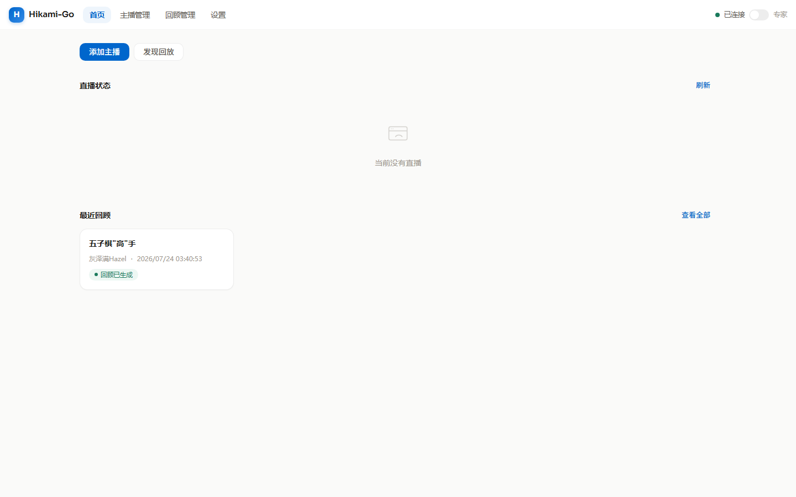
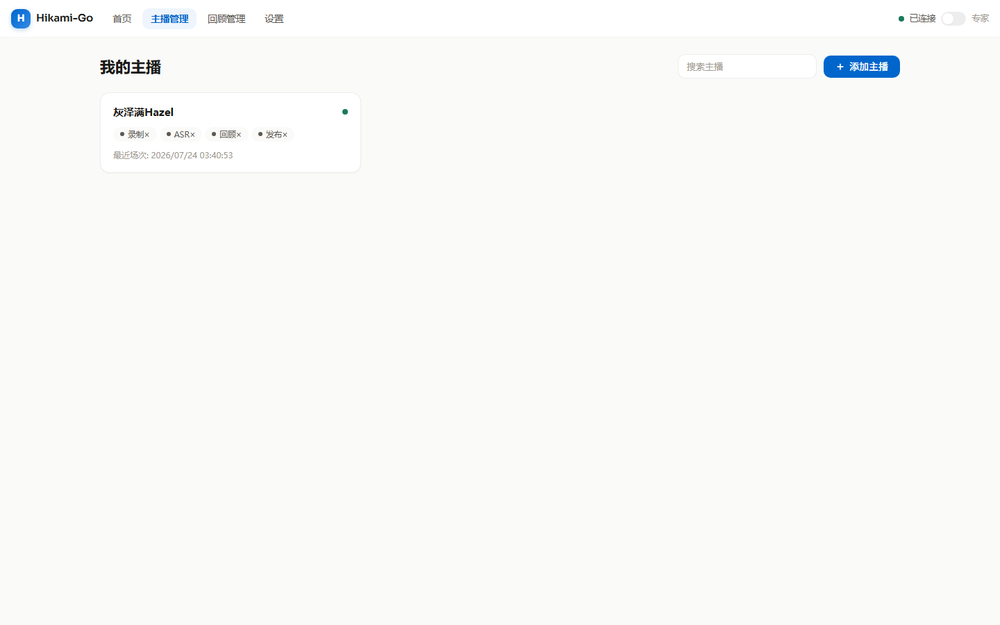
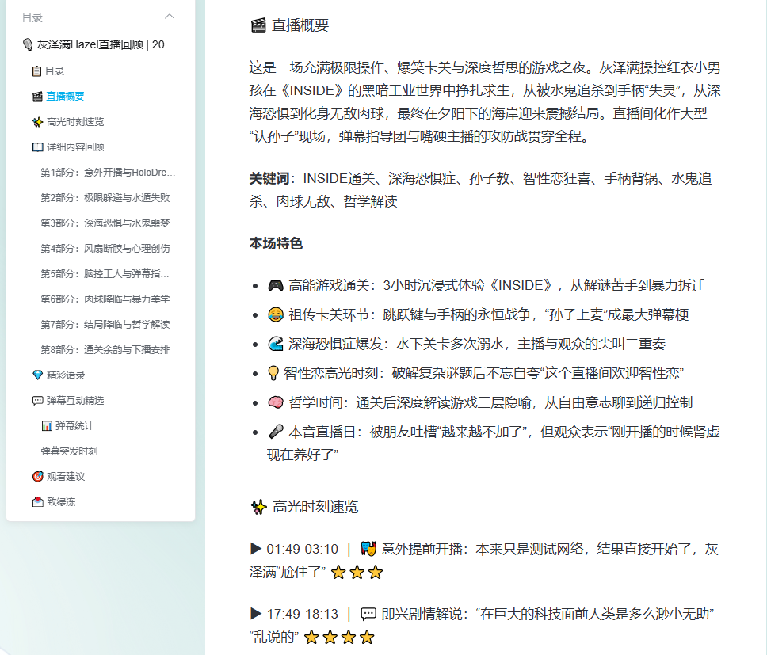
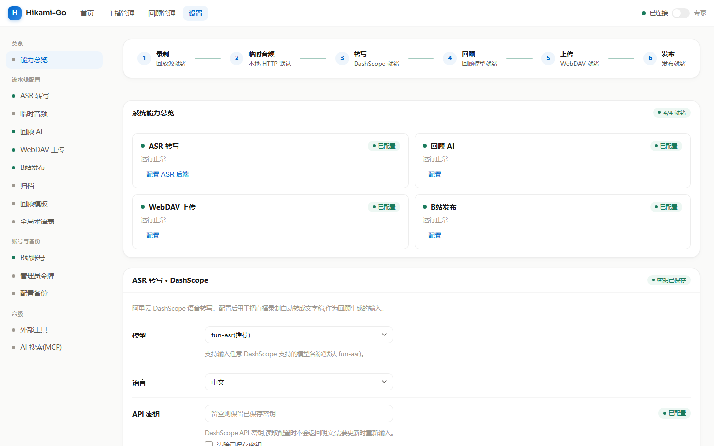

# Hikami-Go · 你好神!Golang 直播 AI 回顾生成工具

> 中文名「你好神」取自 **Hi-kami**(Hi=你好,kami=神)的双关。

**帮你把 B 站主播的直播音频录下来、转成文字、再自动写成一篇回顾文章,发到 B 站专栏。**

从直播结束到专栏发布,全流程在一个本地网页里点几下就能完成 —— 不用手动剪辑、不用手写回顾、不用多个软件来回倒腾。

## 它能帮你做什么

- 🎙️ **录直播** — 直播开始自动录制音频和弹幕,错过也不怕;支持断线重连、风控冷却、0 字节僵尸分段自动收尾
- 📥 **存回放** — 自动发现并下载 B 站回放(单 P / 多 P 都行),本地音频文件也能手动导入,URL 直接下载也行
- 🔤 **转文字** — DashScope 通义听悟把录音转成带时间轴的字幕,作为回顾生成的输入;转写前自动裁掉静音段(VAD),省 3-10% 计费时长
- ✍️ **写回顾** — AI(DeepSeek / 通义 / Claude / OpenAI 兼容接口)结合弹幕氛围,自动写出一篇结构完整的直播回顾(概要 / 高光时刻 / 详细内容 / 精彩语录 / 观看建议)
- 🌐 **AI 联网查证** — 内置 MCP 搜索工具(Brave / Tavily),回顾生成时 AI 可主动联网核实术语、人名、事件,减少胡编
- 📚 **术语表** — 按主播维护专属术语表(人名 / 游戏术语不再转错),支持 AI + 搜索自动发现新词候选、批量复核
- 📤 **发专栏** — 一键发布到 B 站专栏,支持草稿、自定义封面、分区、文集;下载 / 发布可走不同账号
- 🗂️ **存网盘** — 录音文件自动归档到 WebDAV 网盘,不占本地空间

## 谁适合用

- 经常看直播、不想错过精彩内容的 **B 站主播粉丝**
- 想快速定位直播精彩时刻、做切片的 **直播切片员**

## 快速开始

### 1. 准备环境

需要先装好这些(程序会调用它们):

- **必须**:`ffmpeg`、`ffprobe`(音视频处理,缺失会启动失败)
- **可选(按需启用)**:`yt-dlp`(回放下载 / 发现 / 多 P 回退)、`rclone`(WebDAV / ASR 临时目录未配内置后端时的后备)

> 项目已用 Go 实现了下载(native)、WebDAV 上传、ASR 临时文件上传的内置后端,`yt-dlp` / `rclone` 仅在不支持的场景作 fallback。缺失只降级对应能力(启动时探测并在健康检查暴露),不影响其他功能。

### 2. 构建 & 运行

```bash
make build        # 构建前端 + 编译程序
cp config.example.yaml config.yaml
# 编辑 config.yaml,至少填 output_root(存录播的目录)
make run          # 启动
```

启动后浏览器打开 **http://127.0.0.1:6334** 就是管理界面。

**Windows 用户**:可直接到 [Releases](../../releases) 下载预编译的单文件 exe,无需命令行。裁剪版 ffmpeg 只编译了本项目用到的 demuxer / 转码器(录制流复制不编码、仅 normalize/importer 需编码器),体积约完整版的 1/8。

#### 该下哪个版本?

Releases 里有 4 个 Windows 产物,按你的使用场景对号入座:

| 产物 | 适用场景 | 说明 |
|------|----------|------|
| **`hikami-windows-amd64-desktop-ffmpeg.exe`** ✨推荐 | 自己电脑日常挂着录直播 | 双击运行,**托盘图标 + 无黑窗**,自带 ffmpeg,开箱即用 |
| `hikami-windows-amd64-desktop.exe` | 同上,但机器已装 ffmpeg | 比上面少 3M(去掉内嵌 ffmpeg),其余完全一样 |
| **`hikami-windows-amd64-ffmpeg.exe`** | 服务器 / 后台跑、命令行操作 | 普通控制台程序,自带 ffmpeg,日志打 stdout |
| `hikami-windows-amd64.exe` | 同上,但服务器已装 ffmpeg | 去掉内嵌 ffmpeg 的控制台版(最精简) |

> **命名约定**:`-ffmpeg` = 内嵌了 ffmpeg(无需另装,开箱即用);无后缀 = 不内嵌(需系统已装 ffmpeg,体积更小)。`-desktop` = 托盘 + 隐藏黑窗(双击运行)。所有版本**功能完全一样**,只是 ffmpeg 来源和运行形态不同。不确定就选 `hikami-windows-amd64-desktop-ffmpeg.exe`。

#### 双击运行(desktop 版)

下载 `*-desktop-ffmpeg.exe`(或机器已装 ffmpeg 则用 `*-desktop.exe`)后双击,任务栏右下角出现托盘图标 → 右键「打开管理界面」即可。日志在 `%LOCALAPPDATA%\Hikami-Go\hikami.log`。

#### 命令行运行 / 后台服务(非 desktop 版)

```bash
# 命令行直接跑(日志打到终端)
hikami-windows-amd64-ffmpeg.exe -config config.yaml

# 后台服务:推荐用 NSSM 包装成 Windows Service
# 下载 NSSM → nssm install hikami → 填 exe 路径和参数 → 自动开机启动 + 崩溃重启
```

> ⚠️ **无显示器 / 无桌面会话的 Windows 服务器(如 Server Core、以 Service 跑)请务必用非 desktop 版**。desktop 版依赖系统托盘(Win32 `Shell_NotifyIcon`),在没有桌面会话时无法创建托盘图标,关闭流程会走不通。非 desktop 版走信号监听(`SIGTERM`),能被服务管理器优雅关闭。
>
> 📝 **MCP stdio server 小提示**:Windows 上配置 stdio 传输的自定义 MCP server 时,子进程由 MCP 库内部启动,可能偶现控制台窗口闪一下(无法隐藏),不影响功能;介意的话优先用 http/sse 传输的 server。

### 3. 填好 AI 能力(可选但推荐)

回顾和转写需要 AI 服务,在网页「设置」里填 API Key 即可:

- **转写**:阿里云 DashScope(通义听悟)
- **写回顾**:任意 OpenAI 兼容接口 / Anthropic / 本地 CLI

> 默认只监听本机(127.0.0.1)。如果要从别的电脑访问,务必在 `config.yaml` 里设置 `web.admin_token` 加密码,否则任何人都能操作你的后台。

## 界面与操作

打开网页就是一个管理后台,主要四个页面:

- **首页** — 直播状态总览、最近回顾、系统就绪情况、月度统计
- **主播** — 添加 B 站主播,配置自动录制 / 转写 / 发布开关;每个主播可独立设置发布账号、文集、回顾模型、术语表
- **回顾** — 每场直播的完整生命周期:录音 → 转写 → 回顾 → 发布,点点点走完;失败场次有重试 / 重置入口
- **设置** — AI 配置、B 站登录、术语表、回顾模板、网盘、发布参数、VAD 静音裁剪、MCP AI 搜索、配置备份导入导出

操作上就是「选中一场直播 → 点按钮一步步往下走」,全程 WebSocket 实时进度,不用盯着命令行。

### 📸 界面长什么样

<table>
  <tr>
    <td width="50%" align="center"><b>🏠 首页</b> · 直播状态 / 最近回顾 / 系统能力 / 统计仪表板</td>
    <td width="50%" align="center"><b>👥 主播管理</b> · 每个主播独立配置录制 / 转写 / 发布</td>
  </tr>
  <tr>
    <td width="50%"></td>
    <td width="50%"></td>
  </tr>
  <tr>
    <td width="50%" align="center"><b>📋 回顾列表</b> · 录播 / 回放双 tab · 失败场次一键重试</td>
    <td width="50%" align="center"><b>📖 AI 回顾 · Markdown 源码</b> · AI 生成的 md 格式回顾,可直接编辑</td>
  </tr>
  <tr>
    <td width="50%"></td>
    <td width="50%"></td>
  </tr>
  <tr>
    <td width="100%" align="center" colspan="2"><b>⚙️ 设置</b> · 总览 / 流水线配置 / 账号 / 备份 / 高级(MCP AI 搜索)</td>
  </tr>
  <tr>
    <td width="100%" colspan="2"></td>
  </tr>
</table>

> 截图为实际运行界面。所有页面共用同一套设计系统(token 驱动),风格统一。

## 文档

- 📋 [完整 API 路由清单](./CLAUDE-detail/api-routes.md) — 给二次开发 / 接入用
- 🏗️ [前端架构说明](./docs/FRONTEND_ARCHITECTURE.md)
- 🔄 [业务流程](./docs/BUSINESS_FLOW.md) / [数据流](./docs/data-flow.md)
- 🔧 [开发指南](./CLAUDE-detail/development.md)
- 📐 [OpenAPI 文档](./docs/api/) — Swagger UI

---

<details>
<summary><b>🛠️ 开发者信息(技术栈 / 项目结构)</b></summary>

### 技术栈

| 组件 | 选型 |
|------|------|
| 后端 | Go 1.25.5 + Gin + gorilla/websocket |
| 数据库 | SQLite(纯 Go,无需 CGO) |
| 配置 | Viper (YAML) + 运行时覆盖持久化 |
| 前端 | Vue 3 + 自建 H* 组件库 + Pinia + Vite |
| 外部工具 | ffmpeg / ffprobe(必需);yt-dlp / rclone(可选,按需启用) |
| AI | DashScope ASR + OpenAI 兼容 / Anthropic 回顾 + MCP 搜索工具(Brave / Tavily) |
| 桌面 | Windows 系统托盘 + 隐藏控制台 + 文件日志(可选 build tag) |

### 数据流

```
录制/下载/导入 --> 标准化 --> 静音裁剪(VAD) --> 转写(ASR) --> AI回顾(+MCP搜索) --> 网盘归档 --> 专栏发布
```

### 项目结构

```
cmd/hikami/           程序入口(main + 自动触发链 + Windows 托盘)
internal/             后端各模块,按职责分层:
                      入口编排    config / db / handler / runtime / worker / scheduler
                      生命周期    channel / session / state / live_record / discover
                      处理管道    download → normalize → asr → recap → upload → publisher → archive
                      AI 能力     aiprovider / mcp / glossary
                      支撑        biliutil / secrets / runtimeconfig / notify / fsutil / executil
web/                  Vue 3 前端源码
CLAUDE-detail/        API 路由、开发、测试等详细文档
docs/                 架构与设计文档(含 screenshots/ 界面截图)
```

### 开发命令

```bash
make web-dev       # 前端热更新开发模式
make test          # go test ./...
make fmt           # gofmt
make tidy          # go mod tidy
make web-build     # 构建前端嵌入用 UI 包
```

</details>

## 许可证

GPL-3.0(详见 [LICENSE](./LICENSE))

> 界面字体使用 [Sora](https://github.com/JonathanMoon/Sora)(OFL 1.1),许可证随二进制分发,源码见 [web/public/fonts/LICENSE.txt](./web/public/fonts/LICENSE.txt)。
