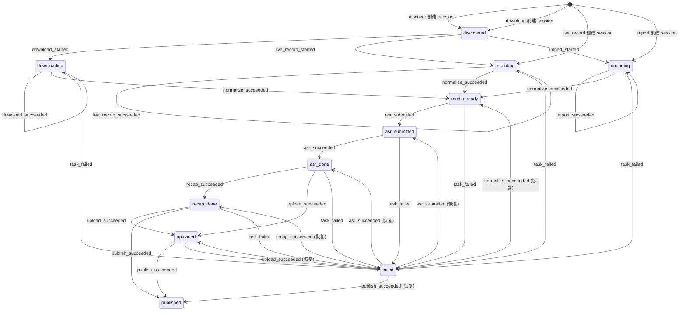
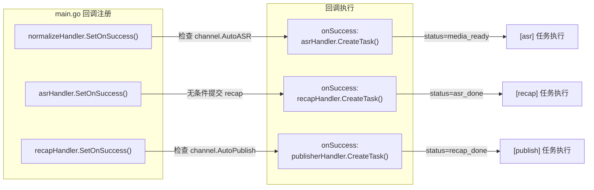
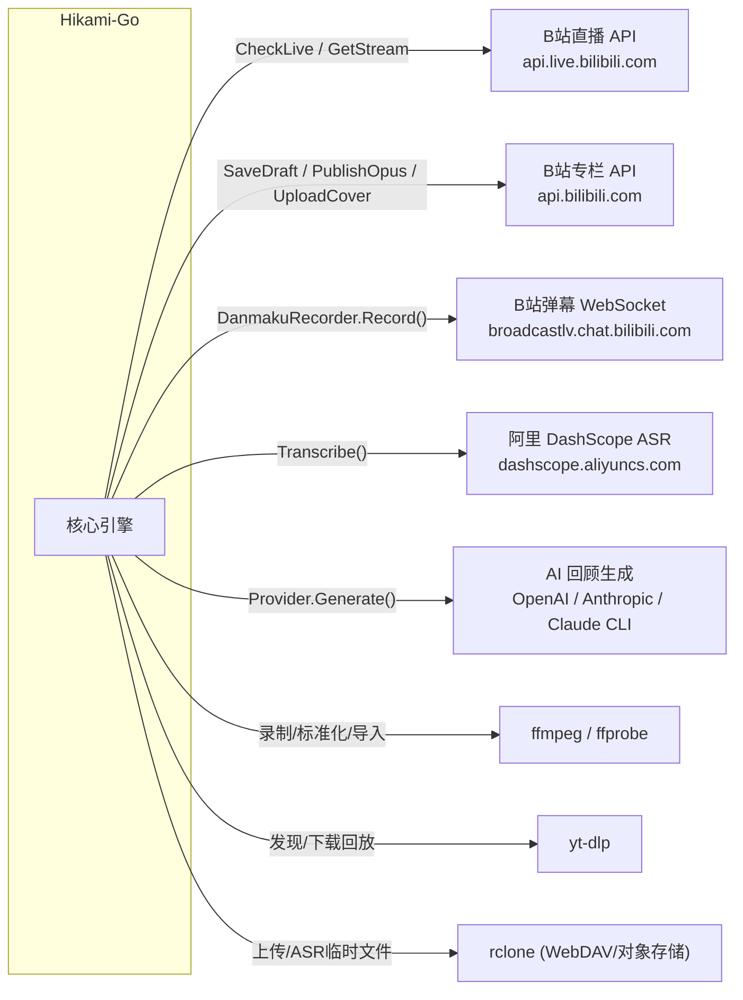

# Hikami-Go 业务流程图

本文档基于源码分析，详细描述 Hikami-Go 系统的两大核心业务流程：**直播录制流程** 和 **回放发现/手动导入流程**。

---

## 一、状态机总览

Session 贯穿整个生命周期，状态由 `internal/state/state.go` 中的有限状态机管理。



### 状态说明

| 状态 | 含义 |
|------|------|
| `discovered` | 回放已发现，等待下载 |
| `downloading` | 回放音频下载中（yt-dlp） |
| `recording` | 直播录制中（ffmpeg） |
| `importing` | 手动导入文件转换中（ffmpeg） |
| `media_ready` | 音频已标准化，可以进行 ASR |
| `asr_submitted` | ASR 任务已提交给 DashScope |
| `asr_done` | ASR 转写完成 |
| `recap_done` | AI 回顾文档生成完成 |
| `uploaded` | 已上传至远程存储（WebDAV/rclone） |
| `published` | 已发布为 B 站专栏 |
| `failed` | 任意环节失败 |

---

## 二、流程一：直播录制流程

```mermaid
flowchart TD
    subgraph trigger["触发层 [scheduler]"]
        CRON1["cron: live_check<br/>配置: cfg.Cron.LiveCheck"]
        CRON1 --> CHECK_ALL["CheckAndStartAll()"]
    end

    subgraph live_check["直播检查 [live_record]"]
        CHECK_ALL --> LOOP_CH["遍历所有 channel"]
        LOOP_CH --> CHECK_ENABLED{"channel.Enabled<br/>且 LiveRoomID > 0?"}
        CHECK_ENABLED -- 否 --> SKIP["跳过该 channel"]
        CHECK_ENABLED -- 是 --> ALREADY_REC{"已在录制?<br/>active[channelID]"}
        ALREADY_REC -- 是 --> STATUS_REC["返回 Recording=true"]
        ALREADY_REC -- 否 --> CHECK_LIVE["BiliClient.CheckLive()<br/>调用 B站 API<br/>GET /xlive/web-room/v1/index/getInfoByRoom"]
        CHECK_LIVE --> IS_LIVE{"info.Live == true?"}
        IS_LIVE -- 否 --> STATUS_NOT_LIVE["返回 Live=false"]
        IS_LIVE -- 是 --> AUTO_REC{"channel.AutoRecord?"}
        AUTO_REC -- 否 --> STATUS_LIVE["返回 Live=true（不自动录制）"]
        AUTO_REC -- 是 --> START_REC["Manager.Start()"]
    end

    subgraph session_create["Session 创建 [session]"]
        START_REC --> CREATE_SESSION["sessions.CreateLive()<br/>创建 live 类型 session"]
        CREATE_SESSION --> ENQUEUE_TASK["workers.Enqueue()<br/>type=live_record<br/>payload={room_id}"]
    end

    subgraph recording["录制处理 [live_record]"]
        ENQUEUE_TASK --> HANDLE_TASK["HandleTask()<br/>Worker Pool 执行"]
        HANDLE_TASK --> STATE_REC_START["state.Apply(live_record_started)<br/>→ recording"]
        STATE_REC_START --> SELECT_STREAM["selectStream()<br/>BiliClient.GetStream()<br/>GET /xlive/web-room/v2/index/getRoomPlayInfo<br/>优先混合流，ffmpeg 丢弃视频轨"]
        SELECT_STREAM -->|"获取失败"| FAIL1["state.Apply(task_failed)<br/>→ failed"]
        SELECT_STREAM -->|"成功"| MKDIR_RAW["创建 raw/ 目录<br/>写入 live.raw.json"]
        MKDIR_RAW --> RECORD_DANMAKU{"channel.RecordDanmaku<br/>或 cfg.LiveRecord.RecordDanmaku?"}
        RECORD_DANMAKU -- 是 --> DM_REC["goroutine: DanmakuRecorder.Record()<br/>WebSocket wss://broadcastlv.chat.bilibili.com:2245/sub<br/>输出 raw/danmaku.jsonl"]
        RECORD_DANMAKU -- 否 --> AUDIO_ONLY
        DM_REC --> AUDIO_ONLY["FFmpegRecorder.Record()<br/>HTTP 流 → ffmpeg stdin → raw/audio.{container}<br/>-vn -c:a copy"]
        AUDIO_ONLY -->|"stream EOF / 正常结束"| REC_DONE["state.Apply(live_record_succeeded)<br/>→ recording"]
        AUDIO_ONLY -->|"ctx.Cancel() 手动停止"| REC_CANCEL["同上: live_record_succeeded"]
        AUDIO_ONLY -->|"ffmpeg 错误"| FAIL2["state.Apply(task_failed)<br/>→ failed"]
    end

    subgraph normalize_step["标准化 [normalize]"]
        REC_DONE --> ENQ_NORM["workers.Enqueue()<br/>type=normalize"]
        REC_CANCEL --> ENQ_NORM
        ENQ_NORM --> NORM_TASK["HandleTask()"]
        NORM_TASK --> FIND_RAW["findRawAudio()<br/>查找 raw/audio.m4a 或其他 audio.*"]
        FIND_RAW --> CONVERT["FFmpegConverter.Convert()<br/>raw/audio → asr/audio.asr.mp3<br/>-vn -ac 1 -ar 16000 -b:a 64k -f mp3"]
        CONVERT --> NORM_DM["normalizeDanmaku()<br/>优先级: danmaku.jsonl > danmaku.xml > danmaku_parts/"]
        NORM_DM --> WRITE_META["写入 package/metadata.json<br/>写入 package/danmaku.json"]
        WRITE_META --> STATE_NORM["state.Apply(normalize_succeeded)<br/>→ media_ready"]
    end

    subgraph auto_asr_check["自动 ASR 决策"]
        STATE_NORM --> AUTO_ASR{"normalize onSuccess 回调<br/>channel.AutoASR?"}
        AUTO_ASR -- 否 --> WAIT_MANUAL_ASR["等待手动触发 ASR"]
        AUTO_ASR -- 是 --> ASR_CAP{"runtime.Capabilities.ASRSubmit?"}
        ASR_CAP -- 不可用 --> SKIP_ASR["日志警告，跳过"]
        ASR_CAP -- 可用 --> ASR_CREATE["asrHandler.CreateTask()"]
    end

    subgraph asr_step["ASR 转写 [asr + dashscope]"]
        ASR_CREATE --> ASR_TASK["HandleTask()"]
        WAIT_MANUAL_ASR --> API_ASR["API: POST /api/sessions/:sid/asr/submit"]
        API_ASR --> ASR_TASK
        ASR_TASK --> STATE_ASR_SUB["state.Apply(asr_submitted)<br/>→ asr_submitted"]
        STATE_ASR_SUB --> ASR_EXEC["Transcriber.Transcribe()"]
        ASR_EXEC -->|"LocalTranscriber"| LOCAL_ASR["本地占位结果"]
        ASR_EXEC -->|"DashScopeTranscriber"| DS_PUBLISH["rclone copyto<br/>上传 asr/audio.asr.mp3 至临时公开存储"]
        DS_PUBLISH --> DS_SUBMIT["POST DashScope ASR API<br/>提交转写任务"]
        DS_SUBMIT --> DS_POLL["轮询任务状态（每 5s，最多 120 次）"]
        DS_POLL -->|"SUCCEEDED"| DS_FETCH["获取转写结果 URL"]
        DS_POLL -->|"FAILED/CANCELED"| FAIL_ASR["state.Apply(task_failed)"]
        DS_POLL -->|"超时"| FAIL_ASR
        DS_FETCH --> DS_PARSE["解析 transcript + segments + SRT"]
        LOCAL_ASR --> ASR_WRITE
        DS_PARSE --> ASR_WRITE["写入产物:<br/>package/transcript.txt<br/>package/transcript.srt<br/>package/segments.json<br/>asr/result.raw.json"]
        ASR_WRITE --> STATE_ASR_DONE["state.Apply(asr_succeeded)<br/>→ asr_done"]
    end

    subgraph auto_recap["自动 Recap 决策"]
        STATE_ASR_DONE --> ASR_SUCCESS_CB["asrHandler.onSuccess 回调<br/>自动提交 recap 任务"]
    end

    subgraph recap_step["AI 回顾生成 [recap]"]
        ASR_SUCCESS_CB --> RECAP_TASK["HandleTask()"]
        RECAP_TASK --> READ_TRANSCRIPT["读取 package/transcript.txt"]
        READ_TRANSCRIPT --> READ_DM["读取 package/danmaku.json<br/>analyzeDanmaku() 弹幕密度分析"]
        READ_DM --> READ_META2["读取 package/metadata.json"]
        READ_META2 --> BUILD_PROMPT["buildPrompt()<br/>拼接: 基本信息 + 格式要求 + 术语校正 + 弹幕分析 + 转写原文"]
        BUILD_PROMPT --> GEN_PROVIDER["Provider.Generate()"]
        GEN_PROVIDER -->|"OpenAI Compatible"| OPENAI_CALL["POST {BaseURL}/chat/completions<br/>Bearer {APIKey}"]
        GEN_PROVIDER -->|"Anthropic"| ANTHROPIC_CALL["Anthropic API"]
        GEN_PROVIDER -->|"Claude CLI"| CLAUDE_CLI["claude CLI 本地调用"]
        GEN_PROVIDER -->|"Codex CLI"| CODEX_CLI["codex CLI 本地调用"]
        GEN_PROVIDER -->|"LocalProvider"| LOCAL_RECAP["本地占位结果"]
        OPENAI_CALL --> WRITE_RECAP
        ANTHROPIC_CALL --> WRITE_RECAP
        CLAUDE_CLI --> WRITE_RECAP
        CODEX_CLI --> WRITE_RECAP
        LOCAL_RECAP --> WRITE_RECAP["写入产物:<br/>recap/live-recap.prompt.md<br/>recap/{slug}.md<br/>recap/{slug}_bilibili.txt<br/>recap/live-recap.raw.json"]
        WRITE_RECAP --> STATE_RECAP["state.Apply(recap_succeeded)<br/>→ recap_done"]
    end

    subgraph auto_publish_check["自动发布决策"]
        STATE_RECAP --> AUTO_PUB{"recap onSuccess 回调<br/>channel.AutoPublish?"}
        AUTO_PUB -- 否 --> MANUAL_UPLOAD["等待手动触发 upload/publish"]
        AUTO_PUB -- 是 --> PUB_CAP{"runtime.Capabilities.PublishOpus?"}
        PUB_CAP -- 不可用 --> SKIP_PUB["日志警告，跳过"]
        PUB_CAP -- 可用 --> PUB_CREATE["publisherHandler.CreateTask()"]
    end

    subgraph upload_step["上传 [upload]"]
        MANUAL_UPLOAD -->|"API: POST /api/sessions/:sid/upload"| UPLOAD_TASK
        PUB_CREATE -->|"也可先上传"| UPLOAD_TASK["HandleTask()<br/>rclone copy {sessionDir} {remote}"]
        UPLOAD_TASK --> STATE_UPLOAD["state.Apply(upload_succeeded)<br/>→ uploaded"]
        STATE_UPLOAD --> CLEANUP["cleanupSession()<br/>策略: none / temp / generated / all"]
    end

    subgraph publish_step["B站专栏发布 [publisher]"]
        MANUAL_UPLOAD -->|"API: POST /api/sessions/:sid/publish"| PUB_TASK
        PUB_CREATE --> PUB_TASK["HandleTask()"]
        PUB_TASK --> LOAD_COOKIE["LoadCookie(channel.CookieFile)"]
        LOAD_COOKIE --> FIND_MD["findRecapMarkdown(recap/)<br/>查找最新 .md 文件"]
        FIND_MD --> CONVERT_OPUS["ConvertMarkdownToOpus()<br/>Markdown → B站专栏段落结构"]
        CONVERT_OPUS --> COVER_IMG{"recap/ 目录有封面图?"}
        COVER_IMG -- 是 --> UPLOAD_COVER["UploadCover()<br/>POST /x/article/creative/article/upcover"]
        COVER_IMG -- 否 --> SAVE_DRAFT
        UPLOAD_COVER --> SAVE_DRAFT["SaveDraft()<br/>POST /x/dynamic/feed/article/draft/add"]
        SAVE_DRAFT --> PUB_MODE{"publish Mode?<br/>publish / draft"}
        PUB_MODE -->|"draft"| DRAFT_DONE["保存草稿，publishTarget=draft:{id}"]
        PUB_MODE -->|"publish"| PUB_OPUS["PublishOpus()<br/>POST /x/dynamic/feed/create/opus"]
        PUB_OPUS --> PUB_DONE["publishTarget=dyn_id"]
        DRAFT_DONE --> STATE_PUB["state.Apply(publish_succeeded)<br/>→ published"]
        PUB_DONE --> STATE_PUB
    end

    style trigger fill:#e1f5fe
    style live_check fill:#e3f2fd
    style session_create fill:#f3e5f5
    style recording fill:#fff3e0
    style normalize_step fill:#e8f5e9
    style auto_asr_check fill:#fce4ec
    style asr_step fill:#f1f8e9
    style auto_recap fill:#fce4ec
    style recap_step fill:#ede7f6
    style auto_publish_check fill:#fce4ec
    style upload_step fill:#e0f2f1
    style publish_step fill:#fbe9e7
    style FAIL1 fill:#ffcdd2
    style FAIL2 fill:#ffcdd2
    style FAIL_ASR fill:#ffcdd2
    style SKIP fill:#f5f5f5
    style SKIP_ASR fill:#f5f5f5
    style SKIP_PUB fill:#f5f5f5
    style WAIT_MANUAL_ASR fill:#f5f5f5
    style MANUAL_UPLOAD fill:#f5f5f5
```



---

## 三、流程二：回放发现与手动导入流程

```mermaid
flowchart TD
    subgraph discover_trigger["触发层 [scheduler / API]"]
        CRON2["cron: discovery<br/>配置: cfg.Cron.Discovery"]
        API_DISC["API: POST /api/sessions/discover"]
        CRON2 --> DISC_ALL["discoverManager.DiscoverAll()"]
        API_DISC --> DISC_ALL
    end

    subgraph discover_step["回放发现 [discover]"]
        DISC_ALL --> LOOP_CH2["遍历所有 channel"]
        LOOP_CH2 --> CH_FILTER{"channel.Enabled<br/>且 ReplaySourceURL 非空?"}
        CH_FILTER -- 否 --> SKIP2["跳过"]
        CH_FILTER -- 是 --> YT_LIST["YTDLPLister.List()<br/>yt-dlp --dump-json --flat-playlist<br/>外部调用: yt-dlp"]
        YT_LIST --> ENTRY_LOOP["遍历发现的 entries"]
        ENTRY_LOOP --> TITLE_FILTER{"TitlePrefix 匹配?"}
        TITLE_FILTER -- 否 --> SKIP_ENTRY["跳过该条目"]
        TITLE_FILTER -- 是 --> CREATE_DL_SESSION["sessions.CreateDownload()<br/>去重: 同 channel+sourceID 不重复创建"]
        CREATE_DL_SESSION -->|"已存在"| SKIP_EXIST["跳过，不创建新任务"]
        CREATE_DL_SESSION -->|"新创建"| ENQ_DL["workers.Enqueue()<br/>type=download"]
    end

    subgraph download_step["回放下载 [download]"]
        ENQ_DL --> DL_TASK["HandleTask()"]
        DL_TASK --> STATE_DL_START["state.Apply(download_started)<br/>→ downloading"]
        STATE_DL_START --> CHECK_MULTIP["listPlaylist()<br/>yt-dlp --dump-json --flat-playlist"]
        CHECK_MULTIP -->|"单P或获取失败"| DL_SINGLE["downloadSingleP()<br/>yt-dlp --no-playlist -x --audio-format m4a<br/>--write-info-json<br/>输出 raw/audio.{ext}"]
        CHECK_MULTIP -->|"多P"| DL_MULTI["downloadMultiP()<br/>逐P下载至 raw/parts/pNNN/"]
        DL_MULTI --> PROBE_DUR["ffprobe 探测每P时长"]
        PROBE_DUR --> CONCAT["ffmpeg concat 合并为 raw/audio.m4a"]
        CONCAT --> WRITE_PARTS["写入 raw/part_durations.json<br/>移动弹幕至 raw/danmaku_parts/<br/>移动元数据至 raw/metadata_parts/"]
        DL_SINGLE --> RENAME_META["normalizeMetadataName()<br/>重命名 .info.json → metadata.ytdlp.json"]
        WRITE_PARTS --> STATE_DL_OK["state.Apply(download_succeeded)<br/>→ downloading（中间状态）"]
        RENAME_META --> STATE_DL_OK
        STATE_DL_OK --> ENQ_NORM2["workers.Enqueue()<br/>type=normalize"]
    end

    subgraph import_trigger["手动导入 [API]"]
        API_IMPORT["API: POST /api/sessions/import<br/>multipart: media + danmaku"]
        API_IMPORT --> CREATE_IMP_SESSION["sessions.CreateImport()"]
        CREATE_IMP_SESSION --> SAVE_FILES["保存文件:<br/>raw/import.source.{ext}<br/>raw/danmaku.jsonl (可选)<br/>raw/import.raw.json"]
        SAVE_FILES --> ENQ_IMP["workers.Enqueue()<br/>type=import"]
    end

    subgraph import_step["导入处理 [importer]"]
        ENQ_IMP --> IMP_TASK["HandleTask()"]
        IMP_TASK --> STATE_IMP_START["state.Apply(import_started)<br/>→ importing"]
        STATE_IMP_START --> FIND_SRC["findImportSource()<br/>查找 raw/import.source.*"]
        FIND_SRC --> FF_CONV["FFmpegConverter.Convert()<br/>import.source → raw/audio.m4a<br/>-vn -c:a aac"]
        FF_CONV --> STATE_IMP_OK["state.Apply(import_succeeded)<br/>→ importing（中间状态）"]
        STATE_IMP_OK --> ENQ_NORM3["workers.Enqueue()<br/>type=normalize"]
    end

    subgraph normalize_common["标准化 [normalize]"]
        ENQ_NORM2 --> NORM_TASK2["HandleTask()"]
        ENQ_NORM3 --> NORM_TASK2
        NORM_TASK2 --> FIND_RAW2["findRawAudio()"]
        FIND_RAW2 --> CONVERT2["ffmpeg: raw/audio.* → asr/audio.asr.mp3<br/>-vn -ac 1 -ar 16000 -b:a 64k"]
        CONVERT2 --> NORM_DM2["normalizeDanmaku()<br/>优先级: .jsonl > .xml > danmaku_parts/"]
        NORM_DM2 --> WRITE_PKG["写入 package/:<br/>metadata.json / danmaku.json"]
        WRITE_PKG --> STATE_NORM2["state.Apply(normalize_succeeded)<br/>→ media_ready"]
    end

    subgraph downstream["后续流程（同流程一）"]
        STATE_NORM2 --> SAME_AS_FLOW1["后续 ASR → Recap → Upload → Publish<br/>与流程一完全相同<br/>参见上方流程一图表"]
    end

    style discover_trigger fill:#e1f5fe
    style discover_step fill:#e3f2fd
    style download_step fill:#fff3e0
    style import_trigger fill:#f3e5f5
    style import_step fill:#fce4ec
    style normalize_common fill:#e8f5e9
    style downstream fill:#f5f5f5
    style SKIP2 fill:#f5f5f5
    style SKIP_ENTRY fill:#f5f5f5
    style SKIP_EXIST fill:#f5f5f5
```



---

## 四、API 触发的手动任务流程

```mermaid
flowchart LR
    subgraph api_layer["API 路由 [handler]"]
        API_SESSIONS["GET /api/sessions<br/>GET /api/sessions/:sid<br/>DELETE /api/sessions/:sid"]
        API_CHANNELS["GET /api/channels<br/>POST /api/channels<br/>PUT /api/channels/:id"]
        API_LIVE_CHECK["POST /api/live/check<br/>GET /api/live/status<br/>GET /api/live/:channel_id/status"]
        API_LIVE_START["POST /api/live/:channel_id/record/start"]
        API_LIVE_STOP["POST /api/live/:channel_id/record/stop"]
        API_DISCOVER2["POST /api/sessions/discover"]
        API_DOWNLOAD2["POST /api/sessions/download"]
        API_IMPORT2["POST /api/sessions/import"]
        API_ASR2["POST /api/sessions/:sid/asr/submit"]
        API_RECAP2["POST /api/sessions/:sid/recap/generate<br/>GET /api/sessions/:sid/recap"]
        API_UPLOAD2["POST /api/sessions/:sid/upload"]
        API_PUBLISH2["POST /api/sessions/:sid/publish"]
        API_TASKS["GET /api/tasks<br/>GET /api/tasks/:id<br/>POST /api/tasks/:id/retry<br/>POST /api/tasks/:id/cancel<br/>DELETE /api/tasks/:id"]
        API_WS["WS /ws<br/>实时任务进度推送"]
    end
```



---

## 五、回调链示意

下图展示了 `normalize → asr → recap → publish` 的自动回调链，这是 Hikami-Go 最重要的自动化机制。



---

## 六、外部服务调用汇总



---

## 七、关键决策点说明

### 1. 自动录制决策 (`auto_record`)

- **位置**: `internal/live_record/manager.go` `CheckAndStartAll()`
- **逻辑**: 定时任务遍历所有 channel，调用 B站 API 检查直播状态。当 `channel.Enabled=true` 且 `channel.LiveRoomID>0` 且 `channel.AutoRecord=true` 时，自动触发录制。
- **不自动录制**: 如果 `AutoRecord=false`，仅返回直播状态信息，不创建录制任务。

### 2. 自动 ASR 决策 (`auto_asr`)

- **位置**: `cmd/hikami/main.go` `normalizeHandler.SetOnSuccess()` 回调
- **逻辑**: normalize 成功后，检查 `channel.AutoASR` 标志。若为 true 且运行时 ASR 能力可用（`runtime.Capabilities.ASRSubmit`），自动提交 ASR 任务。
- **前提条件**: session 状态必须为 `media_ready`，且 `asr/audio.asr.mp3` 文件存在。

### 3. 自动发布决策 (`auto_publish`)

- **位置**: `cmd/hikami/main.go` `recapHandler.SetOnSuccess()` 回调
- **逻辑**: recap 成功后，检查 `channel.AutoPublish` 标志。若为 true 且运行时发布能力可用（`runtime.Capabilities.PublishOpus`），自动提交 publish 任务。
- **前提条件**: session 状态必须为 `recap_done` 或 `uploaded`，且 `recap/` 目录存在 markdown 文件，且 channel 配置了 `CookieFile`。

### 4. 弹幕录制决策 (`record_danmaku`)

- **位置**: `internal/live_record/manager.go` `HandleTask()`
- **逻辑**: 优先使用 `channel.RecordDanmaku`，若未配置则 fallback 到 `cfg.LiveRecord.RecordDanmaku`。弹幕录制通过 goroutine 并发执行，不影响音频录制主流程。
- **错误处理**: 弹幕录制失败仅记日志，不影响录制主任务。

### 5. DashScope ASR 路径决策

- **位置**: `internal/asr/dashscope.go` `NewConfiguredTranscriber()`
- **逻辑**: 当环境变量中存在 API Key 且配置了 `ASRTemp.RcloneRemote` 和 `ASRTemp.PublicBaseURL` 时，使用 `DashScopeTranscriber`；否则 fallback 到 `LocalTranscriber`（占位结果）。
- **模型选择**: 根据配置的模型名自动选择请求格式（`file_url` vs `file_urls`），默认使用 `fun-asr`。

---

## 八、产物文件结构

每个 session 的文件组织如下：

```
{output_root}/{channel_id}/{slug}/
├── raw/                          # 原始素材
│   ├── audio.m4a                 # 录制/下载的原始音频
│   ├── audio.flac                # (可能) flv 录制时的格式
│   ├── live.raw.json             # 直播元数据（录制流程）
│   ├── import.raw.json           # 导入元数据（导入流程）
│   ├── metadata.ytdlp.json       # yt-dlp 下载元数据（回放流程）
│   ├── danmaku.jsonl             # 直播弹幕（JSONL 格式）
│   ├── danmaku.xml               # B站回放弹幕（XML 格式）
│   ├── danmaku_parts/            # 多P弹幕分片
│   │   ├── p001.xml
│   │   └── p002.xml
│   ├── metadata_parts/           # 多P元数据分片
│   ├── parts/                    # 多P下载临时目录（处理后删除）
│   ├── part_durations.json       # 多P时长信息
│   ├── concat.list               # ffmpeg concat 列表（临时）
│   └── import.source.*           # 手动导入的原始文件
├── asr/                          # ASR 相关
│   ├── audio.asr.mp3             # 标准化后的音频（16kHz mono 64kbps）
│   └── result.raw.json           # DashScope 原始结果
├── package/                      # 标准化产物包
│   ├── metadata.json             # 统一元数据
│   ├── danmaku.json              # 标准化弹幕
│   ├── transcript.txt            # ASR 转写文本
│   ├── transcript.srt            # ASR SRT 字幕
│   └── segments.json             # ASR 分段信息
├── recap/                        # AI 回顾
│   ├── live-recap.prompt.md      # 发送给 AI 的 prompt
│   ├── live-recap.raw.json       # AI 原始响应
│   ├── 直播回顾_{slug}.md         # 最终回顾文档
│   ├── 直播回顾_{slug}_bilibili.txt  # B站文本版本
│   ├── cover.png                 # (可选) 封面图
│   └── cover.jpg                 # (可选) 封面图
└── metadata.json                 # 顶层元数据（normalize 输出）
```

---

## 九、Worker 任务系统

所有业务操作均通过 Worker Pool 异步执行，任务类型如下：

| 任务类型 | 模块 | 触发方式 | 状态变化 |
|----------|------|----------|----------|
| `live_record` | live_record | 自动(cron)/手动(API) | `→ recording → recording`(中间) |
| `download` | download | 自动(discover)/手动(API) | `→ downloading → downloading`(中间) |
| `import` | importer | 手动(API) | `→ importing → importing`(中间) |
| `normalize` | normalize | 自动(前置任务成功后) | `→ media_ready` |
| `asr` | asr | 自动(auto_asr)/手动(API) | `→ asr_submitted → asr_done` |
| `recap` | recap | 自动(asr onSuccess)/手动(API) | `→ recap_done` |
| `upload` | upload | 手动(API) | `→ uploaded` |
| `publish` | publisher | 自动(auto_publish)/手动(API) | `→ published` |

### 任务恢复策略

Worker Pool 启动时会恢复上次未完成的任务（`recoverRunning`）：

- `live_record`: 检查 ffmpeg 进程是否存活，存活则保留，否则标记 failed
- `asr_poll` / `upload`: 重新入队执行
- 其他任务: 标记为 failed，允许用户通过 API 重试

---

## 十、错误处理与重试

1. **任务级别重试**: 任何任务失败后状态变为 `failed`，用户可通过 `POST /api/tasks/:id/retry` 手动重试
2. **状态机恢复**: `failed` 状态允许通过正常的事件转换恢复（如再次提交 normalize、ASR 等）
3. **弹幕录制容错**: 弹幕录制失败不影响主录制任务，仅记日志
4. **DashScope 轮询**: ASR 任务最多轮询 120 次（每次间隔 5 秒，总计约 10 分钟），超时则失败
5. **Cookie 过期处理**: B站 API 返回 -101 时标记为 `ErrCookieExpired`，B站内容审核拒绝返回 -403 标记为 `ErrContentRejected`
6. **原子写入**: normalize 和 import 使用 `.tmp` 临时文件 + `os.Rename` 确保产物文件完整性
7. **ffmpeg 优雅停止**: context 取消时发送 SIGTERM 而非 SIGKILL，给 ffmpeg 最多 10 秒写完容器头
