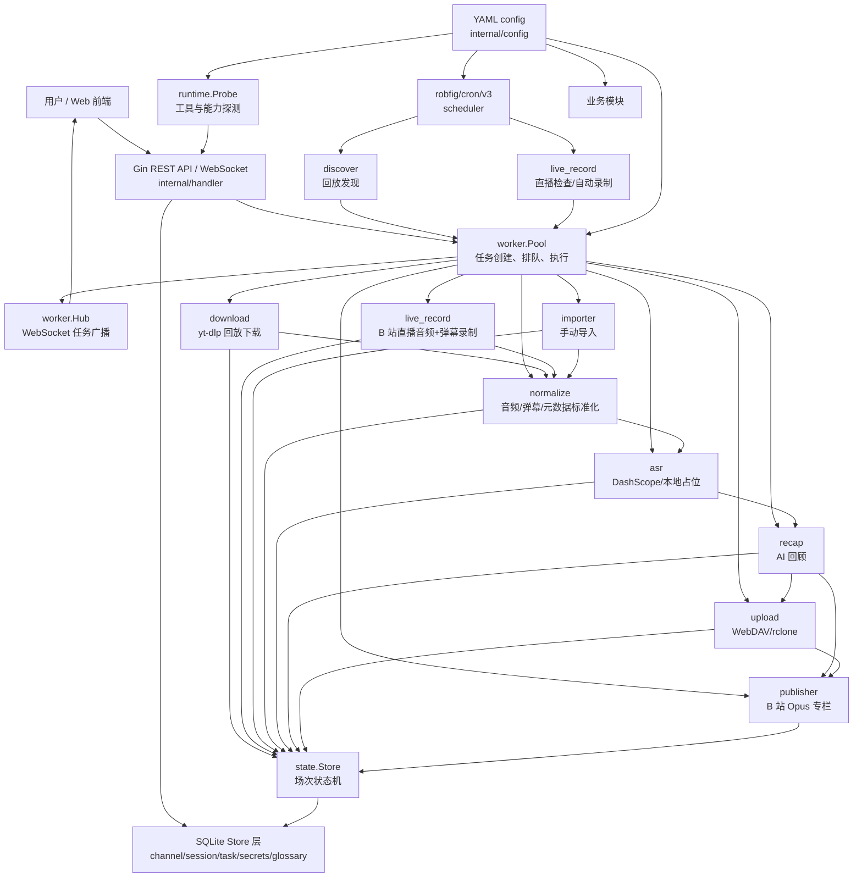
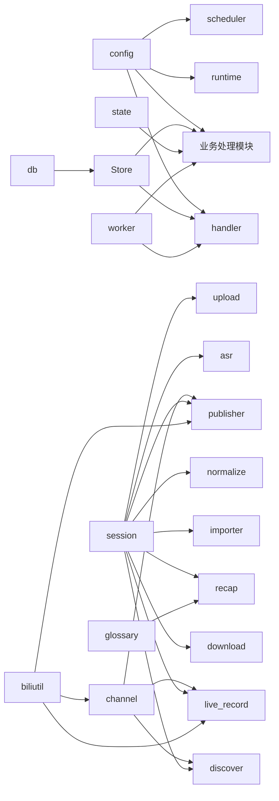
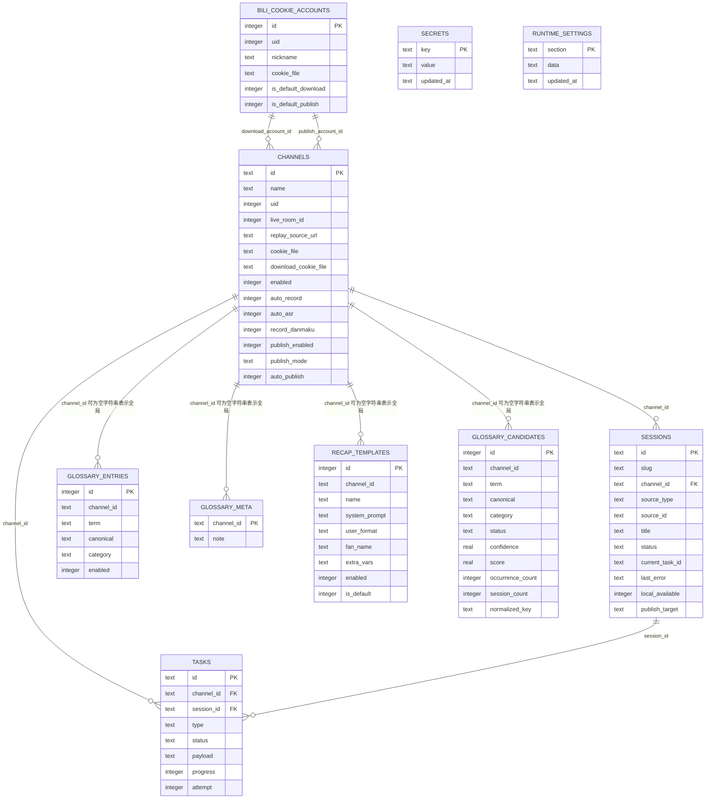
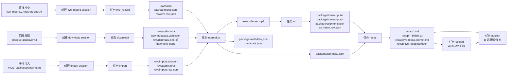
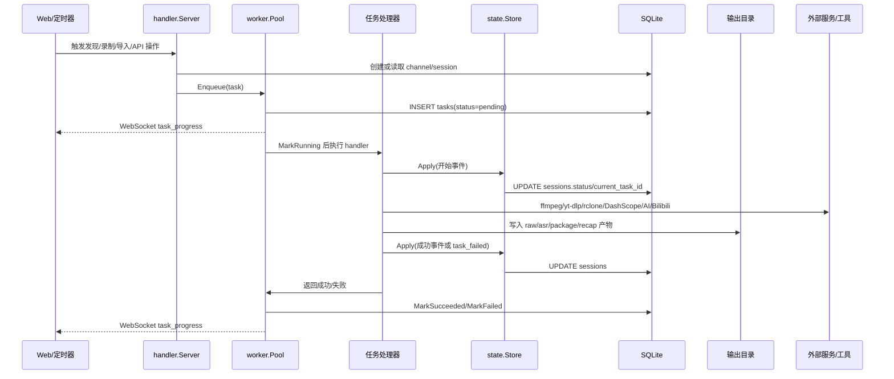
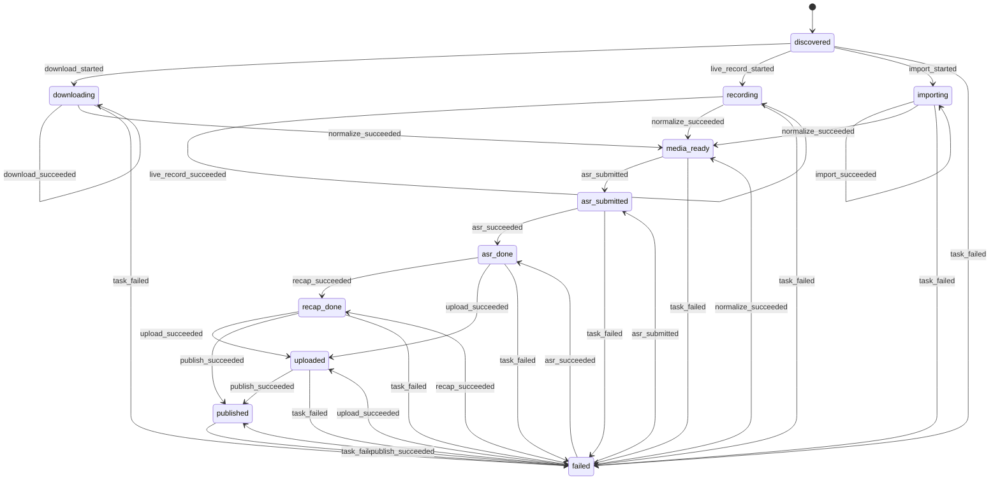
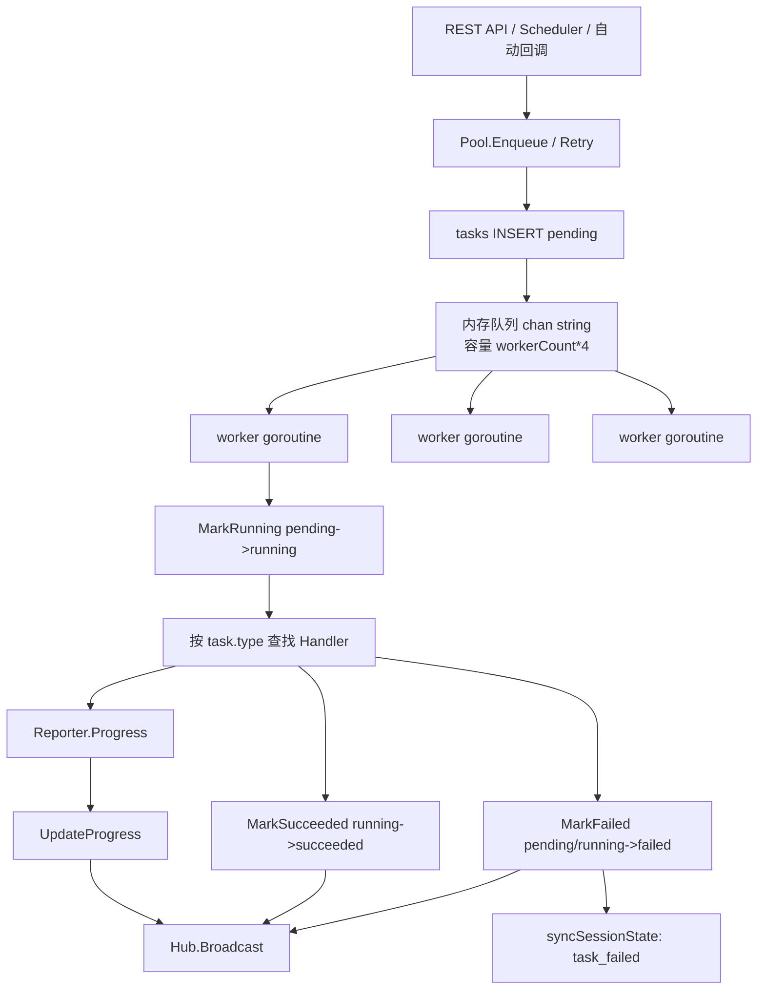

# Hikami-Go 设计文档

本文档基于项目内 `CLAUDE.md`、模块源码、数据库迁移、前端 API 封装和测试文件整理。所有事实性描述均标注到对应源码依据；若历史文档与代码不一致，以当前源码为准。

## 系统概述

### 项目定位

Hikami-Go 是面向 B 站主播和录播维护者的单机自动化直播音频处理服务。系统围绕“来源适配 + 标准化 + 后处理”管道工作，将直播录制、回放发现与下载、手动导入统一汇入同一套 ASR、AI 回顾、WebDAV 归档和 B 站专栏发布流程。

源码依据：`CLAUDE.md`、`README.md`、`cmd/hikami/main.go`

### 目标用户

- B 站主播：自动录制直播音频、归档、生成直播回顾和发布专栏。
- 录播维护者：批量发现回放、下载、标准化、转写、归档。
- 运营或剪辑人员：通过 Web 管理界面查看场次、任务、回顾内容和系统能力状态。

源码依据：`README.md`、`web/CLAUDE.md`、`web/src/views/*.vue`

### 核心价值

- 单机部署：Go 服务、SQLite 单文件数据库、内嵌 Vue SPA。
- 多来源统一：直播录制、回放下载、手动导入都进入 `normalize` 后续管道。
- 状态可控：`internal/state` 统一维护场次生命周期，业务模块只提交事件。
- 异步可观测：`internal/worker` 持久化任务，`Hub` 通过 WebSocket 广播任务进度。
- 可扩展外部集成：ffmpeg、yt-dlp、rclone、DashScope、AI 回顾 Provider、B 站专栏客户端均通过接口封装。

源码依据：`internal/state/state.go`、`internal/worker/*.go`、`internal/*/CLAUDE.md`

## 架构设计

### 总体架构



源码依据：`cmd/hikami/main.go`、`internal/handler/server.go`、`internal/scheduler/scheduler.go`、`internal/worker/worker.go`

### 分层设计

- 入口层：`cmd/hikami/main.go` 负责加载配置、迁移数据库、加载 secrets、导入旧术语表、探测运行时依赖、初始化 Store 与 Handler、注册任务处理器、启动 worker、scheduler 和 HTTP 服务。
- 接入层：`internal/handler/server.go` 暴露 REST API、WebSocket、嵌入式 SPA 静态资源。
- 编排层：`internal/worker` 执行异步任务；`internal/scheduler` 定时触发回放发现和直播检查；`cmd/hikami/main.go` 注册自动 ASR、自动回顾、自动发布回调。
- 领域层：`channel`、`session`、`state`、`discover`、`download`、`live_record`、`importer`、`normalize`、`asr`、`recap`、`upload`、`publisher`、`glossary`、`secrets`。
- 基础设施层：`db`、`config`、`runtime`、`biliutil`，以及外部工具 `ffmpeg`、`ffprobe`（必需）；`yt-dlp`、`rclone`（可选，缺失仅降级对应能力）。
- 前端层：`web` 使用 Vue 3、Pinia、Vue Router、自建 H\* 组件库（18 个 `H*.vue` + `ConfirmHost.vue` = 19 个 Vue 组件；命令式 `HMessage`/`HConfirm`/`HToast`）、Axios、mitt 和 WebSocket。

源码依据：`cmd/hikami/main.go`、`internal/*/CLAUDE.md`、`web/CLAUDE.md`

### 模块依赖关系



源码依据：各模块 import，尤其是 `cmd/hikami/main.go`、`internal/download/download.go`、`internal/live_record/manager.go`、`internal/recap/recap.go`、`internal/publisher/publisher.go`

## 数据模型

### 迁移版本

当前 `internal/db/migrate.go` 的 `migrations` 切片包含 38 个物理迁移元素，业务语义版本到 v35（其中 v35 的 `runtime_settings` 表重建由 4 条 SQL 迁移 CREATE/INSERT/DROP/RENAME 完成，占物理序号 v35-v38）。

| 版本 | 内容 | 影响对象 |
|---:|---|---|
| 1 | 创建 `schema_migrations` | 迁移记录 |
| 2 | 创建 `channels` 基础表 | 主播 |
| 3 | 创建 `sessions` 基础表，关联 `channels(id)` | 场次 |
| 4 | 创建 `sessions_channel_source_uidx` 唯一索引 | 场次去重 |
| 5 | 创建 `sessions_channel_slug_uidx` 唯一索引 | 路径 slug 去重 |
| 6 | 创建 `tasks` 表，关联 `channels(id)` 与 `sessions(id)` | 后台任务 |
| 7 | 创建 `tasks_status_idx` | 任务状态查询 |
| 8 | 创建 `tasks_channel_session_idx` | 主播/场次任务查询 |
| 9 | `channels` 增加 `download_cookie_file` | 下载/识别/录制 Cookie |
| 10 | `channels` 增加 `auto_record` | 自动录制 |
| 11 | `channels` 增加 `auto_asr` | 自动 ASR |
| 12 | 创建 `secrets` | API Key 数据库存储 |
| 13 | `channels` 增加 `record_danmaku` | 弹幕录制开关 |
| 14 | 创建 `glossary_entries` | 术语词条 |
| 15 | 创建 `glossary_entries_channel_term_uidx` | 术语词条去重 |
| 16 | 创建 `glossary_meta` | 全局/主播术语备注 |
| 17 | `channels` 增加发布配置字段：`publish_enabled`、`publish_mode`、`publish_category_id`、`publish_list_id`、`publish_private_pub`、`publish_original`、`auto_publish` | 主播级发布配置 |
| 18 | `channels` 增加发布扩展字段：`publish_aigc`、`publish_timer_pub_time`、`publish_cover_url`、`publish_topics` | AI 声明、定时发布、封面、话题 |
| 19 | `channels` 增加 `source_mode TEXT NOT NULL DEFAULT 'both'` | 直播/回放来源模式开关 |
| 20 | `channels` 增加 `discover_limit INTEGER NOT NULL DEFAULT 0` | 回放发现数量上限 |
| 21 | 创建 `recap_templates` 表（`id`/`channel_id`/`name`/`system_prompt`/`user_format`/`fan_name`/`extra_vars`/`enabled`/`is_default`/`created_at`/`updated_at`） | 回顾模板（全局 + per-channel） |
| 22 | 创建 `recap_templates_channel_name_uidx` 唯一索引 `UNIQUE(channel_id, name)` | 模板去重 |
| 23 | INSERT 内置 default 模板行（`system_prompt='__builtin__'`、`is_default=1`） | 默认模板初始化 |
| 24 | `tasks` 增加 `usage_metadata TEXT NOT NULL DEFAULT '{}'` | 任务用量/成本追踪 |
| 25 | 创建 `bili_cookie_accounts` 表（`id`/`uid` UNIQUE/`nickname`/`cookie_file`/`is_default_download`/`is_default_publish`/`created_at`/`updated_at`） | B 站多账号管理 |
| 26 | `channels` 增加 `download_account_id INTEGER DEFAULT NULL` | 主播关联下载账号 |
| 27 | `channels` 增加 `publish_account_id INTEGER DEFAULT NULL` | 主播关联发布账号 |
| 28 | 创建 `glossary_candidates` 表 + 3 索引（字段含 `term`/`canonical`/`category`/`status` CHECK pending/approved/rejected/`confidence`/`score`/`occurrence_count`/`session_count`/`first_session_id`/`last_session_id`/`reason`/`normalized_key`/`reviewed_at`） | 术语候选发现 |
| 29 | `channels` 增加 `recap_model TEXT NOT NULL DEFAULT ''` | per-channel 回顾模型 |
| 30 | `channels` 增加 `max_continuations INTEGER NOT NULL DEFAULT -1` | per-channel 续写次数上限 |
| 31 | `sessions` 增加 `archived_at TEXT` | 场次归档时间戳 |
| 32 | `channels` 增加 `auto_recap INTEGER NOT NULL DEFAULT 1` | per-channel 自动回顾开关 |
| 33 | 创建 `runtime_settings` 表（`section` CHECK 6 段 / `data` JSON / `updated_at`，PRIMARY KEY(section)） | 全局运行时配置覆盖持久化 |
| 34 | `tasks` 增加 `bypass_fail_state INTEGER NOT NULL DEFAULT 0` | 任务级 bypass fail state |
| 35 | `runtime_settings` 表重建：CHECK 扩展到 7 段（加 `tools`），由 4 条 SQL 完成（CREATE v35 + INSERT v36 + DROP v37 + RENAME v38，占物理序号 v35-v38） | 运行时配置段扩展 |

源码依据：`internal/db/migrate.go`

### SQLite Schema

#### `schema_migrations`

| 字段 | 类型 | 约束 |
|---|---|---|
| `version` | INTEGER | PRIMARY KEY |
| `applied_at` | TEXT | NOT NULL DEFAULT datetime('now') |

#### `channels`

| 字段 | 类型 | 约束/默认值 |
|---|---|---|
| `id` | TEXT | PRIMARY KEY |
| `name` | TEXT | NOT NULL |
| `uid` | INTEGER | NOT NULL |
| `live_room_id` | INTEGER | NOT NULL DEFAULT 0 |
| `replay_source_url` | TEXT | NOT NULL DEFAULT '' |
| `space_url` | TEXT | NOT NULL DEFAULT '' |
| `title_prefix` | TEXT | NOT NULL DEFAULT '' |
| `cookie_file` | TEXT | NOT NULL DEFAULT '' |
| `enabled` | INTEGER | NOT NULL DEFAULT 1 |
| `created_at` | TEXT | NOT NULL DEFAULT datetime('now') |
| `updated_at` | TEXT | NOT NULL DEFAULT datetime('now') |
| `download_cookie_file` | TEXT | NOT NULL DEFAULT '' |
| `auto_record` | INTEGER | NOT NULL DEFAULT 1 |
| `auto_asr` | INTEGER | NOT NULL DEFAULT 0 |
| `record_danmaku` | INTEGER | NOT NULL DEFAULT 1 |
| `publish_enabled` | INTEGER | NOT NULL DEFAULT 0 |
| `publish_mode` | TEXT | NOT NULL DEFAULT '' |
| `publish_category_id` | INTEGER | NOT NULL DEFAULT 0 |
| `publish_list_id` | INTEGER | NOT NULL DEFAULT -1 |
| `publish_private_pub` | INTEGER | NOT NULL DEFAULT 0 |
| `publish_original` | INTEGER | NOT NULL DEFAULT -1 |
| `auto_publish` | INTEGER | NOT NULL DEFAULT 0 |
| `publish_aigc` | INTEGER | NOT NULL DEFAULT -1 |
| `publish_timer_pub_time` | INTEGER | NOT NULL DEFAULT 0 |
| `publish_cover_url` | TEXT | NOT NULL DEFAULT '' |
| `publish_topics` | TEXT | NOT NULL DEFAULT '' |
| `source_mode` | TEXT | NOT NULL DEFAULT 'both' |
| `discover_limit` | INTEGER | NOT NULL DEFAULT 0 |
| `recap_model` | TEXT | NOT NULL DEFAULT '' |
| `max_continuations` | INTEGER | NOT NULL DEFAULT -1 |
| `auto_recap` | INTEGER | NOT NULL DEFAULT 1 |
| `download_account_id` | INTEGER | DEFAULT NULL |
| `publish_account_id` | INTEGER | DEFAULT NULL |

#### `sessions`

| 字段 | 类型 | 约束/默认值 |
|---|---|---|
| `id` | TEXT | PRIMARY KEY |
| `slug` | TEXT | NOT NULL |
| `channel_id` | TEXT | NOT NULL, FK `channels(id)` |
| `source_type` | TEXT | NOT NULL |
| `source_id` | TEXT | NOT NULL |
| `title` | TEXT | NOT NULL |
| `started_at` | TEXT | 可空 |
| `ended_at` | TEXT | 可空 |
| `source_url` | TEXT | NOT NULL DEFAULT '' |
| `status` | TEXT | NOT NULL |
| `current_task_id` | TEXT | 可空 |
| `last_error` | TEXT | 可空 |
| `local_available` | INTEGER | NOT NULL DEFAULT 1 |
| `uploaded_at` | TEXT | 可空 |
| `published_at` | TEXT | 可空 |
| `publish_target` | TEXT | 可空 |
| `archived_at` | TEXT | 可空 |
| `created_at` | TEXT | NOT NULL DEFAULT datetime('now') |
| `updated_at` | TEXT | NOT NULL DEFAULT datetime('now') |

索引：

- `sessions_channel_source_uidx`：`UNIQUE(channel_id, source_type, source_id)`
- `sessions_channel_slug_uidx`：`UNIQUE(channel_id, slug)`

#### `tasks`

| 字段 | 类型 | 约束/默认值 |
|---|---|---|
| `id` | TEXT | PRIMARY KEY |
| `channel_id` | TEXT | NOT NULL, FK `channels(id)` |
| `session_id` | TEXT | 可空，FK `sessions(id)` |
| `type` | TEXT | NOT NULL |
| `status` | TEXT | NOT NULL |
| `payload` | TEXT | NOT NULL DEFAULT '{}' |
| `progress` | INTEGER | NOT NULL DEFAULT 0 |
| `message` | TEXT | NOT NULL DEFAULT '' |
| `error` | TEXT | 可空 |
| `attempt` | INTEGER | NOT NULL DEFAULT 1 |
| `started_at` | TEXT | 可空 |
| `finished_at` | TEXT | 可空 |
| `created_at` | TEXT | NOT NULL DEFAULT datetime('now') |
| `updated_at` | TEXT | NOT NULL DEFAULT datetime('now') |
| `usage_metadata` | TEXT | NOT NULL DEFAULT '{}' |
| `bypass_fail_state` | INTEGER | NOT NULL DEFAULT 0 |

索引：

- `tasks_status_idx`：`tasks(status)`
- `tasks_channel_session_idx`：`tasks(channel_id, session_id)`

#### `secrets`

| 字段 | 类型 | 约束/默认值 |
|---|---|---|
| `key` | TEXT | PRIMARY KEY |
| `value` | TEXT | NOT NULL DEFAULT '' |
| `updated_at` | TEXT | NOT NULL DEFAULT datetime('now') |

#### `glossary_entries`

| 字段 | 类型 | 约束/默认值 |
|---|---|---|
| `id` | INTEGER | PRIMARY KEY AUTOINCREMENT |
| `channel_id` | TEXT | NOT NULL DEFAULT '' |
| `term` | TEXT | NOT NULL |
| `canonical` | TEXT | NOT NULL |
| `category` | TEXT | NOT NULL DEFAULT '' |
| `enabled` | INTEGER | NOT NULL DEFAULT 1 |
| `created_at` | TEXT | NOT NULL DEFAULT datetime('now') |
| `updated_at` | TEXT | NOT NULL DEFAULT datetime('now') |

索引：

- `glossary_entries_channel_term_uidx`：`UNIQUE(channel_id, term)`

#### `glossary_meta`

| 字段 | 类型 | 约束/默认值 |
|---|---|---|
| `channel_id` | TEXT | NOT NULL DEFAULT '', PRIMARY KEY |
| `note` | TEXT | NOT NULL DEFAULT '' |
| `updated_at` | TEXT | NOT NULL DEFAULT datetime('now') |

#### `recap_templates`

回顾模板（全局模板 `channel_id=''` + per-channel 模板），由 v21 创建、v22 建唯一索引、v23 插入内置 default 行。

| 字段 | 类型 | 约束/默认值 |
|---|---|---|
| `id` | INTEGER | PRIMARY KEY AUTOINCREMENT |
| `channel_id` | TEXT | NOT NULL DEFAULT ''（空串表示全局模板） |
| `name` | TEXT | NOT NULL DEFAULT 'default' |
| `system_prompt` | TEXT | NOT NULL DEFAULT '' |
| `user_format` | TEXT | NOT NULL DEFAULT '' |
| `fan_name` | TEXT | NOT NULL DEFAULT '' |
| `extra_vars` | TEXT | NOT NULL DEFAULT '{}'（JSON） |
| `enabled` | INTEGER | NOT NULL DEFAULT 1 |
| `is_default` | INTEGER | NOT NULL DEFAULT 0 |
| `created_at` | TEXT | NOT NULL DEFAULT datetime('now') |
| `updated_at` | TEXT | NOT NULL DEFAULT datetime('now') |

索引：

- `recap_templates_channel_name_uidx`：`UNIQUE(channel_id, name)`

内置 default 模板：`channel_id=''`、`name='default'`、`system_prompt='__builtin__'`、`user_format='__builtin__'`、`is_default=1`。

#### `bili_cookie_accounts`

B 站多账号表（v25 创建），供下载/发布账号选择。

| 字段 | 类型 | 约束/默认值 |
|---|---|---|
| `id` | INTEGER | PRIMARY KEY AUTOINCREMENT |
| `uid` | INTEGER | NOT NULL UNIQUE |
| `nickname` | TEXT | NOT NULL DEFAULT '' |
| `cookie_file` | TEXT | NOT NULL |
| `is_default_download` | INTEGER | NOT NULL DEFAULT 0 |
| `is_default_publish` | INTEGER | NOT NULL DEFAULT 0 |
| `created_at` | TEXT | NOT NULL DEFAULT datetime('now') |
| `updated_at` | TEXT | NOT NULL DEFAULT datetime('now') |

主播通过 `channels.download_account_id` / `channels.publish_account_id` 关联本表 `id`。

#### `glossary_candidates`

术语候选发现表（v28 创建），承载回放/录制转写后自动发现的待审术语候选。

| 字段 | 类型 | 约束/默认值 |
|---|---|---|
| `id` | INTEGER | PRIMARY KEY AUTOINCREMENT |
| `channel_id` | TEXT | NOT NULL DEFAULT '' |
| `term` | TEXT | NOT NULL（CHECK `trim(term) <> ''`） |
| `canonical` | TEXT | NOT NULL DEFAULT '' |
| `category` | TEXT | NOT NULL DEFAULT '' |
| `status` | TEXT | NOT NULL DEFAULT 'pending'，CHECK IN ('pending','approved','rejected') |
| `confidence` | REAL | NOT NULL DEFAULT 0，CHECK `[0,1]` |
| `score` | REAL | NOT NULL DEFAULT 0，CHECK `[0,1]` |
| `occurrence_count` | INTEGER | NOT NULL DEFAULT 1，CHECK `>= 0` |
| `session_count` | INTEGER | NOT NULL DEFAULT 1，CHECK `>= 0` |
| `first_session_id` | TEXT | NOT NULL DEFAULT '' |
| `last_session_id` | TEXT | NOT NULL DEFAULT '' |
| `reason` | TEXT | NOT NULL DEFAULT '' |
| `normalized_key` | TEXT | NOT NULL（CHECK `trim(normalized_key) <> ''`） |
| `created_at` | TEXT | NOT NULL DEFAULT datetime('now') |
| `updated_at` | TEXT | NOT NULL DEFAULT datetime('now') |
| `reviewed_at` | TEXT | 可空 |

索引：

- `glossary_candidates_channel_key_uidx`：`UNIQUE(channel_id, normalized_key)`
- `glossary_candidates_channel_status_score_idx`：`(channel_id, status, score DESC, updated_at DESC)`
- `glossary_candidates_last_session_idx`：`(last_session_id)`

#### `runtime_settings`

全局运行时配置覆盖持久化（v33 创建，v35 重建为 7 段）。`config.yaml` 降级为只读基线，UI 改动按配置段写入此表，启动时 `ApplyOverrides` 用本表覆盖 viper 加载的基线值。

| 字段 | 类型 | 约束/默认值 |
|---|---|---|
| `section` | TEXT | NOT NULL，CHECK IN ('publish','asr_s3','dashscope','recap_ai','webdav','archive','tools')，PRIMARY KEY |
| `data` | TEXT | NOT NULL DEFAULT '{}'，CHECK `json_valid(data)` |
| `updated_at` | TEXT | NOT NULL DEFAULT datetime('now') |

v35 重建将 CHECK 白名单从 6 段扩到 7 段（新增 `tools` 段，承载 `yt_dlp`/`rclone` 路径），通过 CREATE 新表 + INSERT 回灌 + DROP 旧表 + RENAME 完成。

源码依据：`internal/db/migrate.go`、`internal/channel/channel.go`、`internal/session/session.go`、`internal/worker/task.go`、`internal/glossary/glossary.go`、`internal/secrets/secrets.go`

### 实体关系图



## 核心数据流

### 完整处理管道



源码依据：`internal/discover/discover.go`、`internal/download/download.go`、`internal/live_record/manager.go`、`internal/importer/importer.go`、`internal/normalize/normalize.go`、`internal/asr/asr.go`、`internal/recap/recap.go`、`internal/upload/upload.go`、`internal/publisher/publisher.go`

### 序列图



源码依据：`internal/worker/worker.go`、`internal/state/state.go`、各任务处理器 `HandleTask`

### 自动化回调

- `normalize` 成功后，`cmd/hikami/main.go` 根据主播 `auto_asr` 和运行时 `ASRSubmit` 能力自动创建 ASR 任务。
- `asr` 成功后，`cmd/hikami/main.go` 自动创建 recap 任务。
- `recap` 成功后，`cmd/hikami/main.go` 根据主播 `auto_publish` 和运行时 `PublishOpus` 能力自动创建 publish 任务。
- `scheduler` 根据 `cron.discovery` 定时执行 `discover.DiscoverAll`，根据 `cron.live_check` 定时执行 `live_record.CheckAndStartAll`。

源码依据：`cmd/hikami/main.go`、`internal/scheduler/scheduler.go`

## 状态机设计

### 状态与事件

状态常量：

| 状态 | 含义 |
|---|---|
| `discovered` | 场次已创建，等待来源处理 |
| `downloading` | 回放下载中 |
| `recording` | 直播录制中 |
| `importing` | 手动导入中 |
| `media_ready` | 标准化媒体已就绪 |
| `asr_submitted` | ASR 已提交或正在执行 |
| `asr_done` | ASR 产物已生成 |
| `recap_done` | AI 回顾已生成 |
| `uploaded` | 场次目录已上传归档 |
| `published` | B 站专栏草稿保存或发布已完成 |
| `failed` | 场次失败，可从后续管道事件恢复 |

事件常量：

| 事件 | 触发模块 |
|---|---|
| `download_started` / `download_succeeded` | `download` |
| `live_record_started` / `live_record_succeeded` | `live_record` |
| `import_started` / `import_succeeded` | `importer` |
| `normalize_succeeded` | `normalize` |
| `asr_submitted` / `asr_succeeded` | `asr` |
| `recap_succeeded` | `recap` |
| `upload_succeeded` | `upload` |
| `publish_succeeded` | `publisher` |
| `task_failed` | 任何任务失败路径或 worker 恢复失败路径 |

源码依据：`internal/state/state.go`

### 状态图



源码依据：`internal/state/state.go`

### 转换持久化与失败恢复

- `Store.Apply` 在事务中读取当前状态、调用 `Next` 校验转换、再更新 `sessions`。
- `task_failed` 从任意状态转入 `failed`，写入 `current_task_id` 和 `last_error`。
- `upload_succeeded` 写入 `uploaded_at`，`publish_succeeded` 写入 `published_at`。
- 非失败事件清空 `last_error`。
- `failed` 允许通过后续管道成功事件恢复到 `media_ready`、`asr_submitted`、`asr_done`、`recap_done`、`uploaded`、`published`。

源码依据：`internal/state/state.go`、`internal/state/state_test.go`

## 任务系统

### Task Pool 设计



源码依据：`internal/worker/worker.go`、`internal/worker/task.go`

### 任务类型

| 任务类型 | 注册模块 | 主要职责 |
|---|---|---|
| `download` | `internal/download` | 下载回放音频和元数据（native 单 P 优先，多 P/回放发现回退 yt-dlp），随后入队 `normalize` |
| `live_record` | `internal/live_record` | 录制 B 站直播流和弹幕，停止或结束后入队 `normalize` |
| `import` | `internal/importer` | 转换上传媒体为 `raw/audio.m4a`，随后入队 `normalize` |
| `normalize` | `internal/normalize` | 生成 ASR 音频、弹幕 JSON、元数据 |
| `asr` | `internal/asr` | 生成 transcript、SRT、segments 和原始结果 |
| `recap` | `internal/recap` | 生成直播回顾、B 站专栏文本、prompt 和 raw response |
| `upload` | `internal/upload` | 上传场次目录到 WebDAV（native HTTP 优先，未配置时回退 rclone） |
| `publish` | `internal/publisher` | 保存 B 站专栏草稿或直接发布 |

源码依据：各模块 `const TaskType` 与 `Register` 方法

### Hub 广播机制

- `Hub.Broadcast(task)` 将任务转换为 `Event{type:"task_progress", task_id, channel_id, session_id, status, progress, message, error}`。
- `Hub.Run` 持有订阅者集合，广播 channel 缓冲为 64，每个订阅者 channel 缓冲为 16。
- 向订阅者发送时使用非阻塞写；慢订阅者不会阻塞整个广播。
- `/ws` 端点订阅 Hub 并通过 gorilla/websocket 写出 JSON。
- 前端 `useWebSocket` 将 `/ws` 的 `task_progress` 事件转发到 mitt 事件总线，`RecapsView`（任务列表）与 HomeView（运行中任务）用它更新 Pinia task store。

源码依据：`internal/worker/hub.go`、`internal/handler/server.go`、`web/src/composables/useWebSocket.ts`、`web/src/views/RecapsView.vue`

### 恢复策略与并发控制

- 服务启动时 `Pool.Start` 先执行 `recoverRunning`。
- `asr_poll` 和 `upload` 类型 running 任务会 `ResetToPending` 并重新入队；当前源码没有注册 `asr_poll` 处理器，但恢复分支已存在。
- `live_record` running 任务会从 message 中解析 ffmpeg PID，若进程仍存活则保留 running，否则标记 failed 并同步 session 状态。
- 其他 running 任务标记 failed，用户可通过重试 API 再次提交。
- 每个任务的状态流转由 `MarkRunning`、`MarkSucceeded`、`MarkFailed`、`Retry`、`Cancel` 控制；`MarkSucceeded` 只允许 running 任务成功。
- 各业务 `CreateTask` 通常通过 `ActiveBySessionAndType` 避免同场次同类型 pending/running 任务重复提交。
- `live_record.Manager` 额外维护 `active map[channelID]activeRecord`，防止同主播并发录制；`Start` 还检查数据库中的活跃直播场次。

源码依据：`internal/worker/worker.go`、`internal/worker/task.go`、`internal/live_record/manager.go`、`internal/asr/asr.go`、`internal/recap/recap.go`、`internal/upload/upload.go`、`internal/publisher/publisher.go`

## API 设计

### 通用约定

- JSON 错误一般为 `{"error":"..."}`；术语表未找到/重复场景为 `{"error":"not found|duplicate","reason":"..."}`。
- 常见状态码：`200 OK`、`201 Created`、`202 Accepted`、`204 No Content`、`400 Bad Request`、`404 Not Found`、`409 Conflict`、`403 Forbidden`、`422 Unprocessable Entity`、`429 Too Many Requests`、`502 Bad Gateway`、`500 Internal Server Error`。
- 能力不可用时，ASR、回顾、上传、发布接口返回 `409`，响应包含 `error` 和 `reason`。
- 路由列表以 `Server.routes()` 为准。

源码依据：`internal/handler/server.go`

### WebSocket

| 方法 | 路径 | 请求 | 响应 |
|---|---|---|---|
| GET | `/ws` | WebSocket Upgrade | 推送 `task_progress` JSON 事件 |

事件结构：

```json
{
  "type": "task_progress",
  "task_id": "task_xxx",
  "channel_id": "bili_123",
  "session_id": "bili_123_download_BV...",
  "status": "running",
  "progress": 40,
  "message": "generating transcript package",
  "error": ""
}
```

源码依据：`internal/handler/server.go`、`internal/worker/hub.go`

### 健康与运行时

| 方法 | 路径 | 请求 | 成功响应 |
|---|---|---|---|
| GET | `/api/healthz` | 无 | `{"status":"ok"}` |
| GET | `/api/health/runtime` | 无 | `runtime.Status`，包含 `tools`、`capabilities`、`config_status` |

源码依据：`internal/handler/server.go`、`internal/runtime/probe.go`

### 主播 API

| 方法 | 路径 | 请求 | 成功响应 |
|---|---|---|---|
| GET | `/api/channels` | 无 | `{"items": Channel[]}` |
| POST | `/api/channels/identify` | `IdentifyInput` | `IdentifyResult` |
| POST | `/api/channels/identify/save` | `IdentifyInput` | `IdentifySaveResult`，新建时 `201`，更新时 `200` |
| POST | `/api/channels` | `UpsertInput` | `Channel`，`201` |
| PUT | `/api/channels/:id` | `UpsertInput` | `Channel` |
| DELETE | `/api/channels/:id` | 无 | `204` |

`IdentifyInput`：

```json
{
  "input": "https://live.bilibili.com/123 或 https://space.bilibili.com/456 或纯数字",
  "uid": 456,
  "live_room_id": 123
}
```

`Channel/UpsertInput` 字段包括：`id`、`name`、`uid`、`live_room_id`、`replay_source_url`、`space_url`、`title_prefix`、`cookie_file`、`download_cookie_file`、`enabled`、`auto_record`、`auto_asr`、`record_danmaku`、`publish_enabled`、`publish_mode`、`publish_category_id`、`publish_list_id`、`publish_private_pub`、`publish_original`、`auto_publish`、`publish_aigc`、`publish_timer_pub_time`、`publish_cover_url`、`publish_topics`。

错误映射：无效参数 `400`；不存在 `404`；重复或被 session 外键引用导致无法删除 `409`。

源码依据：`internal/handler/server.go`、`internal/channel/channel.go`、`internal/channel/identify.go`

### 直播 API

| 方法 | 路径 | 请求 | 成功响应 |
|---|---|---|---|
| POST | `/api/live/check` | 无 | `202 {"items": LiveStatus[]}`，会对开启 `auto_record` 的在线主播自动开始录制 |
| GET | `/api/live/status` | 无 | `{"items": LiveStatus[]}` |
| GET | `/api/live/:channel_id/status` | path 参数 | `LiveStatus` |
| POST | `/api/live/:channel_id/record/start` | path 参数 | `202 LiveStatus` |
| POST | `/api/live/:channel_id/record/stop` | path 参数 | `202` |

`LiveStatus` 字段：`channel_id`、`room_id`、`live`、`title`、`started_at`、`recording`、`session_id`、`task_id`、`error`。

错误映射：直播能力关闭、已在录制、未在录制、未开播返回 `409`；主播不可录制返回 `400`。

源码依据：`internal/handler/server.go`、`internal/live_record/types.go`、`internal/live_record/manager.go`

### 场次 API

| 方法 | 路径 | 请求 | 成功响应 |
|---|---|---|---|
| POST | `/api/sessions/discover` | 无 | `202 {"items": DiscoverResult[]}` |
| GET | `/api/sessions` | 无 | `{"items": Session[]}` |
| GET | `/api/sessions/:sid` | path 参数 | `{"session": Session, "files": [{"path":"...", "size":123}]}` |
| DELETE | `/api/sessions/failed` | 无 | `{"deleted": number}`，先删失败场次关联任务 |
| DELETE | `/api/sessions/:sid` | path 参数 | `204`，先删该场次关联任务 |
| POST | `/api/sessions/download` | `{"session_id":"..."}` | `202 Task` |
| POST | `/api/sessions/import` | multipart form | `202 Task` |
| POST | `/api/sessions/:sid/asr/submit` | path 参数 | `202 Task` |
| POST | `/api/sessions/:sid/recap/generate` | path 参数 | `202 Task` |
| GET | `/api/sessions/:sid/recap` | path 参数 | 回顾内容 |
| POST | `/api/sessions/:sid/upload` | path 参数 | `202 Task` |
| POST | `/api/sessions/:sid/fetch` | path 参数 | `202 {"session": Session}` |
| POST | `/api/sessions/:sid/publish` | path 参数 | `202 Task` |

导入 multipart 字段：

| 字段 | 必填 | 说明 |
|---|---|---|
| `media_file` | 是 | 本地媒体文件 |
| `channel_id` | 是 | 主播 ID |
| `title` | 是 | 场次标题 |
| `started_at` | 否 | RFC3339 |
| `ended_at` | 否 | RFC3339 |
| `source_url` | 否 | 原始来源 |
| `danmaku_file` | 否 | JSONL 弹幕文件 |

`GET /api/sessions/:sid/recap` 响应：

```json
{
  "available": true,
  "markdown": "...",
  "bilibili": "...",
  "prompt": "...",
  "raw_response": "..."
}
```

错误映射：场次不存在 `404`；参数无效 `400`；前置状态不满足、文件缺失、能力不可用或任务冲突 `409`。

源码依据：`internal/handler/server.go`、`internal/session/session.go`、`internal/importer/importer.go`、`internal/asr/asr.go`、`internal/recap/recap.go`、`internal/upload/upload.go`、`internal/publisher/publisher.go`

### 任务 API

| 方法 | 路径 | 请求 | 成功响应 |
|---|---|---|---|
| GET | `/api/tasks` | 无 | `{"items": Task[]}` |
| GET | `/api/tasks/:id` | path 参数 | `Task` |
| POST | `/api/tasks/:id/retry` | path 参数 | `202 Task` |
| POST | `/api/tasks/:id/cancel` | path 参数 | `Task` |
| DELETE | `/api/tasks/failed` | 无 | `{"deleted": number}` |
| DELETE | `/api/tasks/:id` | path 参数 | `204` |

`Task` 字段：`id`、`channel_id`、`session_id`、`type`、`status`、`payload`、`progress`、`message`、`error`、`attempt`、`started_at`、`finished_at`、`created_at`、`updated_at`。

错误映射：任务不存在 `404`；无效任务 `400`；状态冲突 `409`。

源码依据：`internal/handler/server.go`、`internal/worker/task.go`

### Secrets 与发布配置 API

| 方法 | 路径 | 请求 | 成功响应 |
|---|---|---|---|
| GET | `/api/secrets` | 无 | `{"items": SecretView[]}` |
| PUT | `/api/secrets/:key` | `{"value":"..."}`；空字符串表示删除 | `SecretView` |
| GET | `/api/config/publish` | 无 | `PublishConfig` |
| PUT | `/api/config/publish` | 部分字段指针式更新 | `PublishConfig` |

`SecretView` 字段：`key`、`masked_value`、`set`、`source`、`updated_at`。

`PublishConfig` 字段：`enabled`、`mode`、`category_id`、`list_id`、`private_pub`、`summary_len`、`aigc`、`timer_pub_time`。

`PUT /api/secrets/:key` 仅允许配置中声明的 `dashscope.api_key_env` 与 `recap_ai.api_key_env`。

源码依据：`internal/handler/server.go`、`internal/secrets/secrets.go`、`internal/config/config.go`

### 术语表 API

| 方法 | 路径 | 请求 | 成功响应 |
|---|---|---|---|
| GET | `/api/glossary/entries` | 无 | `{"items": Entry[]}` |
| POST | `/api/glossary/entries` | `{"term":"...","canonical":"...","category":"..."}` | `{"ok": true}` |
| DELETE | `/api/glossary/entries/:eid` | path 参数 | `204` |
| GET | `/api/glossary/note` | 无 | `{"note":"..."}` |
| PUT | `/api/glossary/note` | `{"note":"..."}` | `{"ok": true}` |
| GET | `/api/channels/:id/glossary/entries` | path 参数 | `{"items": MergedEntry[]}` |
| POST | `/api/channels/:id/glossary/entries` | `{"term":"...","canonical":"...","category":"..."}` | `{"ok": true}` |
| DELETE | `/api/channels/:id/glossary/entries/:eid` | path 参数 | `204` |
| GET | `/api/channels/:id/glossary/note` | path 参数 | `{"note":"..."}` |
| PUT | `/api/channels/:id/glossary/note` | `{"note":"..."}` | `{"ok": true}` |
| POST | `/api/glossary/import/markdown` | `{"content":"..."}` | `{"imported": number}` |
| POST | `/api/glossary/import/json` | JSON body | `{"imported": number}` |
| GET | `/api/glossary/export/json` | 无 | JSON 文件内容 |
| POST | `/api/channels/:id/glossary/import/markdown` | `{"content":"..."}` | `{"imported": number}` |
| POST | `/api/channels/:id/glossary/import/json` | JSON body | `{"imported": number}` |
| GET | `/api/channels/:id/glossary/export/json` | 无 | JSON 文件内容 |
| POST | `/api/glossary/entries/batch-delete` | `{"ids":[1,2]}` | `{"deleted": number}` |
| POST | `/api/glossary/entries/batch-toggle` | `{"ids":[1,2],"enabled":true}` | `{"updated": number}` |
| POST | `/api/glossary/entries/:eid/toggle` | `{"enabled":true}` | `{"ok": true}` |
| POST | `/api/channels/:id/glossary/entries/batch-delete` | `{"ids":[1,2]}` | `{"deleted": number}` |
| POST | `/api/channels/:id/glossary/entries/batch-toggle` | `{"ids":[1,2],"enabled":true}` | `{"updated": number}` |
| POST | `/api/channels/:id/glossary/entries/:eid/toggle` | `{"enabled":true}` | `{"ok": true}` |

错误映射：词条不存在 `404`；重复 `409`；无效 entry id 或 JSON `400`。

源码依据：`internal/handler/server.go`、`internal/glossary/glossary.go`

### 静态前端路由

如果 `cmd/hikami/embed.go` 内嵌的 `webdist` 可用，`handler` 的 `NoRoute` 会服务静态文件并对非 `/api/`、非 `/ws` 路径回退到 `index.html`。若没有内嵌前端，则只提供根路径 `/` 的简单 HTML。

源码依据：`cmd/hikami/embed.go`、`internal/handler/server.go`

## 配置体系

### YAML 配置结构

核心配置结构位于 `internal/config/config.go`。

| 配置块 | 主要字段 |
|---|---|
| 根配置 | `output_root`、`db_path`、`ffmpeg`、`ffprobe`、`yt_dlp`、`rclone` |
| `web` | `enabled`、`listen` |
| `worker` | `num` |
| `cron` | `discovery`、`live_check` |
| `live_record` | `enabled`、`audio_only`、`record_danmaku`、`audio_container`、`require_audio_stream`、`fallback_extract_audio`、`generate_asr_audio`、`segment_minutes`、`stop_grace_seconds` |
| `logs` | `dir`、`level` |
| `dashscope` | `api_key_env`、`asr_url`、`tasks_url`、`model`、`language` |
| `asr_temp` | `rclone_remote`、`base_path`、`public_base_url`、`cleanup_after_success` |
| `recap_ai` | `provider`、`api_key_env`、`base_url`、`model`、`timeout_seconds`、`cli_path`、`glossary_file` |
| `webdav` | `remote`、`base_path` |
| `upload` | `cleanup_policy` |
| `publish` | `enabled`、`mode`、`category_id`、`list_id`、`private_pub`、`summary_len`、`aigc`、`timer_pub_time` |
| `bootstrap_channels` | 主播初始数据与 per-channel 发布字段 |

源码依据：`internal/config/config.go`、`config.example.yaml`

### 默认值与校验

- 默认输出目录为 `hikami-go`，默认数据库为 `hikami.db`。
- 默认命令：`ffmpeg`、`ffprobe`、`yt-dlp`、`rclone`。
- 默认监听 `127.0.0.1:6334`（仅绑定回环；若绑非回环地址则强制要求 `web.admin_token`），worker 数为 3。
- 默认定时：回放发现 `@every 20m`，直播检查 `@every 30s`。
- `output_root`、`db_path` 必须非空；启用 Web 时 `web.listen` 必须非空。
- `worker.num` 必须大于 0。
- `live_record.audio_container` 必须非空，`segment_minutes` 和 `stop_grace_seconds` 不能为负。
- `publish.mode` 只能为空、`draft` 或 `publish`；`publish.summary_len` 不能为负。
- `EnsureDirs` 创建 `output_root`、`logs.dir` 和数据库父目录。

源码依据：`internal/config/config.go`

### YAML + SQLite 分层

- YAML 提供全局运行配置、外部工具命令、首次主播引导、全局发布默认值。
- SQLite 持久化运行期业务数据：主播、场次、任务、API Key、术语表。
- `cmd/hikami/main.go` 启动时先加载 YAML，再打开 SQLite 并迁移。
- `channel.Store.Bootstrap` 只在 `channels` 表为空时导入 `bootstrap_channels`；如果数据库已有主播，不再覆盖。
- `secrets.Store.LoadIntoEnv` 启动时将数据库中非空 secrets 写入进程环境变量；Web 修改 secret 后也立即 `os.Setenv` 或 `os.Unsetenv`。
- `recap_ai.glossary_file` 是旧配置；启动时如果全局术语表为空，会把该 Markdown 文件导入数据库。

源码依据：`cmd/hikami/main.go`、`internal/channel/channel.go`、`internal/secrets/secrets.go`、`internal/glossary/glossary.go`

### Per-channel 发布配置合并

`publisher.resolvePublishConfig` 将主播配置与全局 `publish` 合并：

- `PublishMode == ""` 时使用全局 `Mode`。
- `PublishCategoryID == 0` 时使用全局 `CategoryID`。
- `PublishListID == -1` 时使用全局 `ListID`。
- `PublishPrivatePub == 0` 时使用全局 `PrivatePub`。
- `PublishOriginal == -1` 时解析为 `0`；当前实现没有回退到全局原创字段，因为全局 `PublishConfig` 没有 `Original` 字段。
- `PublishAigc == -1` 时使用全局 `Aigc`。
- `PublishTimerPubTime == 0` 时使用全局 `TimerPubTime`。
- `PublishCoverURL` 和 `PublishTopics` 直接使用主播字段；当前 `DraftRequest` 使用 `CoverURL`，`Topics` 已进入配置结构但当前发布请求未消费。
- 发布启用条件：主播 `PublishEnabled` 或全局 `publish.enabled` 至少一个为 true；否则 `CreateTask` 返回 `ErrPublishNotEnabled`。

源码依据：`internal/publisher/publisher.go`、`internal/config/config.go`、`internal/channel/channel.go`

## 外部集成

### Bilibili API 与 Cookie

- Cookie 文件使用 Netscape cookie 格式解析，要求存在未过期的 `SESSDATA`、`bili_jct`、`DedeUserID`。
- `cookie_file` 用于 B 站专栏发布；`download_cookie_file` 用于识别、回放发现、回放下载、直播状态检查、直播流获取和弹幕连接。
- 主播识别支持 UID、直播间 ID、B 站直播间 URL、B 站空间 URL和数字输入。
- 识别按已存主播 Cookie、Bootstrap Cookie 的匹配或兜底策略加载下载 Cookie。
- 直播状态接口调用 `https://api.live.bilibili.com/xlive/web-room/v1/index/getInfoByRoom`。
- 直播流接口调用 `https://api.live.bilibili.com/xlive/web-room/v2/index/getRoomPlayInfo`，优先选择 FLV/AVC 混合流；`selectStream` 当前固定取混合流，由 ffmpeg 丢弃视频轨。
- 发布接口调用：
  - `https://api.bilibili.com/x/dynamic/feed/article/draft/add`
  - `https://api.bilibili.com/x/dynamic/feed/create/opus`
  - `https://api.bilibili.com/x/dynamic/feed/article/draft/del`
  - `https://api.bilibili.com/x/article/creative/article/upcover`
- B 站 API 错误映射：`-101` 为 Cookie 过期，`-403` 为内容拒绝，`-509` 为限流，其他非零 code 归类为 B 站 API 错误。

源码依据：`internal/biliutil/cookie.go`、`internal/channel/identify.go`、`internal/live_record/bilibili.go`、`internal/publisher/bilibili_opus.go`

### WBI 签名

- `biliutil.WBISigner` 实现 `URLSigner`，对 URL 增加 `wts` 和 `w_rid`。
- 密钥从 `https://api.bilibili.com/x/web-interface/nav` 获取，读取 `wbi_img.img_url` 与 `wbi_img.sub_url`，通过 64 元素置换表生成 `mixinKey`，缓存 1 小时。
- 签名时按 query key 排序，移除值中的 `!'()*`，对拼接字符串加 `mixinKey` 后计算 MD5。
- 弹幕 `getDanmuInfo` 先尝试 WBI 签名，签名失败时降级为未签名 URL；遇到 B 站 `-352` 风控时刷新密钥重试一次，仍失败时降级到默认弹幕服务器。

源码依据：`internal/biliutil/wbi.go`、`internal/live_record/danmaku.go`

### 弹幕协议

- 弹幕录制先调用 `getDanmuInfo` 获取 token 和 WebSocket host，然后连接 `wss://host:wss_port/sub`。
- 鉴权包 operation 为 7，心跳包 operation 为 2，每 30 秒发送一次。
- 消息包 operation 为 5；协议版本 0/1 为明文 JSON，版本 2 使用 zlib 解压后递归解析。
- 当前只写入 `DANMU_MSG`，格式为 JSONL，字段包括 `time_ms`、`type`、`user_id`、`user_name`、`text`、`color`、`raw_time`、`source`。

源码依据：`internal/live_record/danmaku.go`

### DashScope ASR

- 启用 DashScope 需要 `dashscope.api_key_env` 对应环境变量存在，且 `asr_temp.rclone_remote` 与 `asr_temp.public_base_url` 非空；否则使用本地占位转写器。
- ASR 先用 `rclone copyto` 将 `asr/audio.asr.mp3` 发布到临时公开地址。
- 提交接口默认 `https://dashscope.aliyuncs.com/api/v1/services/audio/asr/transcription`，Header 包含 `Authorization: Bearer ...`、`Content-Type: application/json`、`X-DashScope-Async: enable`。
- `qwen3-asr-flash-filetrans` 使用 `input.file_url`；其他模型使用 `input.file_urls`。
- 轮询接口为 `dashscope.tasks_url + "/" + taskID`，最多 120 次，每 5 秒一次；成功后读取结果 URL。
- 输出 `package/transcript.txt`、`package/transcript.srt`、`package/segments.json`、`asr/result.raw.json`。

源码依据：`internal/asr/dashscope.go`、`internal/asr/asr.go`、`internal/runtime/probe.go`

### AI 回顾后端

- Provider 类型包括 `openai_compatible`、`anthropic`、`claude_cli`、`codex_cli` 和本地占位。
- OpenAI-compatible 后端请求 `recap_ai.base_url + "/chat/completions"`，body 包含 `model` 和 system/user messages。
- Anthropic 与 CLI Provider 在独立文件中实现，均满足 `Provider.Generate(ctx, prompt, sessionInfo)` 接口。
- Prompt 包含基本信息、输出格式要求、术语表校正参考、弹幕分析数据和转写原文。
- 弹幕分析基于 `package/danmaku.json`，计算总量、独立用户、平均每分钟、30 秒桶峰值、代表性弹幕和关键词统计。

源码依据：`internal/recap/recap.go`、`internal/recap/anthropic.go`、`internal/recap/claude_cli.go`、`internal/recap/codex_cli.go`、`internal/recap/danmaku.go`

### WebDAV 上传

- `upload` 使用 `RcloneCopier` 执行 `rclone copy source target`。
- 远端路径为 `webdav.remote + filepath.ToSlash(filepath.Join(webdav.base_path, channel_id, slug))`。
- `Fetch` 使用相同 Copier 从远端复制回本地。
- 上传后清理策略：
  - `none` 或空：不清理。
  - `temp`：删除本地 `asr/audio.public.json`，并尝试删除 ASR 临时远端对象。
  - `generated`：删除本地 `asr/` 目录。
  - `all`：确认 session 状态为 `uploaded` 后删除整个本地场次目录。

源码依据：`internal/upload/upload.go`

## Web 前端架构

### 技术栈与构建体系

- 核心框架：Vue 3.5、TypeScript、Vite、Vue Router 4、Pinia。
- UI 与交互：自建 H\* 组件库（18 个 `H*.vue` + `ConfirmHost.vue` = 19 个 Vue 组件；命令式 `HMessage`/`HConfirm`/`HToast`）、Axios、mitt、marked、dompurify、qrcode。
- 构建命令：`web/package.json` 定义 `dev`、`build`、`preview`、`type-check`、`test`（`vitest run`）、`test:watch`；生产构建先执行 `vue-tsc -b` 类型检查，再执行 `vite build`。
- 开发代理：`web/vite.config.ts` 将 `/api` 代理到 `http://127.0.0.1:6334`，将 `/ws` 代理到 `ws://127.0.0.1:6334`（与后端 `web.listen` 默认对齐）。
- 路径别名：Vite 将 `@` 指向 `web/src`，业务模块通过 `@/api`、`@/stores`、`@/components` 等路径导入。
- 嵌入式部署：前端构建产物写入 `cmd/hikami/webdist`，由 `cmd/hikami/embed.go` 通过 Go `embed.FS` 嵌入服务端二进制。

源码依据：`web/package.json`、`web/vite.config.ts`、`cmd/hikami/embed.go`

### 目录结构与职责分层

| 目录/文件 | 职责 |
|---|---|
| `web/src/api` | HTTP API 封装。`client.ts` 管理 Axios 实例和通用方法，各业务文件按后端资源拆分请求函数。 |
| `web/src/stores` | Pinia 状态管理。维护频道、场次、任务、直播状态、运行时能力等跨页面共享状态。 |
| `web/src/components` | 可复用 UI 组件。按 `channel`、`session`、`task`、`layout` 分组，承载列表、表单、状态、时间线、布局等可组合视图。 |
| `web/src/composables` | 组合式函数（共 7 个：useAdminToken/useAppRefreshCoordinator/useDiscoverReplay/useExpertMode/usePolling/useRecapModels/useWebSocket）。封装管理员令牌、应用刷新协调、回放发现触发、专家模式、回顾模型选择、轮询、WebSocket 重连等跨组件逻辑。 |
| `web/src/views` | 路由页面。负责页面级数据装配、筛选、批量操作、弹窗抽屉控制和业务动作编排。 |
| `web/src/utils` | 纯工具层。集中维护常量、格式化、状态颜色、生命周期映射和动作能力判断。 |
| `web/src/router` | Vue Router 配置。定义路由表、兼容重定向和页面标题元数据。 |

该分层保持 API 访问、全局状态、页面编排、可复用组件和纯业务规则分离：页面从 store/API 取数，组件通过 props/emit 表达 UI 契约，生命周期与状态映射留在 `utils`，避免把业务规则散落到模板中。

源码依据：`web/CLAUDE.md`、`web/src/api/*.ts`、`web/src/stores/*.ts`、`web/src/components/**/*.vue`、`web/src/views/*.vue`、`web/src/utils/*.ts`

### 状态管理架构

Pinia store 采用组合式写法，每个 store 暴露 `ref` 状态、`loading` 标记和显式 action：

| Store | 状态 | Action / 数据流 |
|---|---|---|
| `channels` | `items`、`loading` | `fetchChannels` 拉取列表；`create`、`update`、`remove` 调用 API 后同步本地列表并显示结果消息。 |
| `sessions` | `items`、`currentDetail`、`loading` | `fetchSessions` 拉取场次列表；`fetchDetail` 维护详情页当前场次。 |
| `tasks` | `items`、`loading` | `fetchTasks` 全量拉取任务；`handleTaskProgress` 根据 WebSocket 事件增量更新任务状态、进度、消息和结束时间，未知任务触发全量刷新。 |
| `liveStatus` | `statusMap`、`loading` | `fetchAll` 拉取直播状态列表并转换为 `channel_id -> LiveStatus` 映射；`getStatus` 提供按主播读取。 |
| `runtime` | `status`、`loading` | `fetchRuntime` 拉取工具、能力和配置状态，供页面动作禁用和设置中心展示。 |

数据流以单向更新为主：视图在 `onMounted` 或用户操作时调用 store action；store 调用 `api` 模块；API 返回后更新响应式状态；组件通过 computed 派生筛选结果、能力提示和操作按钮。实时任务进度由 `AppLayout` 建立 WebSocket 连接，`useWebSocket` 通过 mitt 发布 `task_progress`，`tasks` store 负责落地更新。

源码依据：`web/src/stores/channels.ts`、`web/src/stores/sessions.ts`、`web/src/stores/tasks.ts`、`web/src/stores/liveStatus.ts`、`web/src/stores/runtime.ts`、`web/src/components/layout/AppLayout.vue`

### 路由设计

路由使用 `createWebHistory()`，真实视图组件只有 4 个，其余路径为兼容性 redirect：

| 路径 | 视图 | 说明 |
|---|---|---|
| `/` | `HomeView` | 首页（整合任务/场次/主播/能力/直播状态、运行中任务、待处理场次）。 |
| `/streamers` | `StreamersView` | 我的主播（主播列表 + 通过 `?id=` 打开详情/编辑抽屉）。 |
| `/recaps` | `RecapsView` | 回顾（场次回顾 + 录播/回放子 tab；任务列表、生命周期、回顾抽屉）。 |
| `/settings` | `SettingsView` | 设置（4 折叠分组：总览/流水线配置/账号与备份/高级）。 |

兼容重定向规则（旧路径 → 新路径）：

- `/live` → `/`、`/dashboard` → `/`
- `/sessions` → `/recaps`、`/sessions/:sid` → `/recaps?sid=:sid`、`/tasks` → `/recaps`
- `/import` → `/recaps?import=1`（打开手动导入抽屉）
- `/channels` → `/streamers`、`/channels/:id` → `/streamers?id=:id`
- `/health` → `/settings?section=runtime`（系统能力合并到设置中心）

没有父子路由配置，嵌套结构由 `AppLayout` 全局布局 + `router-view` 承载；详情通过 query 参数（`?sid=`、`?id=`）而非动态段表达。`AppLayout` 挂载 `useAppRefreshCoordinator`（WebSocket + 降级轮询的唯一 owner）和 `useWebSocket`。

源码依据：`web/src/router/index.ts`、`web/src/components/layout/AppLayout.vue`

### 核心组合函数

`web/src/composables/` 共 7 个跨域复用 hook：

- `useAdminToken`：管理员令牌读写（X-Admin-Token header 注入）。
- `useAppRefreshCoordinator`：【核心】应用刷新 ownership 唯一（WebSocket 连接 + 降级轮询 + 终态会话刷新的唯一 owner，避免并发重复拉取）。
- `useDiscoverReplay`：发现回放抽屉可见性 + 执行后刷新（RecapsView/HomeView 共用）。
- `useExpertMode`：专家模式开关（控制高级字段显隐）。
- `usePolling`：通用页面轮询。默认 5 秒间隔、默认立即执行；返回 `active`、`start`、`stop`。内部在卸载时停止定时器，回调异常交由调用方或 API 层处理。
- `useRecapModels`：回顾模型列表/选择（按厂商分组，全局/主播级复用）。
- `useWebSocket`：同源构造 `/ws` 地址，支持传入自定义 URL；维护 `connected` 状态、指数退避重连、30 秒消息心跳检测；解析 `task_progress` 后通过 mitt 事件总线转发给 tasks store。

源码依据：`web/src/composables/` 下 7 个文件（useAdminToken/useAppRefreshCoordinator/useDiscoverReplay/useExpertMode/usePolling/useRecapModels/useWebSocket）

### 生命周期引擎

`web/src/utils/lifecycle.ts` 是前端场次生命周期显示和动作推导的核心纯工具模块，统一把后端状态映射到 6 步流程：

1. `source` 来源处理：`discovered`、`downloading`、`recording`、`importing`
2. `media` 媒体就绪：`media_ready`
3. `asr` ASR：`asr_submitted`、`asr_done`
4. `recap` 回顾：`recap_done`
5. `upload` 上传：`uploaded`
6. `publish` 发布：`published`

关键设计：

- 步骤定义：`LIFECYCLE_STEPS` 保存 key、label、description、statuses，供迷你指示器和详情时间线复用。
- 状态映射：`STATUS_STEP_MAP` 将后端 session status 映射到生命周期步骤；未知状态回退到 `source`。
- 展示格式化：`formatLifecycleForDisplay(session)` 生成当前步骤、当前索引、状态标签、错误标记和 6 个节点的 `completed/current/future/error` 状态。
- 动作元数据：`ACTION_META` 定义 `stop_record`、`submit_asr`、`generate_recap`、`upload`、`fetch`、`publish` 的标签、端点、能力依赖、确认文案和破坏性标记。
- 下一步推导：`getNextAction(status, capabilities)` 先由状态推导动作，再调用能力检测生成 `disabled` 和 `disabledReason`。
- 能力检测：`getDisabledReason` 检查动作依赖的 `Capabilities` 字段；能力未加载时返回等待提示，能力不可用时优先使用后端 reason，再回退到 `ACTION_DISABLED_REASON`。
- 时间推导：来源、媒体、上传、发布节点分别优先使用 `started_at/created_at`、`ended_at`、`uploaded_at`、`published_at`，当前步骤使用 `updated_at`。

源码依据：`web/src/utils/lifecycle.ts`（`LIFECYCLE_STEPS`/`STATUS_STEP_MAP`/`formatLifecycleForDisplay`/`ACTION_META`/`getNextAction`/`getDisabledReason`）。6 步流程的 UI 渲染已下沉到 `web/src/features/recaps/components/`（RecapDrawerV10/SessionTableV10 等）和 `web/src/views/HomeView.vue`。

### 组件架构

V10 重写后组件按 `components/`（跨域复用）和 `features/`（业务域）组织：

#### UI 组件库（`components/ui/`，自建 H* 组件库，已移除 Element Plus）

19 个 Vue 组件：HInput/HSelect/HCombobox/HButton/HCheckbox/HSwitch/HDialog/HDrawer/HTable/HCard/HPill/HProgress/HEmpty/HDescriptions/HCollapse/HCollapseItem/HTextarea/HToast + ConfirmHost.vue。命令式基础设施：HMessage（`message.ts`）、HConfirm/HAlert/HPrompt（`HConfirm.ts`）、HToast。`web/src/styles/design-tokens.css` 锁定设计 token。15 个组件有单测保护。

#### session 组件族（`components/session/`，3 个抽屉）

- `DiscoverResultDrawer`：发现回放两步式抽屉（预览勾选 → 执行下载）。
- `DownloadByURLDrawer`：单链接（BV 号等）触发下载。
- `ImportSessionDrawer`：手动导入表单（媒体文件 + 弹幕文件 + 后续处理选项）。

#### channel 组件族（`components/channel/`，4 个）

- `BiliQRCodeLoginDialog`：B 站扫码登录对话框。
- `ChannelIdentifyDialog`：根据输入识别主播并保存。
- `GlossaryEditor`：可复用术语表编辑器（global/channel 作用域、CRUD、批量操作、Markdown/JSON 导入、JSON 导出）。
- `RecapTemplateEditor`：回顾模板编辑器（全局 + per-channel）。

#### onboarding 组件族（`components/onboarding/`）

- `OnboardingWizard`：首次启动引导向导。

#### layout 组件族（`components/layout/`）

- `AppLayout`：全局应用布局，含侧边导航、WebSocket 连接状态、运行中任务数、失败任务数和能力告警；挂载 `useAppRefreshCoordinator` 和 `useWebSocket`，初始化任务与运行时状态。

源码依据：`web/src/components/ui/*.vue`、`web/src/components/session/*.vue`、`web/src/components/channel/*.vue`、`web/src/components/onboarding/*.vue`、`web/src/components/layout/AppLayout.vue`

### 页面视图详解

视图层（`web/src/views/`）已退化为薄路由壳，数据加载分发、store 编排、动作处理在此，业务 UI 委托给 `features/` 子组件。共 4 个真实视图：

- `HomeView`：首页。整合任务、场次、主播、运行时能力和直播状态，提供检查直播、发现回放、手动导入入口；展示能力风险条、运行中任务、待处理场次、最近场次和统计仪表板。业务子组件在 `features/home/`（RunningTasksSection + useElapsedDuration 等）。
- `StreamersView`：我的主播。主播列表 + 通过 `?id=` 打开详情/编辑抽屉（`features/streamers/` 下 StreamerDrawer + useStreamerDetail）；支持识别、自动化配置、per-channel 回顾模板/术语表、B 站账号关联。
- `RecapsView`：回顾。场次回顾 + 任务列表，拆「录播/回放」子 tab（`isReplaySource` 隐藏回放类的发布/编辑/删除动作）；组合 `features/recaps/components/`（RecapToolbar/SessionFilters/SessionTableV10/RecapDrawerV10）+ `sessionActions.ts` 动作矩阵；支持发现回放两步式抽屉、单链接下载、手动导入、重新生成回顾。
- `SettingsView`：设置中心。左侧 sidebar 4 折叠分组：总览（grp-overview，能力总览）、流水线配置（grp-pipeline，dashscope/asr-s3/recap/webdav/publish/archive/template/glossary 共 8 section）、账号与备份（grp-accounts，accounts/admin-token/backup）、高级（grp-advanced，tools）。支持 `?section=` 滚动定位、配置导入 reload、ASR 后端 hint、B 站 QR 登录。

源码依据：`web/src/views/HomeView.vue`、`web/src/views/StreamersView.vue`、`web/src/views/RecapsView.vue`、`web/src/views/SettingsView.vue`

### API 层设计

- `api/client.ts` 创建共享 Axios 实例，`baseURL` 为空以使用同源请求，超时 30 秒。
- 响应拦截器统一处理错误：后端错误优先读取 `data.error`，其次读取 `data.reason`，否则使用 HTTP status；无响应时提示网络错误；错误继续 `Promise.reject` 交由调用方保持控制流。
- 通用方法 `get<T>`、`post<T>`、`put<T>` 返回 `response.data`；`del` 返回 `Promise<void>`（不解析响应体）；`delJson<T>` 返回解析后的 JSON（用于批量删除等需读取响应体的 DELETE 请求）。业务 API 文件不直接暴露 Axios 响应对象。
- 模块化封装按资源拆分（`web/src/api/` 共 14 个文件）：`channels.ts`、`sessions.ts`、`tasks.ts`、`live.ts`、`health.ts`、`settings.ts`、`glossary.ts`、`bili.ts`、`recap-templates.ts`、`stats.ts`、`client.ts`（共享实例）、`index.ts`（barrel）、`generated.ts`（openapi-typescript 自动生成，契约源）、`types-derived.ts`（从 generated.ts 派生 + 兼容性补齐，集中维护 Channel/Session/Task/LiveStatus/RuntimeStatus/Capabilities/PublishConfig/Glossary/WebSocket 事件等类型）。
- 批量删除接口统一使用 `delJson<T>` 调用 `DELETE /api/sessions/failed` 和 `DELETE /api/tasks/failed`，走 Axios 拦截器统一错误处理。

源码依据：`web/src/api/client.ts`、`web/src/api/channels.ts`、`web/src/api/sessions.ts`、`web/src/api/tasks.ts`、`web/src/api/live.ts`、`web/src/api/health.ts`、`web/src/api/settings.ts`、`web/src/api/glossary.ts`、`web/src/api/bili.ts`、`web/src/api/recap-templates.ts`、`web/src/api/stats.ts`、`web/src/api/generated.ts`、`web/src/api/types-derived.ts`

### 与后端交互模式

- REST API 是主要交互通道：页面通过 API 模块调用 `/api/channels`、`/api/sessions`、`/api/tasks`、`/api/live`、`/api/health/runtime`、`/api/secrets`、`/api/config/publish`、`/api/glossary` 等后端接口。
- WebSocket 用于任务实时推送：前端连接同源 `/ws`，后端广播 `task_progress`，前端由 `useWebSocket` 解析并分发，`tasks` store 增量更新任务队列。
- 轮询用于低频状态刷新：`HomeView`/`StreamersView` 通过 `usePolling` 定期刷新直播状态和任务列表，避免为直播状态单独引入实时协议。
- 能力状态贯穿动作控制：`runtime` store 获取 `Capabilities`，生命周期引擎和页面根据 `asr_submit`、`recap_generate`、`webdav_upload`、`publish_opus` 决定按钮可用性和禁用原因。
- 嵌入式 SPA 部署：生产环境中 Go 服务同时提供 REST、WebSocket 和静态前端资源；前端使用同源相对路径调用后端，刷新或直接访问前端路由时由服务端静态路由回退到 SPA。

源码依据：`internal/handler/server.go`、`web/src/api/*.ts`、`web/src/composables/useWebSocket.ts`、`web/src/composables/usePolling.ts`、`web/src/stores/runtime.ts`、`cmd/hikami/embed.go`

## 测试策略

### 测试分布

当前后端测试全部位于 `internal` 下，按 `func Test` 数量统计：

| 文件 | 测试数量 | 覆盖重点 |
|---|---:|---|
| `internal/asr/asr_test.go` | 31 | ASR 任务前置条件、DashScope 请求体、结果解析、SRT |
| `internal/biliutil/cookie_test.go` | 1 | Cookie 解析 |
| `internal/biliutil/wbi_test.go` | 13 | WBI 签名、密钥缓存、nav 错误 |
| `internal/channel/channel_test.go` | 48 | 主播 CRUD、Bootstrap、识别输入、合并策略 |
| `internal/channel/identify_test.go` | 5 | B 站识别和 Cookie 策略 |
| `internal/db/migrate_test.go` | 2 | 迁移幂等性、核心表创建 |
| `internal/discover/discover_test.go` | 2 | 回放发现和任务创建 |
| `internal/download/download_test.go` | 20 | 下载辅助函数、Handler 入队与失败路径 |
| `internal/glossary/glossary_test.go` | 31 | 术语 CRUD、合并、导入导出、批量操作 |
| `internal/handler/server_test.go` | 13 | API 路由、能力拒绝、任务路由 |
| `internal/importer/importer_test.go` | 8 | 导入源查找、JSON 写入 |
| `internal/live_record/bilibili_test.go` | 3 | 直播状态和流选择 |
| `internal/live_record/danmaku_test.go` | 8 | 弹幕包解析、getDanmuInfo、风控降级 |
| `internal/live_record/ffmpeg_test.go` | 1 | ffmpeg HTTP pipe 和 Headers |
| `internal/live_record/manager_test.go` | 7 | 录制启动、活跃锁、Cookie fallback、流选择 |
| `internal/normalize/normalize_test.go` | 66 | 弹幕解析、多 P 合并、元数据、Handler |
| `internal/publisher/md2opus_test.go` | 17 | Markdown 到 Opus 格式转换 |
| `internal/recap/recap_test.go` | 24 | 回顾任务、Provider、Prompt、弹幕分析 |
| `internal/runtime/probe_test.go` | 1 | ASR 模型和请求模式探测 |
| `internal/secrets/secrets_test.go` | 8 | secrets 存取、环境加载、掩码、校验 |
| `internal/session/session_test.go` | 27 | 场次创建、去重、失败重试、查询 |
| `internal/state/state_test.go` | 10 | 合法/非法状态转换、Apply 持久化 |
| `internal/upload/upload_test.go` | 25 | 上传前置条件、Fetch、清理策略、Handler |
| `internal/worker/task_test.go` | 5 | Task Store 生命周期 |
| `internal/worker/worker_test.go` | 30 | Store、Pool、Hub、恢复策略 |

源码依据：`rg -n "^func Test" internal -g "*_test.go"`、各测试文件

### 测试层次

- 单元测试：状态机、配置辅助逻辑、Cookie/WBI、Markdown 转换、弹幕解析、ASR 结果解析。
- Store 集成测试：使用 SQLite 验证 channel、session、task、glossary、secrets、migration。
- Handler 测试：使用内存数据库和 fake 依赖验证 API 行为。
- 任务处理器测试：用 fake converter/copier/provider/downloader 验证任务前置条件、产物写入和失败路径。
- 外部服务测试：通过 httptest 或 fake 客户端覆盖 B 站、DashScope 相关解析逻辑。

源码依据：各 `*_test.go`

### 覆盖缺口

- 前端已配置 Vitest（@vue/test-utils + happy-dom），共 **26 个测试文件、180 个 it 用例**，覆盖自建 H* 组件库（15 个组件单测含 HCombobox）、Pinia stores（sessions）、utils（format/friendlyStatus/lifecycle）、features（home 的 RunningTasksSection + useElapsedDuration、streamers 的 useStreamerDetail、recaps 的 SessionTableV10 + sessionActions 48 用例、settings 的 TemplateCardV10）；当前无端到端（Playwright/Cypress 等）测试。
- `cmd/hikami/main.go` 启动编排没有专门测试。
- 真实外部工具和真实第三方 API 调用主要通过接口抽象和 fake 覆盖，没有端到端联网测试。

源码依据：`web/package.json`、`cmd/hikami/main.go`、测试文件分布

## 部署与运维

### 构建与运行

```bash
make build
make build-go
make web-build
make web-dev
make run
make test
make fmt
make tidy
```

运行流程：

1. 复制并编辑 `config.example.yaml`。
2. 运行 `./hikami -config config.yaml` 或 `make run`。
3. 默认监听 `127.0.0.1:6334`（仅回环；外网/内网访问需改 `web.listen` 并配置 `admin_token`）。

源码依据：`README.md`、`CLAUDE.md`、`cmd/hikami/main.go`

### 依赖管理

- Go module：`hikami-go`，Go 版本 1.25.0。
- 主要 Go 依赖：Gin、gorilla/websocket、Viper、modernc.org/sqlite、robfig/cron。
- 前端依赖：Vue、Vue Router、Pinia、Axios、marked、mitt、dompurify、qrcode（devDependencies：Vite、TypeScript、vue-tsc、vitest、`@vue/test-utils`、happy-dom）；UI 组件为自建 H\* 组件库，不使用任何第三方 UI 框架。
- 硬依赖外部工具：`ffmpeg`、`ffprobe`，启动时不可用会导致 `StartupError`。
- 可选外部工具：`yt-dlp`、`rclone`、`claude`、`codex`；不可用会降低对应 capability。

源码依据：`go.mod`、`web/package.json`、`internal/runtime/probe.go`

### 监控与健康检查

- `GET /api/healthz` 用于进程存活探测。
- `GET /api/health/runtime` 返回工具可用性、能力开关、ASR 模型与请求模式、配置状态。
- 任务进度通过 `/ws` 实时推送。
- 日志使用 `slog` JSON handler，级别由 `logs.level` 控制。

源码依据：`internal/handler/server.go`、`internal/runtime/probe.go`、`cmd/hikami/main.go`

### 运行时能力判定

- `ReplayDownload`：`yt-dlp` 可用。
- `ASRSubmit`：`rclone` 可用，且 `asr_temp` 和 DashScope API Key 配置完整。
- `RecapGenerate`：OpenAI-compatible/Anthropic 需要 API Key、BaseURL、Model；CLI Provider 需要对应命令可执行。
- `WebDAVUpload`：`rclone` 可用且 `webdav.remote` 非空。
- `PublishOpus`：全局 `publish.enabled` 为 true；运行期可通过 `PUT /api/config/publish` 更新。

源码依据：`internal/runtime/probe.go`、`internal/handler/server.go`

## 扩展性设计

### 接口抽象

| 接口 | 位置 | 扩展点 |
|---|---|---|
| `download.Downloader` | `internal/download/download.go` | 替换 yt-dlp 下载实现 |
| `discover.Lister` | `internal/discover/discover.go` | 替换回放列表发现来源 |
| `live_record.BiliClient` | `internal/live_record/types.go` | 替换直播状态/流获取客户端 |
| `live_record.AudioRecorder` | `internal/live_record/types.go` | 替换 ffmpeg 录制实现 |
| `live_record.DanmakuRecorder` | `internal/live_record/types.go` | 替换弹幕录制协议 |
| `normalize.AudioConverter` | `internal/normalize/normalize.go` | 替换标准化转码实现 |
| `importer.MediaConverter` | `internal/importer/importer.go` | 替换导入转码实现 |
| `asr.Transcriber` | `internal/asr/asr.go` | 增加新的 ASR 后端 |
| `recap.Provider` | `internal/recap/recap.go` | 增加新的 AI 回顾后端 |
| `upload.Copier` / `upload.Deleter` | `internal/upload/upload.go` | 替换 WebDAV/rclone 上传与删除 |
| `publisher.OpusClient` | `internal/publisher/bilibili_opus.go` | 替换 B 站发布客户端 |
| `publisher.OpusCoverUploader` | `internal/publisher/bilibili_opus.go` | 替换封面上传实现 |
| `biliutil.URLSigner` | `internal/biliutil/wbi.go` | 替换 WBI 签名实现 |

源码依据：各接口定义文件

### 插件点与未来扩展方向

- 新来源适配：新增来源模块后创建 `session`，写入 `raw/`，提交 `normalize` 即可接入后续管道。
- 新 ASR 后端：实现 `asr.Transcriber`，在 `NewConfiguredTranscriber` 中按配置选择。
- 新回顾后端：实现 `recap.Provider`，在 `NewConfiguredProvider` 中按 `recap_ai.provider` 选择。
- 新发布目标：当前 `publisher` 面向 B 站 Opus；可增加新的发布模块和任务类型，复用 `recap` 产物与 `state` 事件。
- 新归档后端：实现 `upload.Copier`/`Deleter`，替换 rclone 或扩展到其他对象存储。
- 前端扩展：通过 `web/src/api` 增加 API 封装、Pinia store 和对应 view/component。

源码依据：`cmd/hikami/main.go` 任务注册方式、各模块接口定义、`web/src/api/*.ts`

### 设计约束

- 场次状态更新应通过 `internal/state` 的 `Apply` 完成，避免业务模块直接散写 `sessions.status`。
- 场次路径以 `output_root/channel_id/slug` 为根，原始输入保存在 `raw/`，可再生文件保存在 `asr/`、`package/`、`recap/`。
- `normalize` 对 JSON 产物使用临时文件加 rename 的原子写入。
- 主播隔离依赖 `channel_id`，任务、场次、输出目录和配置合并均携带主播维度。
- 发布与下载 Cookie 分离，避免发布凭证和下载/录制凭证混用。

源码依据：`internal/state/state.go`、`internal/normalize/normalize.go`、`internal/session/session.go`、`internal/channel/channel.go`、`internal/biliutil/cookie.go`

## 源码依据索引

- 项目总览：`CLAUDE.md`、`README.md`
- 入口与编排：`cmd/hikami/main.go`、`cmd/hikami/embed.go`
- 配置：`internal/config/config.go`、`config.example.yaml`
- 数据库迁移：`internal/db/migrate.go`
- 运行时探测：`internal/runtime/probe.go`
- API 与错误映射：`internal/handler/server.go`
- 主播与识别：`internal/channel/channel.go`、`internal/channel/identify.go`
- 场次：`internal/session/session.go`
- 状态机：`internal/state/state.go`
- 任务系统：`internal/worker/task.go`、`internal/worker/worker.go`、`internal/worker/hub.go`
- 回放发现与下载：`internal/discover/discover.go`、`internal/download/download.go`
- 直播录制与弹幕：`internal/live_record/*.go`
- 手动导入：`internal/importer/importer.go`
- 标准化：`internal/normalize/normalize.go`
- ASR：`internal/asr/asr.go`、`internal/asr/dashscope.go`
- 回顾：`internal/recap/*.go`
- 上传：`internal/upload/upload.go`
- 发布：`internal/publisher/*.go`
- B 站工具：`internal/biliutil/*.go`
- Secrets：`internal/secrets/secrets.go`
- 术语表：`internal/glossary/glossary.go`
- 调度：`internal/scheduler/scheduler.go`
- 前端：`web/CLAUDE.md`、`web/src/api/*.ts`、`web/src/stores/*.ts`、`web/src/composables/*.ts`、`web/src/views/*.vue`、`web/src/components/**/*.vue`
